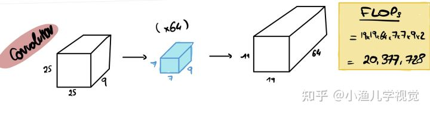
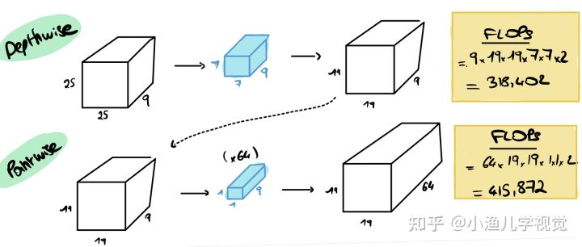
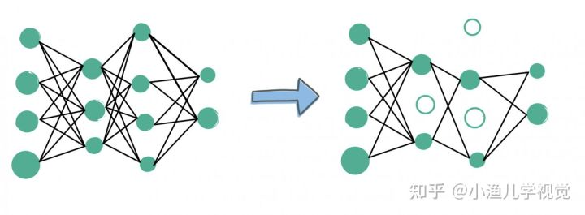

# 提升深度学习模型以提升推理速度

*reference: https://blog.csdn.net/BIT_Legend/article/details/123805898；[如何优化深度学习模型以提升推理速度 - 知乎 (zhihu.com)](https://zhuanlan.zhihu.com/p/417536087)*

推理：指的是神经网络的一次向前传播过程，即将输入数据送入神经网络然后从中得到输出结果的过程

## 1. 衡量模型的推理时间/评价模型大小及计算量

在评价深度学习模型大小和计算量时，经常使用的参数有：parameters, FLOPs, MACs, MAdds，还有MAC, FLOPS, GFLOPS, TFLOPS。其中，后三个参数其实并非用来评价模型的计算量，而是用来评价计算机硬件的计算能力。

### 1.1 parameters

```
表示的是模型内部总的参数数量，用来衡量模型的大小。

例如一个3*3的卷积层包含10个参数，分别为卷积操作的9个参数和偏置操作的1个参数。
```

### 1.2 FLOPs (Floating Point Operations)

```
FLOPs即浮点运算次数，用来衡量模型计算复杂度，常用来做神经网络模型速度的间接衡量标准（已有文章证明靠FLOPs间接标准评价模型的速度时不靠谱的，因为模型的计算速度还跟内存的吞吐等因素有关，但此标准仍被广泛用作模型速度的参考评价标准）。

对于卷积层而言，FLOPs的计算公式为：FLOPs = 2*H*W*(Cin*K*K)*Cout,其中，Cin是指卷积层输入tensor的通道数，Cout是指卷积层输出tensor的通道数，K是指卷积核大小，其中乘以2是因为在卷积操作中，加法次数与乘法次数相同，在卷积乘法中加法次数比乘法次数少一次，但是还需要考虑一次卷积加法，所以总的乘法次数与加法次数相同。
```

### 1.3 MACs/MAdds

```
MACs(Multiply-Accmulate Operations)即乘加累积操作数，1MACs包含一个乘法操作与一个加法操作，大约包含2FLOPs。MACs与MAdds是一样的。
```

### 1.4 MAC

```
MAC(memory access cost)即内存使用量，用来评价模型在运行时的内存占用情况。

1x1卷积的FLOPs为2*H*W*Cin*Cout，对应的MAC为H*W*(Cin+Cout)+Cin*Cout（这里假设内存足够）
```

### 1.5 FLOPS, GFLOPS, TFLOPS

```
1. FLOPs(Floating Point Operations Per Second)即每秒浮点运算次数，它常被用来估算电脑的执行效能，尤其是在使用到大量浮点运算的科学计算领域，这里所谓的“浮点运算”实际上包含了所有涉及小数的运算，这类运算在某类应用软件中常常出现，而它们也比整数运算更花时间。现今大部分的处理器中都有一个专门用来处理浮点运算的“浮点运算器FPU”，因此FLOPS所测量的实际上就是FPU的执行速度。

2. GFLOPS(Giga Floating-point Operations Per Second)即每秒10亿次的浮点运算数，常作为GPU性能参数但不一定代表GPU的实际表现，因为还要考虑具体如何拆分多边形和像素、以及纹理填充，理论上GFLOPS值越高越好。1GFLOPS = 1000MFLOPS
```

### 1.6 提升模型推理速度的两种选择

```
1. 降低模型中的FLOPs值
2. 提升计算平台上的FLOPS值

对于一个特定的计算平台，我们不能改变其计算能力，因此若想要达到提升推理速度的目的，需要对模型进行优化，降低模型的FLOPs值
```

## 2. 如何优化模型

### 2.1 减少模型尺寸

```
减少模型尺寸的好处是可以减少占用的存储空间、提升模型加载速度、提升推理速度等。通常我们可以通过以下3钟方法减少模型尺寸：
1. 量化：
量化是将数值从较大的集合映射到较小的集合的过程。换句话说，我们通过减少大的连续数，并用较小的连续数甚至整数替换它们来达到量化的目的，比如我们可以将权重值2.87950387409量化为2.9。我们可以对权重和激活函数进行量化，量化的结果是改变了数值的精度，最常用的是将32位浮点数(FP32)或16位浮点数(FP16)量化为8位整型数(INT8)甚至4位整型数(INT4)。
量化的好处是减少了模型占用的内存量并且降低了计算的复杂度，但是由于降低了模型权重和激活函数的精度，通常会使得量化后模型的推理精度会有所下降。

2. 知识蒸馏：
知识蒸馏是一种将规模较大、精度较高的模型(teacher)获得的知识迁移到结构简单、计算成本较低的模型(student)上的一种方法。知识蒸馏可以比较形象地理解为老师教学生的过程：老师将自己学习到的知识进行提炼，然后将这些知识教给学生，学生学到的知识虽然不如老师那么广博，但是也深得其精髓。

3. 权重共享：
权重共享是指不同神经元之间共享权重，通过共享的方式，我们可以减少一部分权重，从而减少模型的大小。
```

### 2.2 减少计算操作

```
减少计算操作的方法主要是用过一些更高效、计算量更少的操作来代替模型中原有操作。这里介绍3种减少计算操作的方法：
1. 池化(Pooling)
2. 可分离卷积(Separable Convolutions)
3. 模型剪枝(Model Pruning)
```

#### 2.2.1 池化(Pooling)：

```
最大池化操作和平均池化操作，这些池化操作都是为了减少计算操作。池化层相当于是一个下采样层，可以减少从一层传递到另一层的参数量。池化层通常用在卷积层之后以保留空间信息，同时减少参数数量。最大池化操作是保留窗口中的最大值而丢掉其他的值，从而达到减少参数的目的。
```


#### 2.2.2 可分离卷积(Separable Convolutions)

```
可分离卷积是将标准卷积层分为两个卷积层：`depthwise`卷积和`pointwise`卷积。

1. `depthwise`卷积也是普通的卷积，但是与标准卷积的操作方式不同。举个例子，假设卷积层的输入通道为4，输出通道为8，标准卷积是在4个输入通道上同时做卷积操作然后把得到的结果作为一个输出通道，如果要输出8个通道则要进行8次这样的卷积过程；`depthwise`卷积则是分别在4个通道上做卷积操作，然后每个通道得到的结果作为一个输出通道，也就是输入是几个通道，输出就是几个通道。在这个例子中，标准卷积生成一个输出通道的计算量是`depthwise`卷积生成一个输出通道计算量的4倍。
2. `pointwise`卷积是1x1的卷积，通常用在`depthwise`卷积之后，用于对`depthwise`卷积生成的特征图在深度方向进行信息整合。

用`depthwise`卷积+`pointwise`卷积的可分离卷积代替标准卷积，可以非常显著地减少计算量，我们来看下图的例子：
```



```
可以看出，使用标准卷积的FLOPs值大约为20MFLOPs，depthwise卷积+pointwise卷积的FLOPs值大约为734KFLOPs，标准卷积是可分离卷积的20多倍。换句话说，在这个例子中，用可分离卷积代替标准卷积可以将推理速度提升20倍之多！
```

#### 2.2.3模型剪枝(Model Pruning)

```
修剪是一种模型压缩技术，该方法在尽可能地保留网络原始精度的条件下删除冗余的网络参数以达到降低模型计算复杂度的目的。为了实现该技术，我们首先根据每个神经元对整个模型的重要程度进行分级，然后删除级别较低的神经元，为此，我们可以通过将神经元的连接设置为0或将权重设置为0来删除某个神经元。通过模型剪枝方法，我们可以得到规模更小、推理速度更快、推理精度损失最小的模型。
```

