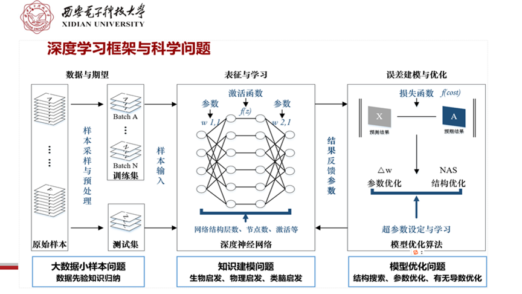
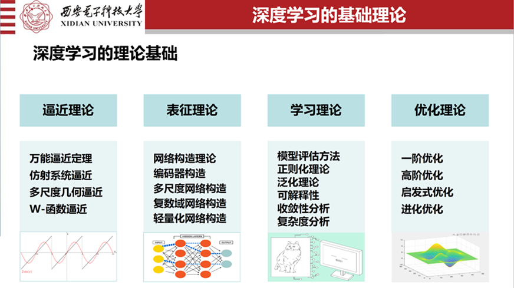
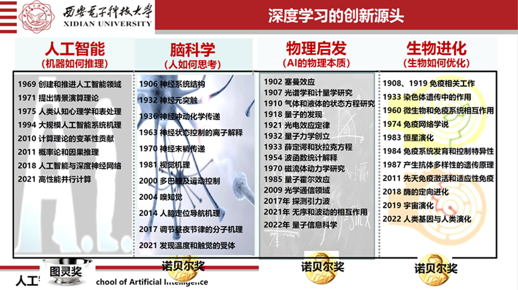
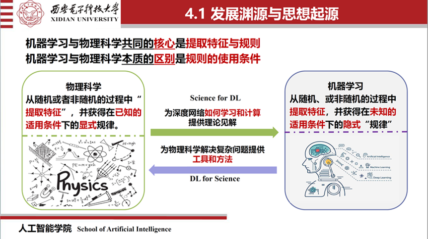
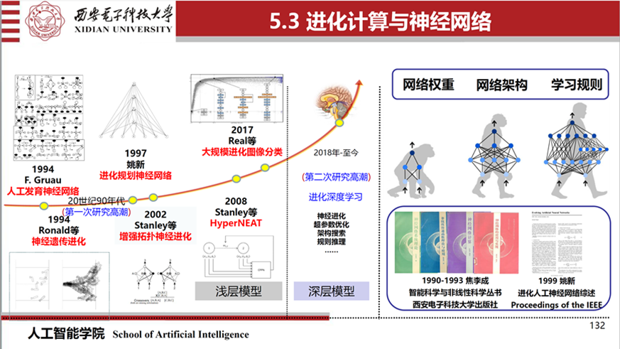
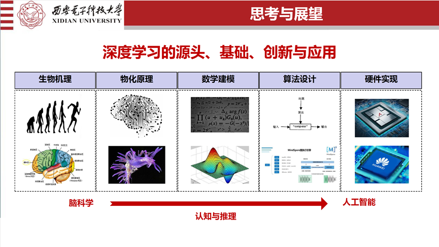
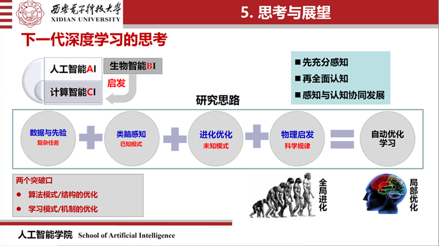

# 下一代深度学习的思考

reference：  [焦李成院士：下一代深度学习的思考与若干问题-西安电子科技大学智能感知与图像理解教育部重点实验室 (xidian.edu.cn)](https://ipiu.xidian.edu.cn/info/1097/2576.htm)

## 1. 深度学习的思想起源

​	深度学习虽然已被广泛应用，但在关键基础研究领域，还需要再认识再突破。	

​	深度学习又称为表征学习。也就是所说大数据驱动层次化的机器学习模型，以自动获取对象的向量化的表达，从而为我们所处的现实世界和问题进行建模。

​	**深度学习的基本思想就是模拟人脑的信息处理机制，希望能够对自然信息，尤其是声音、语言、文字、图像进行很好的处理**。而这些是传统的计算机方法难以做到的。但是目前深度学习对于人脑的知识处理机制和推理机制了解的还不够，同时也实现的不够。实际上，网络的基本结构不仅包含神经元突触和突触的连接机制，相关的学习激励和准则（主要是Hebb学习规则），同时也包含神经元的种类个数，神经网络的层数、连接的结构，前向反馈等等。所有这些基本结构和机制对神经网络的性能起着非常重要的作用。

​	神经网络主要是通过学习和优化来实现对数据的计算处理，从而产生了**对海量大数据样本的训练问题、稀疏编码与表征问题、泛化问题、可解释性问题和鲁棒性问题**。这些问题如何解决呢？

> 1. 首先是**对数据的感知**。也就是说我们如何通过稀疏编码和表征解决这样的问题。
> 2. 第二，如何**表证更复杂的数据**，而不仅仅是简单的数据，比如小样本、复杂的多媒体跨域数据等等。
> 3. 第三，我们要**学习和优化**模型来解译这些数据，对其蕴含的规律进行了解，并通过神经网络获得满意的解。
> 4. 第四，深度学习处理的是一**个物理问题**，与场景有关。
> 5. 第五，现有的网络结构是否能够模拟**大脑信息和知识处理的生物机制**。
> 6. 第六，大脑的**知识处理机制和先验**是人脑信息处理的重要的组成部分，如何嵌入现有的深度学习结构、学习与优化中。

进一步思考：

> 1. 第一，如何**模拟人脑的稀疏性、选择性、方向性、学习性、多样性、记忆遗忘机制**，对数据和知识进行学习、优化和识别。
>
> 2. 第二，**Beyond Data-drived**。就是说要建立knowledge-based，physical-informed和brain-inspired，将其有效的利用和互补起来，去解决复杂的场景问题、物理问题。
>
> 3. 第三，**Beyond BP**。在深度神经网络和学习中，我们主要运用BP算法进行优化，但是BP算法存在收敛性，容易陷入局部最优解、梯度弥散和消失等问题。因此，应该把全局达尔文进化学习和局部的拉马克、班德温学习相结合起来。
>
> 4. 第四，**Beyond Sigmoid**。Sigmoid函数的表征具有一定的局限性，它在稀疏层次表征、选择性、方向性、正则项、正交、紧支性上是有明显缺陷的。因此，我们怎么样能够去有效的表征，仍然是一个亟待解决的问题。
>
> 5. 第五，**神经网络结构的自动搜索**。对于场景问题、实际的问题、想匹配的重要问题，怎么能从多角度、多层次去对神经网络进行解释，实现它的鲁棒性和容错性仍然是有待解决的问题。
>
> 6. 第六，**深度学习的稀疏编码和逼近**。包括学习和优化的基本数学问题，实际上与高维几何动力学密切相关。我们怎么能够从高维的几何动力学角度去对神经网络的学习、逼近进行再认识，再学习，这是一个重要的问题。
>
> 7. 第七，**Beyond Perception**。我们现在模拟的更多是感知问题，但对认知的问题应该怎么样去做？这个问题十分重要，需要考虑知识嵌入建模, 知识与学习发现，归纳与推理，自学习，自组织，自演化，自推理等等。
>
> 8. 第八，**深度学习不仅仅是计算与训练问题，而更重要是类脑感知与认知**，包含编码、表征、学习、优化、推理、决策、行动。
>
> 9. 第九，如何**实现对问题场景的感知、表征、学习与结构优化的高效应用**，而不仅仅是对目标的简单检测、分类和识别。
>
> 10. 第十，深度神经网络亦或人工智能，**如何和科学能够紧密的结合起来，真正的去解决科学的问题**，而不仅仅是一种数据处理的工具。这同样需要我们去认真的考虑设计学习框架。
>
>     

## 2. 深度学习涉及的基础理论

**：逼近理论、表征理论、学习理论和优化理论**

- 对于**函数的逼近**，不仅仅是要从数据样本出发，更重要的是拟合输入和输出的映射关系，同时要对未知的、非线性的、高维的函数进行非线性逼近。**Weierstrass**逼近定理表明，**对于给定的函数，n次多项式可以以任何精度逼近，只要有n的次数足够高。神经网络有一个逼近定义，也就是**通用逼近定理**：只要一个神经网络神经元的个数足够多，能以任意精度逼近任意的连续函数。**对于**Gabor系统的逼近**，同样是包含了对测不准原理（不确定性原理）的应用。从傅里叶分析、小波分析到多尺度几何分析，函数逼近性能在高维奇异性取得了突破。经过几十年的发展，不仅仅是一些波被提出，更重要的是其对于高维奇异性的表征。同样，Weierstrass函数实现了对处处连续而处处不可导的函数的逼近。从这个意义上来讲，它具有更多的泛化性。

- 网络结构的实现，不仅包括网络的结构，还包括学习的结构和参数的优化等等各个方面。广泛使用的**卷积、递归、图卷积、自注意网络的构造**都是在一步一步的实现各种类脑处理的机制和表征理论。除此以外，还有**编码器的构造**领域。在信息处理领域，我们更习惯于用编码器或者说滤波器来表征数据的信息。编码器、自编码器和生成模型都是这一思想的发展。同时，**多尺度学习构造**为深度学习带来了突破性的进展，尤其在特征的时-频表示与分析。当然，我们也要从实数走向复数，因为我们生活的是一个复数的世界，不仅有大小，而且有方向的变化，更重要的是对噪声的学习、记忆和识别。因此，**复数网络的构造**或者复数网络的学习也是表征理论重要的进展。在这个领域，我们希望能够去做更多的工作。目前我们也在复数的卷积网络、复数的轮廓波网络、半监督的复数网络以及复数的Transformer网络方面做了一些工作，具有很大的潜力。对于实际应用来讲，我们所要的神经网络必须是高效的、高性能的同时也是轻量化的网络，设计高效、高性能的**轻量化神经网络**是目前深度神经网络广泛应用的前提。

- 网络学习中最重要的一点是如何评价一个网络性能，**模型评价**是使模型能够实际应用决策的前提。在这个意义上来讲，我们还要去不断的去完善相应的评价体系。**正则化理论**对网络设定了一定的规则约束。它是提高网络泛化能力和避免过拟合，以及进行稳定和加速度深度网络收敛的前提。正则化理论也是设计高效网络的前提和重要的理论基础。其次，**泛化理论**也很重要，它对于网络的训练以及测试起到重要的作用。泛化能力对于深度学习能否应用在实际中，起着决定性的作用。泛化误差是算法基于训练集学习，所得到的模型在未知数据上的预测能力，这是网络的重要指标之一。**可解释性**是神经网络另一方面的重要学习理论。实际上网络的可解释性不仅仅取决于数据，更取决于相应的模型，取决于感知数据的过程，取决于认知数据的过程，也取决于构造的模型和其对数据的表征、学习以及优化过程。而不仅仅是把它变成一个网络黑箱的结构。**收敛性**是网络学习和算法非常重要的依据。怎么样能设计高效的、可行的算法和网络，始终是一个永恒的主题。模型的**复杂度分析**对机器学习、人工智能的算法都是重要的。我们希望它的复杂性既能够匹配问题，又能够匹配硬件的实现，也就是要在可约束的、有限资源的有限环境下来实现满意的最优解。

- 在网络优化理论当中，我们大部分用的都是**梯度下降**算法及它的变体。尽管这些方法对于对小数据是有效的，而且收敛性有保证。但是对大数据稀疏样本病态问题怎么办？那甚至说的更极端的，对于不连续函数怎么办？尽管**高阶优化算法**或者高阶梯度算法能解决一部分问题，但从根本上来讲，梯度算法是不够的。**因此，要能够把梯度的算法和非梯度的算法有效的结合起来是深度的学习发展的方向**。所以说**进化优化**是解决梯度优化问题缺点的一个重要途径。通过自然进化的方法，可以去选择和进化出重要的、好的、优选的解，并且获得系统的满意度。实际上也证明这种结合的方法也获得了非常好的效果。**群体智能**和自然进化都属于启发式算法，和人工智能密不可分。它模拟了局部的相互作用与环境的相互的交互，通过动力学的演化，以概率1收敛于全局的满意解，具有多样性、稳定性、自组织性和自适应性。所以说它也是解决梯度算法现存在问题的非常重要的一个方面。此外，**启发式优化算法**还包括**免疫优化算法**。免疫优化的算法是非常重要的，它能够利用现有的知识，而且具有学习的记忆性、多样性、分布性、容错性和被动免疫性等优点。

  

## 3. 类脑启发的深度学习

​	从感知到认知是一个复杂的过程。**我们不仅要从心理学、哲学、语言、人类学、人工智能、神经科学角度去考虑，更重要的，我们是要从触觉、听觉、视觉去思考。**神经网络源于脑神经的计算，但是当我们回顾生物学中脑神经的过程会发现，真实的生物大脑中并不是用简单的计算来实现大脑认知功能的。**类脑结构中所有的建模均具有稀疏性、学习性、选择性、方向性、知识性和多样性等。然而可惜的是，这些自然的生物特性在我们目前的神经网络设计中并没有被充分考虑进去**。

​	**记忆与遗忘联合建模，记忆与遗忘协同学习与优化是深度学习优化感知的新的途径**。**同样大脑的感知的具有奖惩机制、学习机制以及信息表征的机制，他们分别对应于强化学习理论、反向传播算法以及实际网络的建模**

​	在多尺度几何建模方面，我们提出的多尺度卷积网络，也是把几何学习和卷积网络有效的结合起来，实现了对特征提取和表征的有机统一。可以挖掘不同的、丰富的、多样性的特征，从而来实现对特征的高效的表征以及分类。我们提出的Rigelet-Net网络同样也是通过标记不完整的样本和知识化，或者说先验化，将斑点及波正则化，从而有效的实现了SAR的复杂场景的多尺度几何建模与分类。我们提出的深度多尺度的轮廓波的散射网络，也将物理的散射机理和多尺度表征相结合，从而实现了高分辨的复杂遥感影像的有效分类。

​	对于复数的网络，我们同样也实现了复数的Contourlet网络。Contourlet能够表征极化下的物理机理，同时能够实现和深度学习的结合，并且对方向性、多样性进行有效的建模。

## 4. 物理规律启发的深度学习

## 5. 进化启发的深度学习

## 6. 思考与挑战

对于**源头我们不能不提及生物机理，物化机理和数学的建模表征，以及算法的实现，以及在硬件上的部署能力**。从这个意义上来讲，**更重要的是我们怎么样从类脑出发，从场景物理规律出发，来实现对大样本、小数据和知识的有效的建模和学习，进而在软硬件上实现它。**

下一代的深度学习或者下一代人工智能还需要我们思考以下的问题

> 1. 第一，数据与知识协同的优化与建模。
> 2. 第二，类脑深度学习的学习与优化。
> 3. 第三，Beyond Sigmoid的多尺度表征学习。
> 4. 第四，深度学习特征学习与通用逼近。
> 5. 第五，Beyond BP的学习、进化与优化。
> 6. 第六，感知与认知的协同建模与优化。
> 7. 第七，记忆与遗忘机制的建模。
> 8. 第八，安全可信的深度学习系统理论。
> 9. 第九，轻量高效的深度学习模型。
> 10. 第十，大数据小样本的深度学习。
> 11. 第十一，深度学习绿色迁移的系统理论。
> 12. 第十二，深度学习知识归纳与推理问题。
> 13. 第十三，开放环境的场景应用问题。
> 14. 第十四，Science for DL的建模、优化与学习。
> 15. 第十五，DL for Science的一般框架与范式。