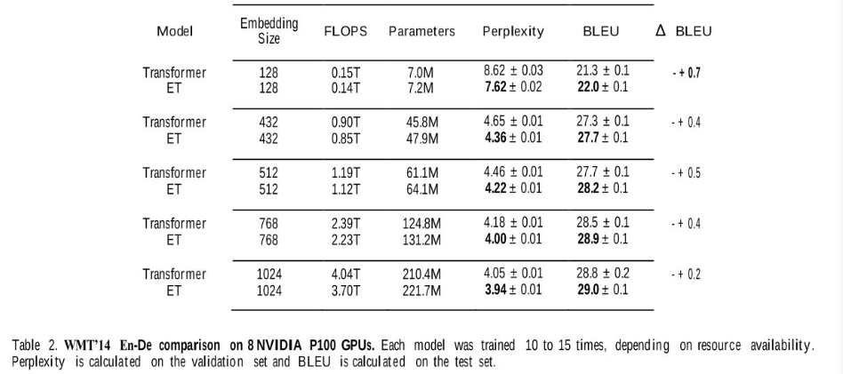
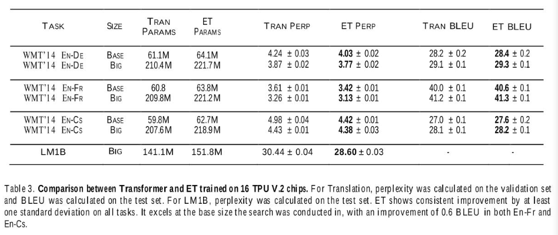

# [The Evolved Transformer](https://arxiv.org/abs/1901.11117v2)

## 摘要

> ​	提出了首个用于改进 Transformer 的神经网络架构搜索算法（NAS）。Transformer 是许多自然语言处理任务的最流行的网络架构之一。该论文使用基于锦标赛选择的进化算法，通过网络搜索算法得到进化版 Transformer。新的网络结构比原来的 Transformer 取得了更好的表现，并且减少了所需要的训练时间。
>
> ​	本文工作的目标是利用NAS找到更好的Transformer架构。首先在feed-forward sequential models（前馈序列网络）的最新进展的启发下构建了一个大的搜索空间，然后运行进化架构搜索，用Transformer播种初始种群；为了在计算量大的WMT 2014英德翻译任务上有效运行这种搜索，开发了渐进动态障碍方法，它允许我们动态地将更多资源分配给更有希望的候选模型。
>
> ​	在大模型尺寸下，ET在FLOPS中的效率是Transformer的两倍，而且没有质量损失。

## 1. 介绍

​	最近研究表明，在解决序列问题时，有更好的替代方案可以替代RNN（循环神经网络），由于基于卷积的网络（如Convolution Seq2Seq）和全注意力网络（如Transformer）的成功，前馈网络现在是解决序列到序列（Seq2Seq）任务的可行选择。前馈网络的主要优点是速度更快、比rnn更容易训练。

​	本文工作目标是研究如何使用NAS方法，为seq2seq任务设计更好的前馈架构。具体来说，我们应用锦标赛选择架构搜索，从被认为是最先进和广泛使用的Transformer进化为更好、更高效的架构。为了实现这一点，我们**构建了一个反映前馈seq2seq模型最新进展的搜索空间（在搜索空间中同时使用了卷积和注意力，以利用两种层类型的优势），并开发了一种称为渐进动态障碍（PHD）的方法（将最好的模型单独训练到最后，但通过在早期丢弃没有前途的模型来优化整个过程）**，使我们能够直接在计算量好的WMT2014英德翻译任务上执行搜索。我们的搜索产生了一个新的架构——进化Transformer(ET)，它在四个完善的语言任务上证明了与原始Transformer的一致改进。

## 2. 背景

​	Transformer网络引入了一种注意力机制，能够同时处理整个文本输入，以学习单词之间的上下文关系（**依赖于多头注意力来传递空间信息**）。一个Transformer网络包括两个部分——编码器（读取文本输入并生成它的横向表示，例如每个词用一个矢量表示），解码器（从该表示中生成翻译的文本）。实验证明该网络设计是非常有效的，许多目前最先进的模型（例如 BERT、GPT-2）都是基于 Transformer 的网络结构而设计的。

> 1. 通过在搜索空间随机采样或使用已知模型作为种子来初始化第一代模型。
> 2. 用给定的任务训练这些模型，并随机采样创建子种群。
> 3. 对表现最好的模型进行突变，随机改变它们结构的一小部分，例如替换一个层或者改变两个层之间的连接。
> 4. 将突变模型（子模型）添加到种群中，而子种群中最弱的模型则被从整个种群中移除。

​	定义搜索空间是解决搜索问题的另一个挑战。如果搜索空间太宽或不够明确，算法可能无法收敛，或者无法在合理的时间内找到一个更好的模型。另一方面，如果搜索空间过于狭窄，则降低了找到一个比人为设计的模型表现更好的新模型的可能性。[NASNet](https://arxiv.org/abs/1707.07012)搜索结构通过定义“可堆叠单元”来应对这一挑战。一个单元可以从一个预定义的词汇表中选择一组作用在输入上的操作（例如卷积），然后通过多次堆叠相同的单元结构来建立模型。这样一来，搜索算法仅需要找到单元的最佳结构。

​	要开始进化NAS，我们有必要开发新技术，因为用于评估每个架构的“适应性”的任务——WMT'14英语-德语翻译——计算量很大。这使得搜索比在视觉领域中执行的类似搜索更加昂贵，这可以利用较小的数据集，如CIFAR-10。

1. 温启动——在初始进化种群中播种Transformer架构而不是随机模型。这有助于在我们熟悉的搜索空间区域中进行搜索，从而使其能够更快地找到更好的模型。

2. 渐进动态跨栏（PDH）（Progressive Dynamic Hurdles ）的新方法，这种算法增强了进化搜索，以便为最强的候选者分配更多的资源，这与先前的工作相反，其中NAS的每个候选模型被分配相同的评估时的资源量。如果模型明显不好，PDH允许我们提前终止对模型的评估，从而使有前途的架构获得更多资源。

## 3. 方法

​	我们采用基于进化的架构搜索，使用锦标赛选择算法，省略了老化正则化。

​	锦标赛选择进化架构搜索首先定义了一个描述神经网络架构的基因编码；然后，通过从基因编码空间中随机采样来创建一个初始种群，以创建个体。这些个体在训练它们在目标任务上描述的神经网络的基础上被分配适应度，然后在任务的验证集上评估它们的表现。然后对该种群进行重复采样，以产生亚种群，从中选择适应度最高的个体作为亲本。被选中的亲本的基因编码会发生突变——编码字段会被随机改变为不同的值以产生子模型。然后通过对目标任务的训练和评估，给这些子模型分配适应度。当适应度评估结束时，再次从该种群中采样，然后将亚种群中适应度最低的个体从种群中移除。然后将新评估的子模型加入到种群中，取代被移除的个体。不断重复这个过程，结果产生了一个具有高适应度个体的种群。

### 3.1 搜索空间

​	本文**搜索空间由两个可堆叠的单元格组成，一个用于模型编码器，一个用于解码器**。每个单元格包含nasnet风格的块，接收两个隐藏状态输入，并产生新的隐藏状态作为输出；编码器包含6个块，解码器包含8个块，这样就可以准确地表示Transformer。这些块对每个输入执行单独的转换，然后将转换输出组合在一起生成单个块输出；我们将应用于每个输入的转换称为一个分支。**整个搜索空间包含5个分支级搜索字段（输入、归一化、层、输出维度和激活）、一个块级(Block)搜索字段（组合函数）和一个单元级(Cell)搜索字段（单元格数量）。**

	

​	在搜索空间中，一个子模型的遗传编码表示为【左输入，左归一化，左层，左相对输出维度，左激活，右输入，右归一化，右层，右相对输出维度，右激活，合成器函数】X 14 + 【单元数】X 2，其中前6块分配给编码器，后8块分配给解码器。

因为**在NAS期间编码器和解码器架构不共享**，因此独立发现该架构对编码器和解码器都很有用，这说明了该设计的优势。**虽然最初的Transformer完全依赖于自注意力机制，但Evolved Transformer是一种混合体，利用了自注意力和广泛卷积的优势**。

​	模型框架和搜索空间的设计要适合原始的Transformer网络结构。

> 1. 该算法搜索两种类型的单元——一种复制 6 次（块），用于编码器，另一种复制 8 次，用于解码器。
> 2. 每个块包括两个操作分支，如下图所示。例如，输入是上一层（块）的任意两个输出，一个层可以是标准卷积操作、注意力头（attention head）等，并且激活函数可以是 ReLU 和 Leaky ReLU。某些元素也可以是同样的操作或终端。
> 3. 每个单元可以重复多达六次。

### 3.2 用Transformer播种搜索空间

使用已知的强模型（Transformer）来播种初始种群更容易。

### 3.3 带有渐进动态障碍的进化

​	如果每个模型的训练和评估时间被延长，那么搜索整个空间需要的时间可能过长。在图像分类领域，可以通过在代理任务上执行搜索来克服这个问题，例如在较大的数据集（如 ImageNet）上测试之前先在较小的数据集（例如 CIFAR-10）上训练。然而，对于翻译模型。作者无法找到等价的解决方案，因此作者引入了**锦标赛选择算法**的一个升级版本。

​	训练是逐渐完成的，并且只对模型池中的最佳模型进行训练。池中的模型在一定数量的样本上进行训练，并且根据原始锦标赛选择算法创建更多模型。一旦池中有了足够的模型，就计算一个“适应度”阈值，只有取得了更好的结果（适应度）的模型才能继续下一步。这些模型将在另一批样本上进行训练，并且下一代模型将基于它们创建和突变。因此，PDH 显著减少了在失败模型上浪费的训练时间，并提高了搜索效率。缺点是“慢热”，那些需要更多的样本才能获得好的结果的模型可能会被忽略。

​	采用的进化算法改编自锦标赛选择进化架构搜索，与原始锦标赛算法相比，本文的搜索任务需要更长的时间进行训练和评估。本文方法中，**根据更有前途的架构的适应度动态分配资源**，我们将这种方法称为渐进动态障碍（PHD），它**允许一贯表现良好的模型进行更多步骤的训练**。它一开始是普通的锦标赛选择进化架构搜索，每个子模型在进行评估适应度之前训练相对较小的s0步数。但是，在预先确定数量的子模型m被评估之后，通过计算当前种群的平均适应度来创建一个障碍h0；对于下一个产生的m个子模型，在s0个训练步之后实现适应度大于h0的模型将获得额外的s1个训练步，然后进一步评估获得他们的最终适应度。一旦另外m个模型以同样方式处理后，通过计算当前种群中所有使用最大训练步数训练的成员的平均适应度来构建另一障碍h1。对于接下来的m个子模型，以同样方式进行训练和评估，使用s0+s1个步数进行训练后适应度大于h1的模型将额外获得s2个训练部署，然后进一步评估获得他们的最终适应度。不断重复这个过程，知道达到最大训练步数。

​	虽然不同的子模型在被分配最终适应度之前可能会进行不同步数的训练，但这不意味着他们的适应度是不可比较的，锦标赛选择进化只关心相对适应度排名。

假设模型在训练过程中没有过拟合，并且他的适应度随它所分配到的训练步数单调增加，那么两个子模型之间的比较能够被视为他们在两个累积训练步数较低处的适应度的比较。因为根据定义，分配了更多训练步数的模型在较低步数的适应度障碍之上执行，而分配了较少步数的模型在较低步数的适应度障碍之上或之下执行，因此可以保证，在较低的训练步数下评估时，拥有更多训练步数的模型更好。

以这种方式改变适应度算法的好处是，性能较差的子模型在计算适应度时，不会消耗那么多的资源。一旦候选者的适应度降至可容忍量以下，对其的评估会立即结束。这也可能导致好的候选者如果只在训练的后半部分较强就会被贴上“坏模型”的标签、然而，丢弃许多坏模型所节省的资源提高了搜索的整体质量，这足以证明潜在也丢弃一些好模型是合理的。

## 4. 实验设置

### 4.1 数据集

**机器翻译**

使用三种不同的机器翻译数据集来执行实验——WMT英语-德语、WMT 英语-法语、WMT 英语-捷克语。

**语言模型**

使用10亿字语言模型基准测试（LM1B）

## 5. 结果

### 5.1 搜索技术

测试了本文的进化算法增强——使用PHD并在Transformer中播种初始种群，与没有使用这些技术的控制搜索进行对比。每个搜索运行3次，每次运行的顶级模型都在单个TPU V.2芯片上进行了300k步的重新训练，训练后模型的性能如下表所示：

我们建议的搜索实验了PHD和Transformer播种，首先运行，每1k模型创建一个障碍（m=1000）和6个30k训练步骤增量。

为了测试Transformer种子的有效性，我们使用随机有效编码的种子运行了一个相同的搜索；

为了测试PHD的有效性，我们运行了三个控制，每个控制都为每个子模型使用固定数量的训练步骤，而不是障碍。对于这些，我们使用步骤增量(30k)、我们建议的搜索最终达到的最大步数（180k）、以及每个顶级模型在经过充分训练以衡量其最终性能时接收到的总步数（300k）。为了确定每个这些搜索能够训练的子模型的数量，我们选择了一个值，使每个控制搜索使用的总资源量等于我们提议的搜索使用的最大资源量，这需要各种数量的资源，取决于多少模型未能跨过障碍。在我们运行的三次试验中，我们提出的搜索使用的训练步数总数为422M+-21M，最大值为446M。因此，为每个非PHD控制搜索分配的子模型数量被设置，以便使用的子模型训练步数总数将为446M。

​	如表1所示，我们提出的搜索，在使用PHD和Transformer播种的情况下平均性能最好它也是最一致的，具有最低的标准差。在所有进行的搜索中，只有一个控制运行——“30K无障碍”产生的模型优于我们提出的所有最佳搜索模型，这就解释了它的高标准差。这一现象是我们开发这种方法的主要动力。尽管激进的早期停止有可能以廉价的价格产生强大的模型，使用它的搜索也可以冒险进入顶级适应度子模型只在早期强大的模式。如果不长时间运行模型，就无法检测出这种情况是否发生。180K和300K无障碍搜索确实洞察了长期性能，但以一种资源效率低下的方式，通过限制它们产生的代的数量，损害了这些搜索；

随机播种搜索也被证明是无效的，表现比任何其他配置都要糟糕得多。在运行的五次搜索中，随机播种是唯一一个顶级模型困惑度高于Transformer的搜索，在相同设置下，top模型困惑度为4.75+-0.01.

​	作者固定了的每种方案的总训练时间，因此模型的数目有所不同：每个模型的训练步骤越多，可以搜索的模型总数就越少，反之亦然。PDH 方法获得了评价最好的结果，同时也更稳定（低方差）。当减少训练步数的数量时（30K），常规方法的平均表现几乎和 PDH 的一样好。然而，它的方差更高，因为它更容易在搜索过程中出错。

**主要的搜索**

在确认了我们搜索程序的有效性之后，我们启动了一个规模更大的搜索版本，使用了270个并行；对每个障碍训练5K模型（m=5000），并使用更大的步数增量来获得更接近300k步数性能的结果；

搜索运行了15k个子模型，总共需要979M的训练步骤，超过13K的模型没有通过第一栏。搜索结束后，我们再挑选出排名前20的模型，训练它们完成完整的30万步，每个模型都在单个TPU V.2芯片上进行训练。最终困惑度最优的模型，也就是Evloved Transformer(ET)。

ET最值得注意的方面是在编码器和解码器块的下层使用了depth-wise可分离卷积，depth-wise和self-attention之前在QANet中有描述，然而ET和QANet的整体架构在很多方面是不同的，例如：QANet的内核尺寸更小，没有分支结构。另一个有趣的例子是在解码器和编码器中使用并行分支（例如，用于相同输入的两个卷积和 ReLU 层）。在消融研究中，作者还发现 ET 能取得如此优异的表现不能只归因于 ET 和 Transformer 之间的任何单一突变。

### 5.2 进化Transformer：性能分析

为了测试ET的有效性，我们将其余Transformer在WMT En-De上的Tensor2Tensor训练架构进行比较。表2显示了实验结果。选择了不同的输入嵌入尺寸进行实验，ET在所有尺寸下表现出比Transformer更强的性能。

为了测试ET的可泛化性，我们还将其与Transformer在另外三个完善的语言任务上进行了比较。当模型尺寸很小时，ET比Transformer更有效；当模型尺寸变大时，它的BLEY性能就会饱和，ET和Transformer之间的差距就会变小，对这种行为的一种解释是，过大的模型尺寸开始出现过拟合，但我们预计数据增强或超参数调优可以提高性能。然而，ET在困惑度方面的改进收益对于大模型规模仍然显著。

**突变分析**

为了了解哪些突变促成了ET性能的提高，我们进行了两轮消融测试。第一轮测试中，我们从Transformer开始，将每个突变分别应用到它上，以衡量每个突变单独引入的性能变化。在第二轮中，我们从ET开始，分别去除每个突变，再次衡量每个单一突变的影响。

在这两种情况下，每个模型都在WMT En-De上训练了3次，用相同的超参数进行300k步。实验结果如表4.

所有情况下，增强ET模型的表现都优于增强Transformer模型，这表明ET和Transformer之间的性能差距不能归因与任何单一的突变。个体影响看似最强的突变是从3个译码块增加到4个，然而即使当这种突变引入Transformer并从ET中移除，得到的增强ET模型仍然比增强Transformer模型具有更高的适应度。

## 6. 结论

​	提出了第一个神经架构搜索，以寻找改进的前馈序列模型。

1. 首先，受seq2seq模型最新进展的启发，构建了一个大型搜索空间，并使用它直接搜索计算密集型的WMT En-De翻译任务。
2. 为减少空间大小和训练子模型的成本，提出了渐进动态障碍方法，并使用已知的强模型Transformer来播种初始种群。

当大规模运行时，搜索发现了进化的Transformer，其在翻译和语言建模方面都表现出一致的更强的性能。

