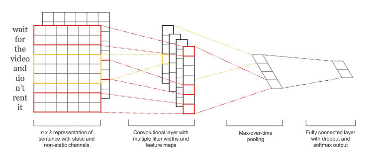

# TextCNN-文本分类算法

*reference： https://www.biaodianfu.com/textcnn.html*

将文本当作一维图像，从而可以用一维卷积神经网络来捕捉临近词之间的关联，TextCNN即为利用卷积神经网络对文本进行分类的算法。

## 1. 简介

    第一层将单词嵌入到低维矢量中。下一层使用多个过滤器大小对嵌入的单词向量执行卷积。例如，一次滑动3，4或5个单词。接下来，将卷积层的结果最大池化为一个长特征向量，添加dropout正则，并使用softmax对结果进行分类。与传统图像的CNN网络相比, textCNN 在网络结构上没有任何变化(甚至更加简单了), 从图中可以看出textCNN 其实只有一层卷积,一层max-pooling, 最后将输出外接softmax 来n分类。

    与图像当中CNN的网络相比，textCNN 最大的不同便是在输入数据的不同：图像是二维数据, 图像的卷积核是从左到右, 从上到下进行滑动来进行特征抽取。自然语言是一维数据, 虽然经过word-embedding 生成了二维向量，但是对词向量做从左到右滑动来进行卷积没有意义. 比如 “今天” 对应的向量[0, 0, 0, 0, 1], 按窗口大小为 1* 2 从左到右滑动得到[0,0], [0,0], [0,0], [0, 1]这四个向量, 对应的都是”今天”这个词汇, 这种滑动没有帮助.

## 2. TextCNN流程

### 2.1 Word Embedding 分词构建词向量

textcnn使用预先训练好的词向量作embedding layer。对于数据集里的所有词，因为每个词都可以表征成一个向量，因此我们可以得到一个嵌入矩阵M, M里的每一行都是词向量。这个M可以是静态(static)的，也就是固定不变。可以是非静态(non-static)的，也就是可以根据反向传播更新。

如图所示, textCNN 首先将 “今天天气很好,出来玩” 分词成”今天/天气/很好/，/出来/玩, 通过word2vec或者GLOV 等embedding 方式将每个词成映射成一个5维(维数可以自己指定)词向量, 如 “今天” -> [0,0,0,0,1], “天气” ->[0,0,0,1,0], “很好” ->[0,0,1,0,0]等等。

这样做的好处主要是将自然语言数值化，方便后续的处理。从这里也可以看出不同的映射方式对最后的结果是会产生巨大的影响, nlp 当中目前最火热的研究方向便是如何将自然语言映射成更好的词向量。我们构建完词向量后，将所有的词向量拼接起来构成一个6*5的二维矩阵，作为最初的输入。

### 2.2 Convolution卷积

输入一个句子，首先对这个句子进行切词，假设有s个单词。对每个词，跟句嵌入矩阵M, 可以得到词向量。假设词向量一共有d维。那么对于这个句子，便可以得到s行d列的矩阵。我们可以把矩阵A看成是一幅图像，使用卷积神经网络去提取特征。由于句子中相邻的单词关联性总是很高的，因此可以使用一维卷积。卷积核的宽度就是词向量的维度d，高度是超参数，可以设置。

### 2.3 Pooling池化
