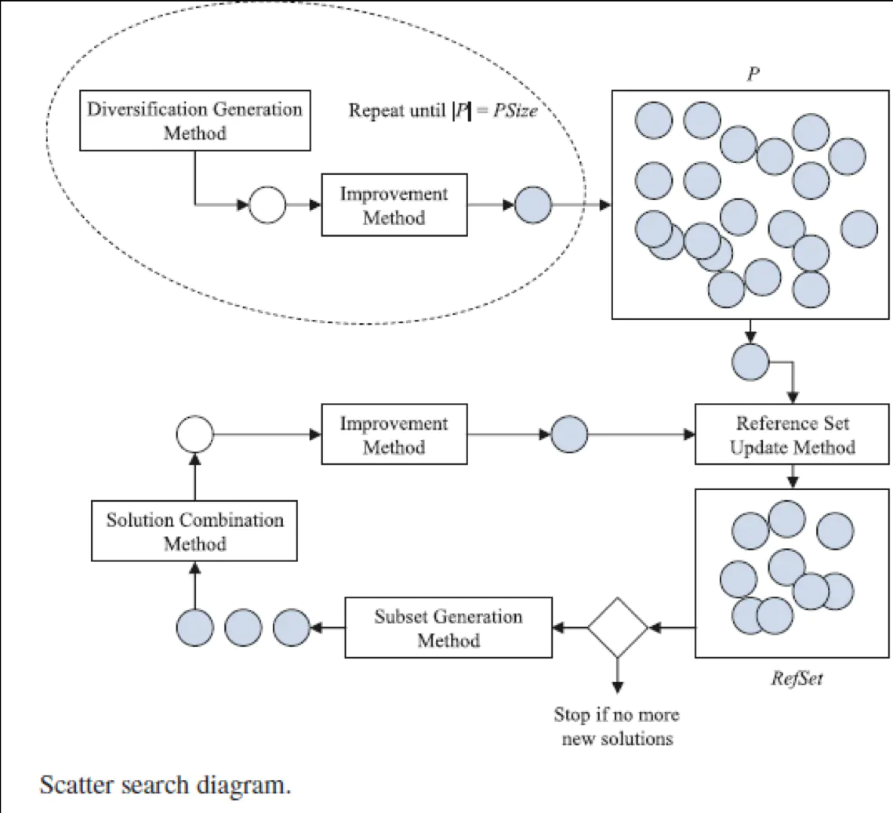
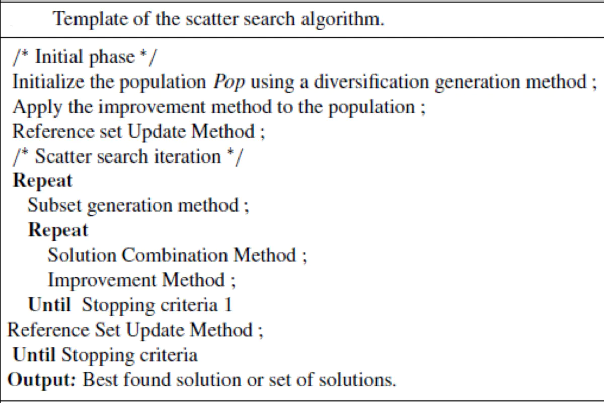

# 分散搜索算法 Scatter search,SS

*reference:  http://cea.ceaj.org/CN/abstract/abstract22752.shtml*

## 1. 简介

是一种演化算法，目前已成为组合优化问题/多目标问题求解的一个有效方法。该算法的结构引用进化算法的杂交和变异算子来增强其性能，但该算法与其他进化算法的不同在于一系列操作策略不再基于随机性原理，而是运用“分散-收敛集聚”的迭代机制。实验表明分散搜索算法具有很好的收敛性和分布性。

SS算法是一种基于种群进化算法，其基本思想是：按照多样化原则构建一小部分参考解集（reference solution）的种群叫做参考集（reference set），然后通过一系列的选择、组合、改进操作以获取更好的新解集。该算法开始采用分布式的初始种群解集的策略构造参考集，参考集的解（个体）通过合并这些解生成新的解。

**SS算法与其他进化算法的解集的不同：**SS算法的参考集的大小往往是少数、如遗传算法中两个不同的个体是随机算则，从适用种群与一个杂交算子或合并机制产生一个或多个后代解。一个典型遗传算法种群大小通常包含100个解，以随机取样合并。而SS算法是用某种选择法在初始种群中选择一些比较有代表性（质量和多样性）的参考集，以这些代表性的参考集选择两个或两个以上的个体的参考集中产生新个体，然后通过优化解方法改进这些解，由于合并过程中至少对两个解的参考集，需要保持该集的基数不要太大，因此典型参考集往往不大于20个解。一般情况下，如果该参考集包含b个个体，其检查合并过程次数大约（3b-7）b/2的4中不同情况。

**SS算法的中心思想：**保留一小部分参考解的种群（或称为参考集），然后合并这些参考解生成新的解。

**SS算法实现的基本模板：**（算法从一个参考集的创建开始）

- 首先使用多样化方法（diversification generation method）生成具有多样性的解；
- 然后通过优化解方法改进这些解，开始建立参考集（参考集的大小通常是20个解，哪些要放入参考集中要根据其质量及多样性来进行选择）；
- 之后，在参考集中的解将用来建立解的子集，每一个子集中的解都是用于合并的候选解，其中最简单的情况是大小为2的子集（两个个体相结合）。子集的解都要进行合并（解合并）；每一个新生成的解都要通过优化解方法得到改进并可能取代参考集中的一个解（优化解）。
- 子集生成，解合并和优化解方法不断重复，直到参考集不再改变或满足某种条件为止。

## 2. 求解过程



### 2.1 多样解生成/多样化生成方法（diversification generation method）

    由于SS的基本机制是参考集组合生成新解，因此参考集中一般不允许存在两个相同的解，这样在初始化时必须保持种群的多样性。对实数编码的优化问题，常用受控的随机方法和频率记忆方法。

```
生成解的种群作为建立初始参考集的候选解，这些解必须是多种多样的，这样次啊能散布与整个搜索空间。
该算法首先将每个变量的范围划分成若干同等大小的子域；然后给每一个解的所有的决策变量赋值。
通过这个方法产生解的值和最优值相比有很大的差别，为了解决这个问题还是要通过优化解方法来改善变量。
```

### 2.2 新解改进/优化解方法（improvement method）

    改进方法一般是用在对散射搜索法的多样性初始解和组合方法产生的新解进行改进。如可以采用梯度下降法和Nelder-Mead直接搜索法（复合型法）等多种方法。

```
该方法基于局部搜索算法的思想，用来改善新产生的解。该算法引用多项式变异算子（polynomial mutation）变换原解产生新的解，然后对原解与新解进行判断，如果新解更优越就代替原来的解，否则放弃该新解
```

### 2.3 参考解集更新/参考集生成方法（generate reference set method）

    参考集是散射搜索法的核心。若参考集缺乏多样性，即使通过组合和改进的方法，也不会产生更好解，因为多样性为子集生成方法提供了基本结构。

```
该方法创建一个参考集RefSet，用于存放高质量和多样化的解，目的是在解组合方法中产生新的解。通常地，参考集包含高质量集合多样化集分别为RefSet1和RefSet2，大小分别为b1和b2，则参考集的数目为b=b1+b2。该算法首先创建RefSet1加入高质量参考集到RefSet1填满，然后计算RefSet与RefSet1直接的最小欧几里得距离，最小欧几里得距离值较大的解是将加入RefSet2，知道RefSet2被填满为止。

参考集的更新方法一般有动态和静态两种。
```

### 2.4 子集生成方法（subset generation method）

    子集是SS组合的基础。根据发散搜索模板的原理，每一个子集中的解都是用于合并的候选解。
    
    一般的子集生成方法是包含2个解的子集生成法，即对参考集中b个解进行两两组合，构成解对(Pairs)，则共有b(b-1)/2个子集。以此基础，则可以衍生出其它子集生成方法。目前实验表明，SS的搜索能力相当程度上取决于解对的组合。

### 2.5 参考解的组合法（solution combination method）

```
组合方法一般取决于所要解决问题的特点。不少优化问题可以采取线性组合法。
它的思想是用两个参考集通过杂交算子产生一个新解，该方法应用实数编码的模拟二进制杂交将两个解合并产生新解，然后通过更新参考集方法见新生成的解与RefSet的解作比较。
```

### 2.6 更新参考集方法（reference set update method）

```
当要更新从解组合方法所产生的解时，先要改善这些解，然后需要满足这些情况：
①新的解一定要有比较好的目标值比最差的目标值的RefSet1集
②新的解一定要有比较好的距离值比最差的距离值的RedSet2集
```


Scatter search的基本过程是，首先利用多样性解生成法生成多样性初始解，并用新解改进法对每一个解进行改进，加入初始种群P；根据解质量(目标函数值优劣)和多样性指标，从P选择若干个解构成初始参考集(RefSet)。然后利用子集生成法从RefSet中系统化生成一系列子集，对这些子集中的解利用组合法策略化地生成新的解，然后利用新解改进法对该新解进行改进，进而利用该解对参考集进行更新，反复执行上述过程，直到满足结束准则。

## 3. 算法伪代码


