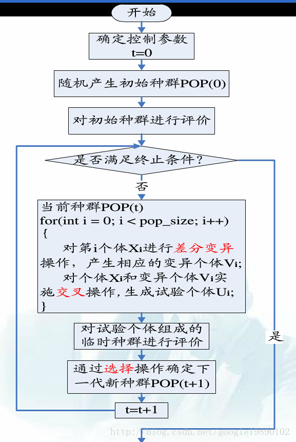
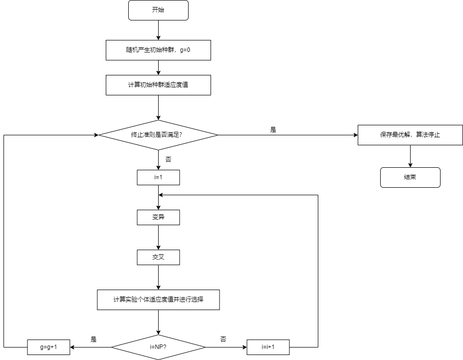
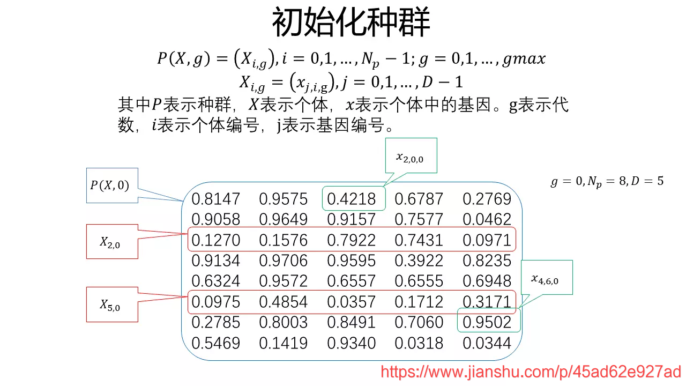
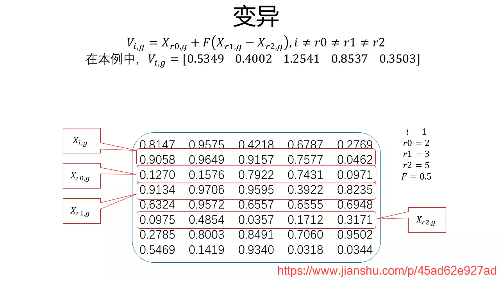
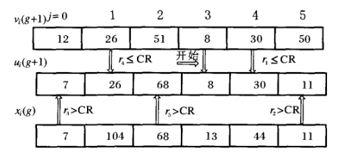
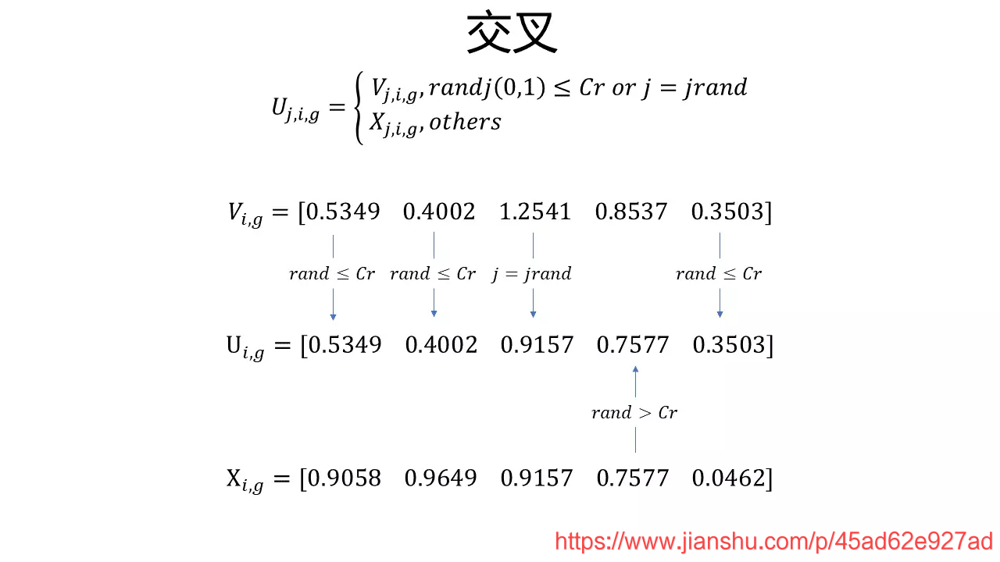
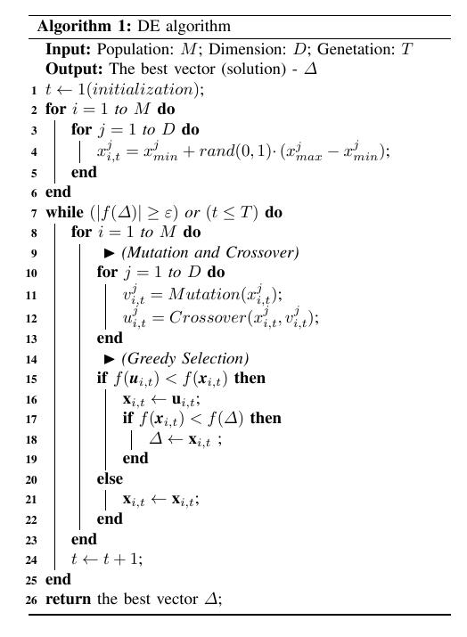

# 差分进化算法 DE

*reference:  [优化算法——差分进化算法(DE) - 云+社区 - 腾讯云 (tencent.com)](https://cloud.tencent.com/developer/article/1390226)*

[(42条消息) 算法 - 差分进化(DE)算法_罗伯特祥的博客-CSDN博客_de算法](https://blog.csdn.net/weixin_43455581/article/details/101694412)

推荐阅读：  

[]: http://swang.xyz/2021/09/17/差分进化算法/

## 1. 简介：

    差分进化算法(Differential Evolution, DE)是一种基于群体差异的启发式随机搜索算法，该算法是由R.Storn和K.Price为求解Chebyshev多项式而提出的，也属于智能优化算法。
    差分进化算法（DE）是一种多目标（连续变量）优化算法（MOEAs），用于求解多维空间中整体最优解。

## 2. 算法原理

    DE算法通过采用浮点矢量进行编码生成种群个体。在DE算法寻优的过程中，首先，从父代个体间选择两个个体进行向量做差生成差分矢量；其次，选择另外一个个体与差分矢量求和生成实验个体；然后，对父代个体与相应的实验个体进行交叉操作，生成新的子代个体;最后在父代个体和子代个体之间进行选择操作，将符合要求的个体保存到下一代群体中去。

## 3. 算法流程

初始化种群 -> 变异 -> 交叉 -> 选择

 

对于无约束优化问题：

其中：D是解空间的维度

利用差分进化求解这样的优化问题，主要分为初始化、变异、交叉和选择等几项操作。

### 3.1 初始化种群

初始化种群为：

其中：X_i(0)表示种群中第0代的第i个个体，j表示第j维度，NP表示种群大小，D表示解空间的维度

由下式随机生成各种群个体：

$$
x_{i,j}(0) = x^L_{i,j} + rand(0,1)(x^U_{i,j} - x^L_{i,j})
$$

其中：

$$
x_{i,j}^L,\  \  x_{i,j}^U
$$

分别为第j维的下界和上界；

rand(0, 1)表示过在区间[0, 1]上均匀分布的随机数。

### 3.2 变异

 DE算法通过差分策略实现个体变异

常见的差分策略是随机选取种群中两个不同的个体，将其向量差缩放后与待变异个体进行向量合成。

$$
V_i(g+1) = X_{r1}(g) + F(X_{r2}(g) - X_{r3}(g)) \\ i \neq r1 \neq r2 \neq r3
$$

其中，r1，r2，r3是三个随机数，区间为[1，NP]；F称为缩放因子，为一个确定的常数；g表示第g代。

在进化过程中，必须保证新生成的解的有效性，因此必须判断生成的解是否满足边界条件，如果不满足，则需要重新生成（生成方案与初始种群相同）。

第g代种群：

$$
\{{x _i(g)∣x_{j,i}^L ⩽x_{j,i}(g)⩽x_{j,i}^v,i=1,2,⋯,NP;j=1,2,⋯,D}\}
$$

变异后的中间体：第g待种群：

$$
\{x_i(g+1)∣x_{j,i}^L ⩽ x_{j,i}(g+1) ⩽ x_{j,i}^v,i=1,2,⋯,NP;j=1,2,⋯,D\}
$$

### 3.3 交叉

 交叉操作的目的是随机选择个体，因为差分进化也是一种随机算法，交叉操作的方法是：

其中，CR称为交叉概率，通过概率的方式随机生成新的个体。

 上图为6个基因位的“染色体”或称为“个体”的交叉操作示意图。为了确保变异中间体{v_{j,i}( g + 1 )}的每个“染色体”至少有一个“基因”遗传给下一代，第一个交叉操作的基因是随机选择{v_{j,i}( g + 1 )}的第 j_rand 作为交叉后的个体u_{j,i} ( g + 1 ) 第 j_rand位的等位基因。后续的交叉操作则是通过交叉概率CR来选取x_i ( g ) 还是v_i ( g + 1 ) 的等位基因作为u_i ( g + 1 )的等位基因。

### 3.4 选择

在DE中采用的是贪婪选择的策略，即选择较优的个体作为新的个体。

## 4. 算法伪代码

## 5. 参数控制

DE算法主要的控制参数包括：种群规模(NP)、缩放因子(F)和交叉概率(CR)。

### 5.1 参数说明

- NP主要反映算法中种群信息量的大小，NP值越大种群信息包含的越丰富，但是带来的后果就是计算量变大，不利于求解。反之，使种群多样性受到限制，不利于算法求得全局最优解，甚至会导致搜索停滞。
- CR主要反映的是在交叉的过程中，子代与父代、中间变异体之间交换信息量的大小程度。CR的值越大，信息量交换的程度越大。反之，如果CR的值偏小，将会使种群的多样性快速减小，不利于全局寻优。
- 相对于CR，F对算法性能的影响更大，F主要影响算法的全局寻优能力。F越小，算法对局部的搜索能力更好，F越大算法越能跳出局部极小点，但是收敛速度会变慢。此外，F还影响种群的多样性

### 5.2 参数选择

- NP：一般介于5D到10D之间(D为每个个体的维度)，但不能少于4，否则变异算则无法进行
- F：一般在[0,2]，通常取0.5
- CR：[0,1]，通常取0.3，CR越大，收敛速度越快，但易发生早熟现象。

## 6. 改进方法

- 基本DE算法在求解的过程中，随着进化代数的增加，会使种群的多样性变小，过早的收敛到局部极小点，或者致使算法停滞，这对依靠种群差异来进行进化的算法来说无疑是致命的，使算法的性能在进化的过程中变差。
- 为了解决基本DE算法的上述缺陷，针对DE算法的特点，目前主要的改进方法是针对进化模式和控制参数的优化，还有一些改进方法是将DE算法与其他一些智能算法进行结合仲用。
