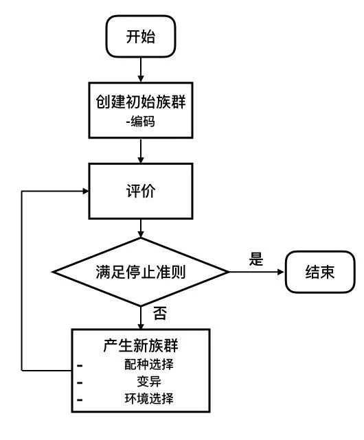
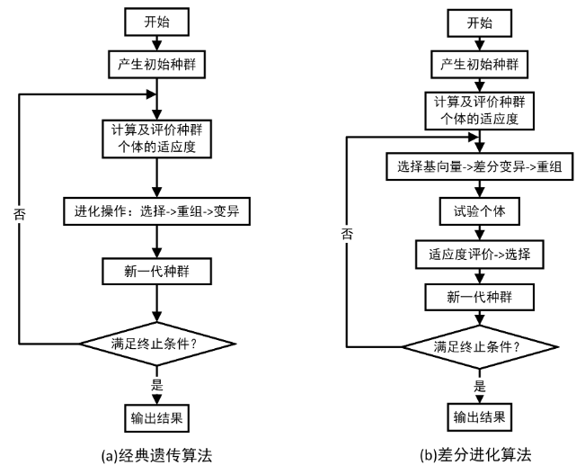

# 演化算法 EA（Evolutionary Algorithm）

*reference:*

*[Evolutionary Algorithm(EA)进化算法初探 - 知乎 (zhihu.com)](https://zhuanlan.zhihu.com/p/463035726)*

*[第一章：概述 – Geatpy](http://geatpy.com/index.php/2019/07/28/第一章：概述/)*

*[基于DEAP库的Python进化算法从入门到入土--(一)进化算法的基本操作与实现 - 简书 (jianshu.com)](https://www.jianshu.com/p/8fa044ed9267)*

## 1. EA简介

EA进化算法 是一类算法的统称（包含遗传算法、粒子群算法、蚁群算法、鱼群算法、蝙蝠算法等等）。这类算法借鉴大自然中生物的进化、选择与淘汰机制，通常先产生一个族群，然后不断进化与淘汰，最终产生能够在严酷的自然环境中生存的优异个体（也就是有较大适应度函数的可行解）。它具有自组织、自适应的特性，常被用来处理传统优化算法难以解决的问题。

通过*人工产生上千个种群个体、每一个体探索不同的路径，通过上百次迭代*，从而找到帕累托最优解（有限组合方案最优）

```text
这个世界上总有一类很难搞的问题，乍一看没什么规律，但各种限制，数学家称之为NP hard问题

  求解NP hard问题，就只能像探索迷宫一样，在指定的范围内不断探索，速度和方向可能是不断变化的

  指定的范围就是搜索空间

  而探索可以是多线程的

  探索的过程也可以是在之前经验的基础上不断累加的
```

进化算法应用的关键，就是如何设计搜索空间和搜索行为:

- 搜索空间设计的大小，直接决定了计算量的大小
- 搜索行为策略设计的好坏，直接决定了系统的搜索效率

关键把握住进化的四个阶段：

1.搜索空间设计；2.搜索策略设计；3.评价方法；4.新搜索空间生成；

对应到术语层面就是：

1.种群初始化；2.基因编码、种群选择；3.评价函数设计；4.交换、变异；

优点：

- 泛用性强，对连续变量和离散变量都能适用；
- 不需要导数信息，因此不要求适应度函数的连续和可微性质(或者说不需要问题内在机理的相关信息)；
- 可以在解空间内大范围并行搜索；
- 不容易陷入局部最优；
- 高度并行化，并且容易与其他优化方法整合。

缺点：

- 对于凸优化问题，相对基于梯度的优化方法（例如梯度下降法，牛顿/拟牛顿法）收敛速度更慢；
- 进化算法需要在搜索空间投放大量个体来搜索最优解。对于高维问题，由于搜索空间随维度指数级膨胀，需要投放的个体数也大幅增长，会导致收敛速度变慢；
- 设计编码方式、适应度函数以及变异规则需要大量经验。

## 2. 进化算法的基本元素

宽泛来讲，大部分进化算法都具有以下元素：

1. 个体编码(Individual representation): 将问题的解空间编码映射到搜索空间的过程。常用的编码方式有二值编码(Binary)，格雷编码(Gray)，浮点编码(Floating-point)等。
2. 评价(Evaluation): 设定一定的准则评价族群内每个个体的优秀程度。这种优秀程度通常称为适应度(Fitness)。
3. 配种选择(Mating selection): 建立准则从父代中选择个体参与育种。尽可能选择精英个体的同时也应当维护种群的多样性，避免算法过早陷入局部最优。
4. 变异(Variation): 变异过程包括一系列受到生物启发的操作，例如重组(Recombination)，突变(mutation)等。通过变异操作，父代的个体编码以一定方式继承和重新组合后，形成后代族群。
5. 环境选择(Environmental selection): 将父代与子代重组成新的族群。这个过程中育种得到的后代被重新插入到父代种群中，替换父代种群的部分或全体，形成具有与前代相近规模的新族群。
6. 停止准则(Stopping crieterion): 确定算法何时停止，通常有两种情况：算法已经找到最优解或者算法已经选入局部最优，不能继续在解空间内搜索。

   

```csharp
Generate the initial population P(0) at random, and set t to 0.
repeat
    Evaluate the fitness of each individual in P(t).
    Select parents from P(t) based on their fitness.
    Obtain population P(t+1) by making variations to parents.
    Set t = t + 1
until Stopping crieterion satisfied
```


## 3. 遗传算法 vs 差分进化算法

    对于常规遗传算法，在计算开始时，根据设计的编码规则随机初始化许多个体(形成一个或多个群)，然后评估种群中个体的适应度，并根据适应度来选择一些个体到交配池，然后对交配池中个体进行一定概率的重组和变异产生育种后代。至此，环境中同时存在父代和育种种群，此时需要从中选择出一些个体最终得到新一代种群。
    
    在这个过程里面出现了两次选择：第一次是从当前种群中选择出一些个体参与重组和变异等进化操作；第二次是在父代和重组变异得到的育种后代中选择一些个体保留到下一代，这个阶段的选择也有时候被称为“重插入”或者“环境选择”。但很多时候这两次选择之中的某一次经常会在算法描述中被省略掉，这并不意味着只有一次选择，本质上依旧是存在两次选择，下图展示了经典遗传算法和经典差分进化算法的流程对比：



左图是经典的遗传算法流程图，可以看到它里面只出现了一次选择。实际上，它在重组和变异得到育种个体之后，无条件地代替了父代个体而形成新一代种群，这本质上也是一次选择，只是在选择中把父代所有个体都淘汰掉了。这种做法也有一定的弊端：收敛速度较慢。因此有不少加入了“精英保留”的改进型遗传算法，比如把育种种群的绝大部分个体（小于全部）代替父代中等数量的非最优个体而得到新一代种群；另外还有把父代个体和育种个体合并，在统一的、相同的环境下进行择优选择一半个体得到新一代种群；差分进化里面的一种经典做法是按照个体的索引顺序，每个育种个体只与其相同位置上的父代个体进行优胜劣汰保留其中一个，从而得到新一代种群。

由图也可以看出，进化算法和传统的搜索和优化算法有着显著不同，最明显的差异是：

- 进化算法具有天然的并行性，它可以并行地搜索一组点，而不是一个点。
- 进化算法使用的是概率转换规则，并非确定性转换规则。
- 进化算法不需要额外的信息，只有目标函数和相应的适应度影响搜索方向。
- 进化算法鲁棒性强，可以与各种算法轻松地结合在一起。
- 进化算法可以整合其他优化算法的优点，比如利用其他优化算法的优化结果来生成初始种群，这种二次搜索方式在很多场合下可以大幅度提高搜索效率。
- 进化算法可以给特定的问题提供多样化的搜索结果，让用户自己选择。比如在多目标优化的进化算法里，算法给出的是一组帕累托最优解。这些最优解可以作为多组备选方案。

    选择、重组和变异是进化算法提供的经典操作算子。很多改进的进化算法都是围绕他们展开的。或许在命名上可能十分多样化，但万变不离其宗，本质上也能够被归入到这几类操作算子当中。
