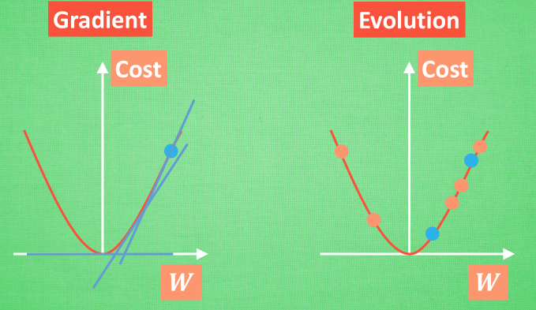
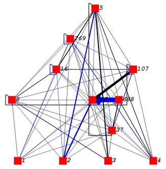
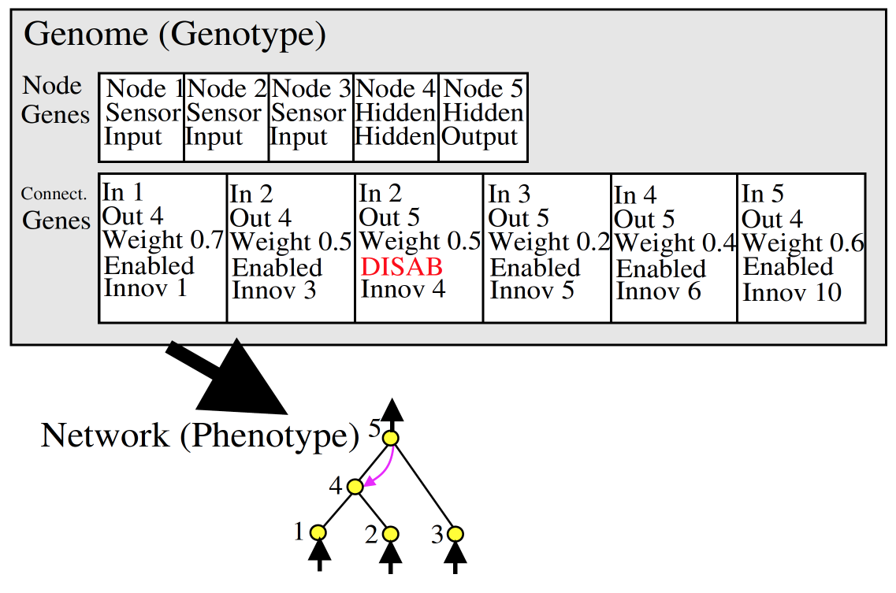
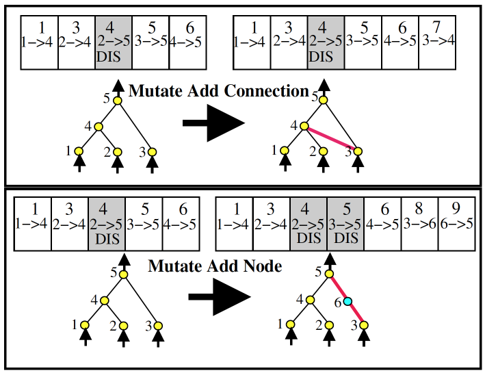
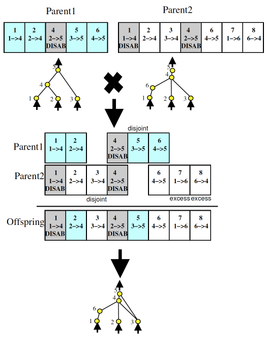
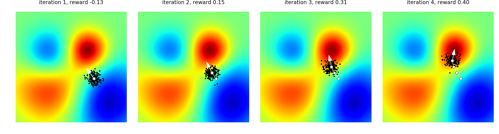

# 神经网络进化(Neuro-Evolution)

```
人工神经网络是一种计算机能理解的数学模型, 这个模型将观测到的信息通过类似电信号的方式正向传播, 获取深程度的理解, 然后输出自己的判断. 最后通过对比自己的判断和真是数据, 将误差反向传播, 更新自己的网络参数. 但是生物中的神经网络却没有这一套反向传播的系统, 它往往是只产生正向传播, 然后通过刺激产生新的神经联结, 用这些产生的联结理解事物. 这就是大家为什么都在说人工神经网络是和生物神经网络不同的原因之一
```

**梯度 vs 进化**



```
在梯度下降中, 我们需要的只是梯度, 让这个神经网络的参数滑到梯度躺平的地方就好了, 因为梯度给你指明了一个优化的方向, 所以如果是监督学习, 优化起来会非常快. 而神经网络的进化, 使用的却是另一种手段. 用原始的点创造出很多新的点, 然后通过新的点来确定下一代的起点在哪. 这样的循环再不断地继续. 可以想象, 如果在监督学习中, 我们需要不断产生非常多新的网络, 测试新的网络, 这将比梯度法慢很多. 但是不使用梯度的方法还有一个好处, 那就是有效避免局部最优.
```

## 1. 神经进化

```
Neuro Evolution 其实可以在很多方面来处理问题. 比如用它来做监督学习 (不过在这点上一般没有反向传播的神经网络学得快),还有可以拿它来做强化学习 (这和传统的强化学习 Reinforcement Learning 是有的一拼的, 在之后内容中我们使用 gym 模块来实现 NeuroEvolution 的强化学习).
```

### 神经网络进化进化的方式

**尝试1：固定神经网络形态 (Topology), 改变参数 (weight)**

```
通过不断尝试变异, 修改链接中间的 weight, 改变神经网络的预测结果, 保留预测结果更准确的, 淘汰不那么准确的. 在这方面, OpenAI 在2017年做出了一个有贡献的研究. 他们将进化策略 (Evolution Strategy) 衍生到神经网络, 然后不断进化神经网络中的参数. 他们的实验结果都能够媲美很多强化学习方法, 比如 Q-learning, Policy Gradient.
```

**尝试2：修改参数和形态**



```
这种变化更多, 除了参数, 形态也是能够改变的. NEAT 算法就是这样一种. 因为能够变化形态, 所以在 NEAT 中, 并不存在神经层这种东西.
```

```
对比尝试1与尝试2这两种不同的方式, 我们可以想象肯定是越能变化的结果会越好. 因为它能够探索的形态结构越多, 找到好方法的机会就越大. 而且还有一个优点就是, NEAT 可以最小化结构. 换句话说如果你拿一个 50 层的神经网络训练, 但是要解决的问题很简单, 并不会用到那么复杂的神经网络, 越多的层结构也是一种浪费, 所以用 NEAT 来自己探索需要使用多少链接, 他就能忽略那些没用的链接, 所以神经网络也就比较小, 而且小的神经网络运行也快嘛.
```

### NEAT算法

```
NEAT 是一种典型的遗传算法,简单来说, NEAT 有几个关键步骤
1. 使用 创新ID (Innovation ID) 对神经网络的 直接编码 (direct coding)
2. 根据 innovation ID 进行 交叉配对 (crossover)
3. 对 神经元 (node), 神经链接 (link) 进行 基因突变 (mutation)
4. 尽量保留 生物多样性 (Speciation) (有些不好的网络说不定突然变异成超厉害的)
5. 通过初始化只有 input 连着 output 的神经网络来尽量减小神经网络的大小 (从最小的神经网络结构开始发展)
```



```
上面的图你可以想象成就是我们如何通过 DNA (图中的 Genome) 来编译出神经网络的； Node genes 很简单就是神经网络每个节点的定义. 哪些是输入, 哪些输出, 哪些是隐藏节点； Connect. Genes 则是对于每一个节点与节点的链接是什么样的形式, 从输入节点 (In) 到输出节点 (Out), 这个链接的参数 (weight) 是多少. 输出节点的值就是 Out = In * weight. 然后这条链接是要被使用 (Enabled) 还是不被使用 (DISAB). 最后就是这条链接专属的 创新号 (Innov)

通过上面的 Genome 我们就能搭建出那个神经网络了, 可以看出我们有一个 2-5 DISAB 的链接, 原因就是在2-5之间我们已经变异出了一个4节点. 所以2-5 是通过 4 相链接的, 这样我们就需要将原来的 2-5 链接 disable 掉.
```

**变异**



```
关于变异呢. 我们可以有 节点变异 和 链接变异, 就和上图一样. 但是如果新加的节点像 6 那样, 是在原有链接上的突变节点, 那么原来的 3-5 链接就要被 disable 掉.
```

**交叉**



```
再来就是 crossover 了, 两个神经网络 交配 啦. 这时你就发现原来 innovation number 在这里是这么重要. 两个父母通过 innovation number 对齐, 双方都有的 innovation, 我们就随机选一个, 如果双方有个方没有的 Innovation, 我们就直接全部遗传给后代.

之所以图上还出现了 disjoint 和 excess 的基因, 是因为在后面如果要区分种群不同度, 来选择要保留的种群的时候, 我们需要通过这个来计算, 计算方式我就不细提了, 大家知道有这么一回事就行.
```

### 进化策略与神经网络

```
Evolution Strategy 相比较于 Genetic Algorithm 更加注重 mutation 的过程. 而且其中高度使用到了正态分布 (Normal distribution).

而 OpenAI 提出的能够替代强化学习的 ES 可以终结如下:
1. 固定神经网络结构;
2. 使用正态分布来扰动 (perturb) 神经网络链接参数;
3. 使用扰动的网络在环境中收集奖励;
4. 用奖励 (reward) 或者 效用 (utility) 来诱导参数更新幅度;
```




```
上图是 OpenAI 用来诠释 ES 算法的精辟:
如果机器学习就是为了找到图中最红的地方, 那么 ES 就是在自己周围随机繁殖后代, 然后有些后代会靠近红色的地方, 有些不会. 那么我们就修改 ES 神经网络的参数, 让它更加像那些好后代的参数. 使用这种方式来越来越靠近红色.
```

