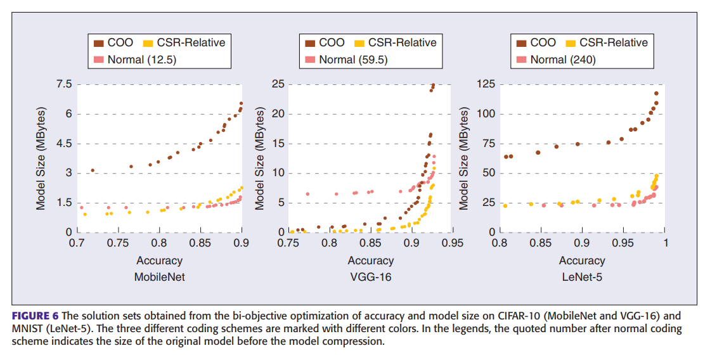

# 深度神经网络的进化多目标模型压缩EMOMC(Evolutionary Multi-Objective Model Compression)

*[reference] Wang Z, Luo T, Li M, et al. Evolutionary multi-objective model compression for deep neural networks[J]. IEEE Computational Intelligence Magazine, 2021, 16(3): 10-21.*

## 摘要

```
	深度神经网络的先进的准确性往往以高计算和空间复杂性为代价，阻碍了它们在边缘设备上的部署。本文提出了一种称为进化多目标模型压缩（EMOMC）的方法，同时优化能源效率（或模型大小）和准确性。具体来说，通过使用架构种群进化来探索网络修剪和量化空间。此外，通过利用剪枝和量化之间的正交性，提出了两阶段剪枝和量化协同优化策略，大大降低了架构搜索的时间成本。最后，在优化过程中考虑了不同的数据流设计和参数编码方案，因为它们对能耗和模型大小有显著影响。由于群体中不同架构之间进化的合作，可以在一次运行中获得一组紧凑的深度神经网络，这些深度神经网络可以在不同目标（例如准确性、能源效率和模型大小）上进行权衡。与大多数旨在减少权重参数大小而不显著降低精度的现有方法不同，本文所提出的方法旨在实现理想目标之间的权衡，以满足各种边缘设备的不同要求。实验结果表明，所提出的方法可以获得各种紧凑型DNN，适用于不同的内存利用和能源消耗要求。在精度损失可以忽略不计的情况下，EMOMC将VGG-16在CIFAR-10上的能量效率和模型压缩率分别提高了89.X和2.4X多倍。
```

## 1. 简介

```
	深度神经网络在很多不同的问题上有着显著的性能，但是却以高计算与空间复杂性为代价，比如VGG-16模型有着约1.38亿个参数，需要500MB以上的内存存储，处理一个224x224像素的输入图像需要需要15.5G的乘加累计操作数(MACs)。大规模深度神经网络通常难以在边缘设备上部署，阻碍了其应用。
	神经网络搜索的一种方法是从头开始搜索，相比之下，模型压缩是从一个训练良好的网络开始搜索最优网络。例如，为了减少DNN的存储需求，有人提出了一个三阶段管道（即修剪、训练量化和哈夫曼编码）来压缩冗余权值；有人建议取出冗余卷积滤波器以减小模型大小；有人尝试以能力小号作为反馈信号直接压缩DNN...这些在减小模型参数大小（或者能耗）方面取得了良好的效果，但是这些方法要求模型达到几乎不损失精度，使得解决方案缺乏灵活性。
	本文提出的进化多目标模型压缩(EMOMC, Evolutionary Multi-Objective Model Compression)方法旨在同时优化能源效率/模型大小以及模型精度。通过考虑网络剪枝(network pruning)和量化(quantization)，将模型压缩(model compression)转化为不同数据流设计(different dataflow designs)和参数编码方案(parameter coding scheme)下的多目标问题(multi-objective problem)，每个候选架构都可以看作是进化种群(evolutionary propulation)中的一个个体。由于种群中不同结构之间进化的合作和相互作用，一组在不同目标（例如，精度、效率和模型大小）上进行权衡的紧凑的DNN可以在一次运行中获得。与现有的大多数方法不同的是，现有方法的目的是在不显著损失精度的情况下减小参数的大小或资源消耗，本文提出的方法视图在期望目标之间取得良好的均衡，以满足不同边缘设备的要求
	
本文的研究已经创新性主要包括：
1. 模型压缩问题被表述为(formulated as)为一个多目标优化问题，采用基于种群的算法在网络剪枝和量化空间中搜索最优解；
2. 为加快种群进化速度，基于网络剪枝和量化之间的正交性，提出了一种两阶段剪枝/量化协调优化策略；
3. 通过考虑不同的数据流设计和参数编码方案实现模型压缩中准确性、资源效率和模型大小之间的权衡。

实验结果表明，本文的方法可以在一次运行中获得一系列Pareto最优解。此外它实现了比当前最好的方法更高的资源效率(energy efficency)。
```

## 2. 背景知识

```
	网络剪枝与量化(network pruning and quantization)是两种常见的提高模型推理速度和减小模型大小的模型压缩技术；此外，边缘设备采用的数据流设计(dataflow design)和用于存储权重矩阵的编码方案对模型压缩性能有显著影响。
```

### 2.1 网络剪枝与量化

```
为了使训练容易，网络通常被过度参数化。
1. 网络剪枝通过将一些冗余的参数值置位0来消除网络中的一些冗余参数。
2. 量化涉及到将数据映射到一个量化级别的小集合，旨在最小化量化级别的重构数据与原始数据之间的误差，量化级别反映了精度、最终反映了代表一个参数的比特数，量化之后，低精度参数依旧为模型推理存储足够的信息，并能保持模型的准确性。在实际实现中，如果权值被量化，可以使用结构更简单的乘法器，从而减少资源消耗。

通过剪枝和量化，不仅可以减少计算过程的能耗，还可以减少数据移到的能耗，以比特计算，。例如，如果对模型中80%的参数进行修剪，并将所有的参数从16位量化为8位，那么可以减少大约90%的数据移到能耗。
```

### 2.2 硬件加速器中的数据流设计

```
	数据流设计决定了数据在不同处理元件(PEs, processing elements)之间如何重用。由于硬件加速器(hardware accelerator)的很大一部分能量消耗在数据移动(data movement)上，因此在优化能量效率时需要考虑数据流设计。
	
算法1（典型的卷积网络层的计算过程）：
for co in range(CO) do
	for ci in range(CI) do
 		for x in range(X) do
 			for y in range(Y) do
 				for fx from -(FX -1)/2 to (FX -1)/2 do
 					for fy from -(FY -1)/2 to (FY -1)/2 do
 						O[co][x][y] += I[ci][x+fx][y+fy] x W[co][ci][fx][fy]
 
	在典型的硬件加速器中有一组处理元件(PE)，每个处理元件(PE)包括一个乘法器和一个加法器，可以独立执行一个MAC(multiply-accumulate，乘加累积操作)操作，如何将MAC操作映射到各个PE、以及数据如何在这些PE之间流动成为硬件加速器设计中需要考虑的关键问题。理论上有许多映射方法，导致不同的数据流设计。例如，假设设备有一个PE数组，则可以将算法1中任意一个循环中的每次迭代映射到该数组的每个PE；同样，如果设备有一个PE矩阵，则可以展开算法1中的任意两个循环并将MAC操作映射到矩阵中的每个PE上，总共有C(6,2) = 15中可能的数据流设计。
	将数据流设计表示为A:B（A,B表示两个展开的循环），每个PE包含一个乘法器和一个加法器，可以独立执行一个MAC(multiply-accumulate，乘加累积操作)操作，同时也包含寄存器，可以暂时存储输入输出数据。
```


```
如Figure.1所示，以4个PE为例展示了四种流行的数据流设计示意图，每个PE包含一个乘法器和一个加法器且每次可以执行一个MAC操作；PE还包含寄存器文件，可以临时存储输入输出数据，下面介绍四种流行的数据流设计：
1. X:Y。MAC运算结果存储在PE输出端口的寄存器中，每次迭代时从寄存器中读取最后一个MAC操作的结果；
2. Ci:Co。每次迭代中输入的特征图被重复使用Co次，并对Ci MAC运算结果相加；
3. Fx:Fy。Fx*Fy权重存储在PE输入端口的寄存器中，每次迭代中对Fx*Fy MAC操作运算结果相加；
4. X:Fx。x*Fx权重存储在PE输入端口的寄存器中，每次迭代中权重被复用x次，Fx MAC运算结果相加。
```

### 2.3 参数编码方案(coding scheme for the parameters)

```
	剪枝后，模型中的过滤器(filter)变成了一个稀疏矩阵(sparse matrix)，这意味着它包含大量的零元素，为了将稀疏矩阵存储到内存中，开发了许多编码方案，编码方案的荀泽主要取决于矩阵的特性。
考虑三种编码方案：
1. 正常的编码方案，以与非零元素相同的方式存储零元素，即为矩阵中的所有零元素保留了空间，这种编码方案的存储大小是N*qi(N为矩阵中权重元素的总数，qi是权重的量化深度)；
2. COO(Coordinate)编码方案，非零元素与行索引和列索引一起被存储，且忽略零元素；
3. CSR(compressed sparse row)编码方案，只有非零元素值与列索引和行偏移一起被存储，为了进一步节省空间，一个版本的CSR编码方案只存储两个非零元素之间的相对距离
```

## 3. 相关工作

### 3.1 模型压缩(Model  Compression)

```
	不同的模型压缩方法有着不同的目标，例如模型大小、FLOPS、延迟(latency)、推理速度。目前主要有两种模型压缩的分支：
1. 第一个分支侧重于计算成本，以FLOPs值为目标。例如，Li等人提出从CNN中修剪整个过滤器，避免稀疏连接模式并显著降低计算成本；Lemaire等人提出了一种用于深度CNN的预算正则化修剪框架(budgeted regularized pruning framework)，这使得压缩模型的计算密集度降低；
2. 第二个分支的目标是模型推理速度。例如，He等人利用强化学习提供模型压缩策略，可以显著加速模型推理。

	模型压缩本质上是一个多目标优化问题，考虑模型精度、能耗、模型大小等多个目标，当前研究很少提示考虑多个目标，即仅仅优化一个目标而将其余目标设置为硬约束(hard constraints)。本文则应用进化多目标优化技术同时实现这些目标。
```

### 3.2 进化多目标优化(Evolutionary Multi-Objective Optimization)

MOPs(multi-objective optimization problem)：多目标优化问题，可以表述为：
$$
min_x F(x) = (f_1(x), f_2(x),...,f_M(x))^T \\
s.t.\ \   g_j(x) \le 0, j\in\{1,2,...,J\}, \\
h_k(x) = 0, k \in \{1,2,...,K\}, \\
x \in \Omega
$$
其中，J表示不等式约束的个数；K表示等式约束的个数；Ω是决策空间；x = (x_1, x_2,..., x_n)^T是一个候选解。

```
Pareto最优解：未被其他解支配的解(dominate)，Pareto最优解有很多个。
决策空间(decision space)的最优解集成为帕累托集(PS)，其在目标空间中的映射成为Pareto front(PF).

	进化算法(evolutionary algorithm, EAs)基于种群搜索的性质，旨在一次执行中逼近整个PF.此外，与传统的数学编程技术相比，EAs通常不具有PF的特性，它们可以很好地处理具有不连续(discontinuous)和非凸的(non-convex)多目标函数。

	在MOEA(multi-objective evolutionary algorithms,多目标进化算法)中，种群中个体的选择策略在进化过程中起着关键作用。由于最优解是在整个搜索空间中不被其他解支配的解，因此帕累托优势(Pareto dominance)自然成为在进化过程中选择有希望的解的可行标准。然而，帕累托优势准则可能无法提供足够的选择压力(selection pressure)，从而使算法难以收敛(coverage)。当目标空间很大时，通常会遇到这种情况。为了将种群推向PF，Goldberg提出了一种称为Pareto排名的机制，用于MOEA中的选择，然后在非支配排序遗传算法(NSGA,Nondomainated Sorting Genetic Algorithm)中利用细分方法(niche method)来维持稳定的子种群。后来，在其新版本的非支配遗传算法-II(NSGA-II)中采用了拥挤度比较算子(crowding degree comparison operator)。最近，许多MOEA倾向于考虑其他选择策略，因为它们可能会快速收敛到PF，例如基于指标(indicator-based)的MOEAs、基于分解(decomposition-based)的MOEAs、双目标标准MOEAs(bi-goal criterion)。
	目前，已经有一些尝试利用MOEA来搜索有效的神经架构，例如Lu等人提出了一种方法成为NSGA-Net，它将神经架构搜索公式化为一个多目标问题，并利用NSGA-II算法来解决它。NSGA-Net考虑两个目标：分类误差和计算成本（通过MAC的数量来衡量），与其他审计架构搜索方法相比NSGA-Net方法取得了很好的结果。
	鉴于模型压缩的多目标性质，本文研究了如何将进化多目标方法用于模型压缩。
```

## 4. 提出的方法

```
EMOMC(Evolutionary Multi-Objective Model Mompression)：将模型压缩问题表述为多目标优化问题(MOP)，优化的目标是找到一组Pareto最优解，这些解代表了对期望目标的各种平衡，从而使AI模型能够部署在具有不同资源约束的边缘设备上
```

```
注：
1. 剪枝量(pruning amount)：
2. 量化深度(quantization depth)：
3. 剪枝和量化之间的正交性
```

### 4.1 问题公式化 (Problem Formulation)

```
	本文旨在压缩一个训练好的模型以实现高精度、低能耗和小模型尺寸，通过采用不同的剪枝量p和量化深度q，压缩模型会具有不同的精度、能耗和大小，本文优化的目标是在减少模型能耗或大小的同时使模型的精度尽可能高。
1. 模型精度Acc、剪枝量p和量化深度q=[q1,q2,...,qL]表示为 Acc = f1(p, q) ，f1()表示原始模型中每层的权重参数进行剪枝、然后对第i层的参数进行qi比特深度量化得到的模型精度评分，L表示原始模型的层数。
2. 模型推理(inference)的能耗(energy consumption)受到边缘设备电池电容(capacitance)的限制，超过边缘设备的能源预算将极大地限制人工智能应用的实施。从用户角度来看，通常可以接受以牺牲一点准确性来换取大量降低能耗，尤其对于边缘设备。对于经过训练的模型，推理过程中的能耗也与应用在边缘设备上的确切数据流设计d有关。剪枝量p、量化深度q和数据流设计d之间的关系为：Energy = f2(p, q, d).
3. 模型大小受边缘设备中片内(on-chip)内存模块容量的限制，如果模型大小超过限制，模型推理过程需要通过片外(off-chip)内存存储器加载和保存权重/特征图(weights/features maps)，考虑到片外内存访问比片外内存访问资源消耗要大得多、推理过程的能力消耗也大大增加。此外应用商店对二进制文件大小很敏感，因此缩小模型大小并确保整个模型能够适应边缘设备的内存限制非常重要。对于给定的模型，模型大小很大程度上取决于存储权重的编码方案c,模型大小、剪枝量p、量化深度q和编码方案c之间的关系为： Model Size = f3(p, q, c)
4. 总共有L+3个变量，L表示原始模型的层数，变量p表示模型中所有层的剪枝量、变量qi表示模型中第i层的量化深度,变量之间的约束为：
p_l <= p <= p_u;
q_l <= qi <= q_u,
d ∈ {d1, d2, d3, d4},
c ∈ {c1, c2, c3}
其中，p_l,p_u分别表示剪枝量的下界与上界；q_l,q_u分别表示量化深度的下界与上界；d1,d2,d3,d4对应四种数据流设计X:Y,Ci:Co,Fx:Fy,X:Fx；c1,c2,c3分别表示三种参数编码方式-正常编码方式(normal coding),COO,CSR
本文中，假设剪枝量范围为0%-100%，每层的量化深度为1-23bits

本文研究了两个双目标优化问题(bi-objective optimization problems):
问题1. 探索了剪枝量和量化深度的可能组合，并以最大化模型精度f1和最小化能耗f2为目标。
max f1(p, q); max f2(p, q, d)
s.t. p_l <= p <= p_u,q_l <= qi <= q_u,d ∈ {d1, d2, d3, d4},
问题2. 最大化模型精度f1和最小化模型大小f3
max f1(p, q); max f3(p, q, c)
s.t. p_l <= p <= p_u,q_l <= qi <= q_u,c ∈ {c1, c2, c3}

本文从两个双目标优化问题而不是三目标优化问题的角度去考虑，有以下2个原因。
①如果同时优化能耗和模型大小（即同时考虑不同的数据流设计和不同的编码方案），决策空间将大大增加，优化难度更大。
②由于对于每个个体的评估有较高的计算成本，因此种群规模不能太大，通常种群规模设置为小于100。三目标空间将导致导致解集比双目标空间稀疏得多。
```

### 4.2 多目标优化与加速 (Multi-Objective Optimization and Speedup)

```
	与直接单步对模型进行剪枝不同，一种更有效的方法是分多个步骤进行剪枝，单步剪枝模型会导致模型准确率明显下降，且恢复模型的难度太大。下图以对训练好的VGG-16模型进行压缩后再CIFAR-10数据集上进行测试，展示了多步剪枝方法与单步剪枝方法之间的比较。
	对于多步剪枝，它分32步将剪枝量从0逐渐增加到95%，每一步中模型都会被部分修剪并重新训练一个epoch;在单步剪枝中，模型立即被剪枝95%，然后重新训练32个epoch。
	如下图所示，可以看出多步剪枝方法在准确率方面优于单步剪枝方法，且有较大的差距。
```


```
	多步剪枝过程中的一个挑战是它通常具有很高的计算复杂度(high computational complexity)，具体来说，每一步都需要通过一个或几个epoch对模型进行微调(fine-tuning)，如果试图为模型找到最佳剪枝量和量化深度，多步剪枝过程将会大大延迟优化进度。为了在给定的剪枝量和量化深度下获得模型的精度，首先需要将模型进行压缩，这通常包括许多训练epoch；由于搜索空间很大，1几乎不可能在剪枝量和量化深度的任意组合下预先存储所有压缩模型。
	对于上面的问题可以采用EMO技术来解决，但是由于进化算法本质上是一种随机搜索(stochastic search)，因此可能需要数千次实验才能找到高质量的解，一旦产生了新的解（架构）就需要话费大量时间来执行评估，这可能导致基于EMP的搜索变得不可能。
	为了解决这个问题，本文利用剪枝和量化之间的正交性，提出了一种两阶段剪枝和量化协同优化方法(two-stage pruning and quantization cooptimization method)，可以有效降低计算成本。具体来说，优化过程分为两个阶段：
阶段a: 通过多个独立循环对模型进行剪枝，在每个循环中，从一个训练好的模型开始，用不同的剪枝量对模型进行剪枝、然后对模型进行微调(fine-tune)并将剪枝后的模型保存到库中，剪枝量集涵盖了多目标求解器可以计算到的所有可能剪枝量，这是为了保证第二阶段不需要剪枝过程；
阶段b: 多目标求解器开始探索设计空间，并试图找到剪枝量和量化深度的最优组合，这个过程中求解器需要知道在给定的剪枝量和量化深度组合下的精度、能耗和模型大小，这一步中只需要从库中加载相应的剪枝模型并进行量化即可。如下图所示，
分为两个阶段进行剪枝和量化模型。第一阶段中，只是对模型进行剪枝，具体来说，假设t为粒度(granularity)，则将模型剪枝100/t次，在第i个时间步，从训练好的模型开始，使用多步剪枝方法逐步剪枝模型，知道目标剪枝量达到i*t，之后将压缩后的模型保存到一个预剪枝模型库中；在第二阶段中，根据所需的剪枝量p从预剪枝模型库中加载一个预剪枝模型，然后根据所需的量化深度q对预剪枝模型上的参数进行量化。由于剪枝和量化是两个正交操作，所以最终的压缩模型将等价于同时剪枝和量化得到的压缩模型。最后，通过执行模型推断并从能力估计器(energy estimator)中读取能量消耗(energy consumption)来获取模型精度.
```


```
本文提出的方法可以有效地加快优化过程(speed uop the optimization process)，为了获得给定剪枝量和量化深度下的准确率和能耗，不再需要对模型进行微调。在优化过程之前完成成了第一阶段，假设粒度为1%，仅将100个压缩模型保存到库中，远小于整个搜索空间中可能压缩的模型数量。对于剪枝量和量化深度的每种组合，评估个体的时间成本大致等于模型的推理时间成本
```

## 5. 实验结果与分析

```
	本文所提出的方法在三个baseline CNN上进行评估：MobileNet、VGG-16、LeNet-5，MobileNet是专为移动和嵌入式视觉应用设计的神经网络；VGG是一个典型的图像分类深度神经网络；LeNet是一个简单的手写和打印字体识别，仅由两组卷积核平均池化层组成，然后是一个展平卷积层、两个全连接层和一个Softmax分类器。本次实验将MobileNet和VGG-16在CIFAR-10数据集上进行了彩色图像分类测试、LeNet-5在MNIST数据集中手写数字识别测试。
```

### 5.1 实验设置

```
1. 基于python的工具Pymoo中的NSGA-II算法用于解决公式化的多目标问题；
2. 使用pytorch框架实现神经网络；
3. 网络训练过程中初始学习率设置为0.01，每30个epoch衰减一般；
4. batch_size设置为256；
5. 多目标优化过程中种群大小设置为40，每次执行会运行250代；
6. 多目标优化和网络训练在GPU上执行；
7. 四种最常用的数据流设计X:Y、Ci:Co、Fx:Fy、X:Fx；
8. 资源计算是根据Xilinx Virtex UltraScale FPGA和Xilinx XPE工具包的能耗计算得到的；
9. 实现上，乘法器和加法器在LUTs(lookup tables,查找表)上实现，一个MxN乘法器需要M/2x(N+1)个LUTs;
10.为了节省内存空间，不需要在每一层计算之后将特征图保存在本地内存中，因此本地内存模块的大小必须支持存储所有层的权重和临时特征图；
11.对于剪枝，采用基于L1-norm的非结构化的剪枝方法，并添加一个掩码来过滤掉(filter out)剪枝掉的权重(pruned weight)；
12.对于量化，采用线性（均匀）量化(linear(uniform)quantization)方法，并使用缩减因子来降低权重的精度
```

### 5.2 双目标优化精度和能耗

```
本文提出了两阶段剪枝和量化协同优化方法，可以有效地完成模型压缩并获得解，整个优化过程包括两个阶段，第一阶段是预处理(pre_processing)，大约需要24小时；第二阶段是多目标优化，求解器可以在GPU上一个小时内生成最佳解。如下图所示，显示了在四种不同的数据流设计下，从精度和能耗的双目标优化得到的解集，图中每个点对应双目标优化得到的解集中的一个压缩模型。
```


```
从图中可知：
1. 不同颜色标记的点涵盖了大范围的准确率和能耗，这意味着EMOMNC在四种数据流设计下对三种baseline CNN模型压缩得到了一个具有高度多样性的解集。例如，在X:Y的数据流设计下，MobileNet的准确率范围从约75%到90%、能耗从约0.2mJ到0.58mJ，这实现了两个目标之间的正确权衡(trade-off)以满足各种边缘设备的限制；
2. 从能耗的角度来看，如果从能耗最高的方案到能耗最低的方案，前几个点的精度损失可以忽略不计。例如，在X:Y数据流设计中，VGG-16的能耗从2.3mJ左右下降到0.5mJ，精度下降不到2%，但是达到一定阈值后精度损失变得非常大；考虑模型的警服，如果从精度最高的解到精度最低的解，前几个点的能耗降低是显著的，但是达到一定的阈值后能耗变得相对稳定；
3. 不同的模型在不同的数据流设计中表现不同。例如，Ci:Co在MobileNet和VGG的四种数据流设计中体现了最优的能耗，但是他却不如LeNet中的其他数据流设计，原因是不同模型的卷积层有着不同的形状。除了能耗，数据流设计对边缘设备的延迟和成本也有一定影响，因此数据流设计的选择设计许多因素，本文仅研究四种流行数据流设计的优化结果。
```

### 5.3 双目标优化精度和模型大小

```
如下图所示，在三种模型、三种参数编码方案下双目标优化模型精度以及模型大小的结果，图中每个点表示EMOMC得到的解集中的一个压缩模型。
```



```
从上图可知，虽然COO和CSR是为了存储稀疏矩阵而开发的，但是与普通编码方案相比，有时他们并没有为压缩模型节省空间，例如在高模型精度下普通编码方案是MobileNet的三种方案中最好的一种，原因是虽然COO和CSR编码方案只存储非零元素，但它们依然需要几个额外的位来记录每个非零元素的位置，如果试图将模型精度保持在较高水平，则压缩率不能太高，这使得过滤器的稀疏性中节省的内存空间小于那些额外位的开销，因此在这种情况下正常的编码方案是更好的选择。但是如果允许一定的精度损失，CSR是三种编码方案中最好的。
```

### 5.4 准确性和能源效率的聚合(Aggregation of Accuracy and Energy Efficiency)

```
从理论上讲，更高的精度伴随着更高的能耗。对于边缘设备上的应用，牺牲一点模型精度来实现能源效率大幅度提高是可以接受的。如Figure5所示，对于VGG-16，如果2%的准确率损失是可以接受的，那么能耗可以降低80%左右；如果考虑模型精度与能耗的平衡则存在一些拐点(knee point)，为了帮助用户选择部署在边缘设备上的模型，本文定义了指标(metric)"聚合分数(aggregation score)"：
			AScore = (f1*r + (1-f1)*τ)/f2
其中，f1是模型精度、f2是指定模型精度下对应的能耗；在对图像进行分类时，如果分类结果正确则获得奖励r，否则执行惩罚τ
通过给定固定的能量预算，可以分类的图像数量与每张图像消耗的能量f2成反比；从上式可以看出，聚合分数AScore的关键参数之一是奖励与惩罚的比率r/τ，这个比率表明了准确率的重要性，最优解的选择高度依赖于比率r/τ
```


```
如Figure 7所示，显示了不同r/τ值下不同解的聚合分数，每条曲线(curve)都是根据多目标优化的一次执行结果绘制的；由于多目标求解器生成离散的解，因此采用cspline平滑函数，渲染数据单调后通过自然三次样条连接连续点，将它们绘制在一条线上，图中得到的分数是由原始未压缩模型获得的聚合分数单独归一化得到的。
从图中可以看出，大多数精度分数曲线都有一个峰值点，对于VGG-16等复杂神经网络，由于其高压缩率，最高分数将比未压缩模型高出约125倍；对于MobileNet和LeNetr等更简单的网络，最高聚合分数比原始模型高出约9倍。
```

### 5.5 神经网络的选择(On Selection of Neural Networks)

```
在同一数据集上，最佳神经网络的选择取决于如何压缩模型。例如，MobileNet是专门为计算效率而设计的，在模型压缩前，虽然它的准确率略低于VGG-16，但在能效和模型大小方面，它是由的硬件资源要比VGG-16少得多；模型压缩后VGG-16可能比MobileNet更加高效。
```


```
Figure8与Figure9分别显示了在四种数据流设计和三种编码方案中VGG-16和MobileNet的能耗比比率与模型大小比率。结果表明，除了数据流设计Ci:Co和正常的编码方案外，当准确率低于88%时，VGG-16比MobileNet消耗少约50%的能量以及少占用约50%的内存空间。这一结果表明，从更复杂的神经网络（例如VGG-16）中选择压缩模型，其在能耗和模型大小方面要比来自简单的神经网络的压缩模型要更优，原因是VGG-16中的参数个数或者参数精度在压缩后会低于MobileNet.
```

### 5.6 与当前最优结果的对比

```
Table II与Table III分别报告了不同模型压缩方法在能耗和聚合分数以及模型大小方面的对比结果。
表2表明，在可忽略不计的精度损失（通常小于0.5%的精度损失）下，
1. EMMOC平均将能效和模型压缩率提高了11.4倍和5.3倍，这个改进有两个原因：①进化多目标求解器逐代优化问题，通过允许一定范围的精度损失，它可以产生许多中间结果，这些结果有助于提高能效和压缩率。与之前讲精度损失作为硬约束的方法相比，EMMOC更有可能找到更好的结果；②通过采用剪枝和量化技术，显著减少了模型压缩过程的搜索空间。与本文提出的两阶段进制和量化协同优化策略相比，以前的方法会因为计算成本太高而无法探索和利用巨大的搜索空间。
2. 聚合分数平均提高了约84.2倍
```


```
在实践中，需要为特定设备上的机器学习任务从EMO算法得到的解集中选择最优解。例如，在解决了精度和能效的双目标优化问题之后可以得到一组解决方案，这两个目标进行了权衡。可以根据能量容量和电池寿命计算对能量的约束，然后将选择精度最高的解作为任务的最佳解，或者从解集中选择拐点作为首选解
```

## 6. 总结

```
	本文提出了一种进化多目标优化模型压缩方法，通过同时优化多个目标（准确率、能源效率、模型大小）来加速和压缩DNN。由于在进化过程中对每个个体（架构）的评估非常耗时，因此本文提出了两阶段剪枝和量化协同优化策略以加快个体（架构）搜索过程。大量实验结果表明，本文所提出的方法可以在一次执行中获得一组不同的网络。此外，与三种流行的DNN模型压缩技术相比，本文提出的方法在能效和模型大小等方面都更优。
```

