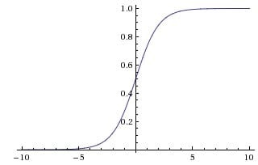
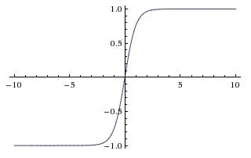
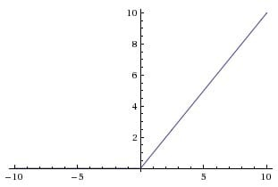
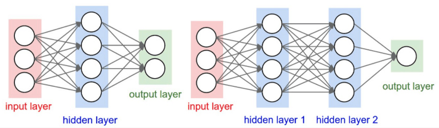

# 使用Sequential and Module定义模型

## 1. 多层神经网络

线性回归中， y = w x + b

 Logistic 回归中，y = Sigmoid(w x + b)，其中 Sigmoid 被称为激活函数

它们都可以看成单层神经网络


右边的神经网络，首先接受数据输入，然后通过计算得到结果，接着经过**激活函数**，再传给第二层的神经元。

### 1.1 激活函数

神经网络使用的激活函数都是非线性的，每个激活函数都输入一个值，然后做一种特定的数学运算得到一个结果，下面举几个例子

sigmoid 激活函数

$$
\sigma(x) = \frac{1}{1 + e^{-x}}
$$



tanh 激活函数

$$
tanh(x) = 2 \sigma(2x) - 1
$$



ReLU 激活函数

$$
ReLU(x) = max(0, x)
$$



现在神经网络中 90% 的情况都是使用ReLU 激活函数。一般一个一层的神经网络的公式就是 $y = max(0, w x + b)$，一个两层的神经网络就是

$$
y = w_2\ max(0, w_1 x + b_1) + b_2
$$

，非常简单，但是却很有效，使用这个激活函数能够加快梯度下降法的收敛速度，同时对比与其他的激活函数，这个激活函数计算更加简单，所以现在变得非常流行，之后你会发现我们激活在所有的神经网络中都会使用它。

### 1.2 神经网络的结构

神经网络就是很多个神经元堆在一起形成一层神经网络，那么多个层堆叠在一起就是深层神经网络，我们可以通过下面的图展示一个两层的神经网络和三层的神经网络



输入层需要根据特征数目来决定，输出层根据解决的问题来决定，那么隐藏层的网路层数以及每层的神经元数就是可以调节的参数，而不同的层数和每层的参数对模型的影响非常大。

### 1.3 为什么要使用激活函数

因为神经元需要通过激活才能往后传播，所以神经网络中需要激活函数

比如一个两层的神经网络，使用 A 表示激活函数，那么
$$
y = w_2 A(w_1 x)
$$
如果我们不使用激活函数，那么神经网络的结果就是
$$
y = w_2 (w_1 x) = (w_2 w_1) x = \bar{w} x
$$
可以看到，我们将两层神经网络的参数合在一起，用 $\bar{w}$ 来表示，两层的神经网络其实就变成了一层神经网络，只不过参数变成了新的 $\bar{w}$，所以如果不使用激活函数，那么不管多少层的神经网络，
$$
y = w_n \cdots w_2 w_1 x = \bar{w} x
$$
就都变成了单层神经网络，所以在每一层我们都必须使用激活函数。

使用了激活函数之后，神经网络可以通过改变权重实现任意形状，越是复杂的神经网络能拟合的形状越复杂，这就是著名的神经网络万有逼近定理。

***神经网络因为有了激活函数的存在，成了一个非线性分类器，所以神经网络分类的边界更加复杂。***

## 2. Sequential和Module

对于前面的线性回归模型、 Logistic回归模型和神经网络，我们在构建的时候定义了需要的参数。这对于比较小的模型是可行的，但是对于大的模型，比如100 层的神经网络，这个时候再去手动定义参数就显得非常麻烦，所以 PyTorch 提供了两个模块来帮助我们构建模型，一个是Sequential，一个是 Module。

Sequential 允许我们构建序列化的模块，而 Module 是一种更加灵活的模型定义方式

```python
''' 1. 构建模型的时候定义需要的参数 '''
# 定义两层神经网络的参数
w1 = nn.Parameter(torch.randn(2, 4) * 0.01) # 隐藏层神经元个数 2
b1 = nn.Parameter(torch.zeros(4))

w2 = nn.Parameter(torch.randn(4, 1) * 0.01)
b2 = nn.Parameter(torch.zeros(1))

# 定义模型
def two_network(x):
    x1 = torch.mm(x, w1) + b1
    x1 = F.tanh(x1) # 使用 PyTorch 自带的 tanh 激活函数
    x2 = torch.mm(x1, w2) + b2
    return x2

optimizer = torch.optim.SGD([w1, w2, b1, b2], 1.)
criterion = nn.BCEWithLogitsLoss()


# 我们训练 10000 次
for e in range(10000):
    out = two_network(Variable(x))
    loss = criterion(out, Variable(y))
    optimizer.zero_grad()
    loss.backward()
    optimizer.step()
    if (e + 1) % 1000 == 0:
        print('epoch: {}, loss: {}'.format(e+1, loss.data[0]))
```

```python
''' 2. 直接使用Sequential构建模型 '''
# Sequential
seq_net = nn.Sequential(
    nn.Linear(2, 4), # PyTorch 中的线性层，wx + b， Linear(in_features=2, out_features=4)
    nn.Tanh(),
    nn.Linear(4, 1)
)

# 序列模块可以通过索引访问每一层
seq_net[0] # 第一层

# 打印出第一层的权重
w0 = seq_net[0].weight
print(w0)

# 通过 parameters 可以取得模型的参数
param = seq_net.parameters()

# 定义优化器
optim = torch.optim.SGD(param, 1.)
criterion = nn.BCEWithLogitsLoss()


# 我们训练 10000 次
for e in range(10000):
    out = seq_net(Variable(x))
    loss = criterion(out, Variable(y))
    optim.zero_grad()
    loss.backward()
    optim.step()
    if (e + 1) % 1000 == 0:
        print('epoch: {}, loss: {}'.format(e+1, loss.data[0]))
```

## 3. 保存模型

保存模型在 PyTorch 中有两种方式，一种是将模型结构和参数都保存在一起，一种是只将参数保存下来

### 3.1 将模型结构和参数都保存在一起

```python
# 将参数和模型保存在一起
'''
torch.save里面有两个参数，第一个是要保存的模型，第二个参数是保存的路径
'''
torch.save(seq_net, 'save_seq_net.pth')

# 读取保存的模型
seq_net1 = torch.load('save_seq_net.pth')
```

### 3.2 只将参数保存下来-可移植性更强

```python
# 保存模型参数
torch.save(seq_net.state_dict(), 'save_seq_net_params.pth')

''' 通过上面的方式，我们保存了模型的参数，如果要重新读入模型的参数，首先我们需要重新定义一次模型，接着重新读入参数 '''
seq_net2 = nn.Sequential(
    nn.Linear(2, 4),
    nn.Tanh(),
    nn.Linear(4, 1)
)

seq_net2.load_state_dict(torch.load('save_seq_net_params.pth'))
```

## 4. 使用Module定义模型

```python
'''
Module 里面也可以使用 Sequential，同时 Module 非常灵活，具体体现在 forward 中，如何复杂的操作都能直观的在 forward 里面执行
'''
class 网络名字(nn.Module):
    def __init__(self, 一些定义的参数):
        super(网络名字, self).__init__()
        self.layer1 = nn.Linear(num_input, num_hidden)
        self.layer2 = nn.Sequential(...)
        ...

        定义需要用的网络层

    def forward(self, x): # 定义前向传播
        x1 = self.layer1(x)
        x2 = self.layer2(x)
        x = x1 + x2
        ...
        return x
```

### 4.1 例子

```python
class module_net(nn.Module):
    def __init__(self, num_input, num_hidden, num_output):
        super(module_net, self).__init__()
        self.layer1 = nn.Linear(num_input, num_hidden)

        self.layer2 = nn.Tanh()

        self.layer3 = nn.Linear(num_hidden, num_output)

    def forward(self, x):
        x = self.layer1(x)
        x = self.layer2(x)
        x = self.layer3(x)
        return x

mo_net = module_net(2, 4, 1)

# 访问模型中的某层可以直接通过名字
# 第一层
l1 = mo_net.layer1
print(l1)            # Linear(in_features=2, out_features=4)

# 打印出第一层的权重
print(l1.weight)

# 定义优化器
optim = torch.optim.SGD(mo_net.parameters(), 1.)

# 我们训练 10000 次
for e in range(10000):
    out = mo_net(Variable(x))
    loss = criterion(out, Variable(y))
    optim.zero_grad()
    loss.backward()
    optim.step()
    if (e + 1) % 1000 == 0:
        print('epoch: {}, loss: {}'.format(e+1, loss.data[0]))
    
# 保存模型
torch.save(mo_net.state_dict(), 'module_net.pth')
```

