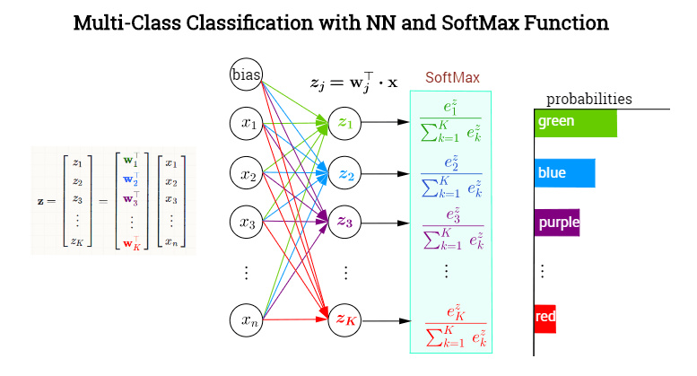

# 深层神经网络

## 1. 多分类问题

### 1.1 softmax函数

sigmoid 函数，如下

$$
s(x) = \frac{1}{1 + e^{-x}}
$$

可以将任何一个值转换到 0 ~ 1 之间，当然对于一个二分类问题，这样就足够了，因为对于二分类问题，如果不属于第一类，那么必定属于第二类，所以只需要用一个值来表示其属于其中一类概率，但是对于多分类问题，这样并不行，需要知道其属于每一类的概率，这个时候就需要 softmax 函数了。



对于网络的输出 
$$
z_1, z_2, \cdots z_k
$$
我们首先对他们每个都取指数变成 $e^{z_1}, e^{z_2}, \cdots, e^{z_k}$，那么每一项都除以他们的求和，也就是
$$
z*i \rightarrow \frac{e^{z_i}}{\sum*{j=1}^{k} e^{z_j}}
$$
如果对经过 softmax 函数的所有项求和就等于 1，所以他们每一项都分别表示属于其中某一类的概率。

### 1.2 交叉熵

交叉熵衡量两个分布相似性的一种度量方式，二分类问题的 loss 函数就是交叉熵的一种特殊情况，交叉熵的一般公式为
$$
cross_entropy(p, q) = E*{p}[-\log q] = - \frac{1}{m} \sum*{x} p(x) \log q(x)
$$
对于二分类问题我们可以写成
$$
-\frac{1}{m} \sum_{i=1}^m (y^{i} \log sigmoid(x^{i}) + (1 - y^{i}) \log (1 - sigmoid(x^{i}))
$$
这就是我们之前讲的二分类问题的 loss

## 2. minist例子

```python
import numpy as np
import torch
from torchvision.datasets import mnist # 导入 pytorch 内置的 mnist 数据

from torch import nn
from torch.autograd import Variable

# 使用内置函数下载 mnist 数据集
train_set = mnist.MNIST('./data', train=True, download=True)
test_set = mnist.MNIST('./data', train=False, download=True)

# 查看单个数据
a_data, a_label = train_set[0]
a_data = np.array(a_data, dtype='float32')
print(a_data.shape)     # (28, 28)
```

```python
# 对于神经网络，我们第一层的输入就是 28 x 28 = 784，所以必须将得到的数据我们做一个变换
def data_tf(x):
    x = np.array(x, dtype='float32') / 255
    x = (x - 0.5) / 0.5  # 标准化，这个技巧之后会讲到
    x = x.reshape((-1,)) # 拉平
    x = torch.from_numpy(x)
    return x

train_set = mnist.MNIST('./data', train=True, transform=data_tf, download=True)    # 重新载入数据集，申明定义的数据变换
test_set = mnist.MNIST('./data', train=False, transform=data_tf, download=True)

# 查看单个数据
a, a_label = train_set[0]
print(a.shape)       # torch.Size([784])
print(a_label)       # 5
```

```python
from torch.utils.data import DataLoader

# 使用 pytorch 自带的 DataLoader 定义一个数据迭代器,使用这样的数据迭代器是非常有必要的，如果数据量太大，就无法一次将他们全部读入内存，所以需要使用 python 迭代器，每次生成一个批次的数据
train_data = DataLoader(train_set, batch_size=64, shuffle=True)
test_data = DataLoader(test_set, batch_size=128, shuffle=False)

a, a_label = next(iter(train_data))
# 打印出一个批次的数据大小
print(a.shape)           # torch.Size([64, 784])
print(a_label.shape)     # torch.Size([64])
```

```python
# 使用 Sequential 定义 4 层神经网络
net = nn.Sequential(
    nn.Linear(784, 400),
    nn.ReLU(),
    nn.Linear(400, 200),
    nn.ReLU(),
    nn.Linear(200, 100),
    nn.ReLU(),
    nn.Linear(100, 10)
)

# 定义 loss 函数
criterion = nn.CrossEntropyLoss()
optimizer = torch.optim.SGD(net.parameters(), 1e-1) # 使用随机梯度下降，学习率 0.1

# 开始训练
losses = []
acces = []
eval_losses = []
eval_acces = []

for e in range(20):
    train_loss = 0
    train_acc = 0
    net.train()
    for im, label in train_data:
        im = Variable(im)
        label = Variable(label)
        # 前向传播
        out = net(im)
        loss = criterion(out, label)
        # 反向传播
        optimizer.zero_grad()
        loss.backward()
        optimizer.step()
        # 记录误差
        train_loss += loss.data[0]
        # 计算分类的准确率
        _, pred = out.max(1)
        num_correct = (pred == label).sum().data[0]
        acc = num_correct / im.shape[0]
        train_acc += acc

    losses.append(train_loss / len(train_data))
    acces.append(train_acc / len(train_data))
    
    # 在测试集上检验效果
    eval_loss = 0
    eval_acc = 0
    net.eval() # 将模型改为预测模式
    for im, label in test_data:
        im = Variable(im)
        label = Variable(label)
        out = net(im)
        loss = criterion(out, label)
        # 记录误差
        eval_loss += loss.data[0]
        # 记录准确率
        _, pred = out.max(1)
        num_correct = (pred == label).sum().data[0]
        acc = num_correct / im.shape[0]
        eval_acc += acc

    eval_losses.append(eval_loss / len(test_data))
    eval_acces.append(eval_acc / len(test_data))
    print('epoch: {}, Train Loss: {:.6f}, Train Acc: {:.6f}, Eval Loss: {:.6f}, Eval Acc: {:.6f}'
          .format(e, train_loss / len(train_data), train_acc / len(train_data), 
                     eval_loss / len(test_data), eval_acc / len(test_data)))
```

```python
''' 绘制曲线 '''
import matplotlib.pyplot as plt
%matplotlib inline

plt.title('train loss')
plt.plot(np.arange(len(losses)), losses)

plt.plot(np.arange(len(acces)), acces)
plt.title('train acc')

plt.plot(np.arange(len(eval_losses)), eval_losses)
plt.title('test loss')

plt.plot(np.arange(len(eval_acces)), eval_acces)
plt.title('test acc')
```

