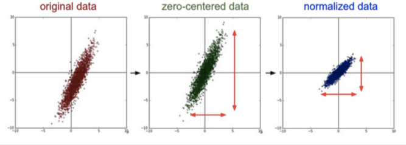
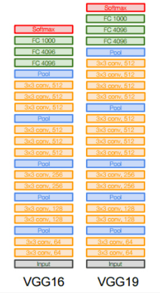
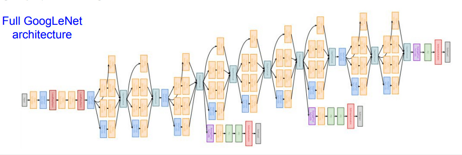
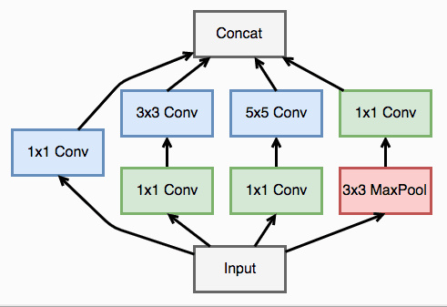
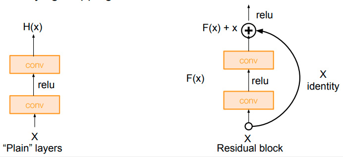

# 卷积神经网络

## 1. 卷积模块介绍

### 1.1 卷积

卷积在 pytorch 中有两种方式，一种是 `torch.nn.Conv2d()`，一种是 `torch.nn.functional.conv2d()`，这两种形式本质都是使用一个卷积操作

这两种形式的卷积对于输入的要求都是一样的，首先需要输入是一个 `torch.autograd.Variable()` 的类型，大小是 (batch, channel, H, W)，其中 batch 表示输入的一批数据的数目，第二个是输入的通道数，一般一张彩色的图片是 3，灰度图是 1，而卷积网络过程中的通道数比较大，会出现几十到几百的通道数，H 和 W 表示输入图片的高度和宽度，比如一个 batch 是 32 张图片，每张图片是 3 通道，高和宽分别是 50 和 100，那么输入的大小就是 (32, 3, 50, 100)

```python
import numpy as np
import torch
from torch import nn
from torch.autograd import Variable
import torch.nn.functional as F
from PIL import Image
import matplotlib.pyplot as plt

im = Image.open('./cat.png').convert('L') # 读入一张灰度图的图片
im = np.array(im, dtype='float32') # 将其转换为一个矩阵

# 可视化图片
plt.imshow(im.astype('uint8'), cmap='gray')

# 将图片矩阵转化为 pytorch tensor，并适配卷积输入的要求
im = torch.from_numpy(im.reshape((1, 1, im.shape[0], im.shape[1])))
```

```python
''' 定义一个算子对其进行轮廓检测 '''
#### 1. 使用 nn.Conv2d
conv1 = nn.Conv2d(1, 1, 3, bias=False) # 定义卷积

sobel_kernel = np.array([[-1, -1, -1], [-1, 8, -1], [-1, -1, -1]], dtype='float32') # 定义轮廓检测算子
sobel_kernel = sobel_kernel.reshape((1, 1, 3, 3))  # 适配卷积的输入输出
conv1.weight.data = torch.from_numpy(sobel_kernel) # 给卷积的 kernel 赋值

edge1 = conv1(Variable(im)) # 作用在图片上
edge1 = edge1.data.squeeze().numpy() # 将输出转换为图片的格式


# 可视化边缘检测之后的结果
plt.imshow(edge1, cmap='gray')
plt.show()

### 2. 使用 F.conv2d
sobel_kernel = np.array([[-1, -1, -1], [-1, 8, -1], [-1, -1, -1]], dtype='float32') # 定义轮廓检测算子
sobel_kernel = sobel_kernel.reshape((1, 1, 3, 3)) # 适配卷积的输入输出
weight = Variable(torch.from_numpy(sobel_kernel))

edge2 = F.conv2d(Variable(im), weight) # 作用在图片上
edge2 = edge2.data.squeeze().numpy() # 将输出转换为图片的格式

# 可视化边缘检测之后的结果
plt.imshow(edge2, cmap='gray')
plt.show()
```

可以看到两种形式能够得到相同的效果，不同的地方在于使用 `nn.Conv2d()` 相当于直接定义了一层卷积网络结构，而使用 `torch.nn.functional.conv2d()` 相当于定义了一个卷积的操作，所以使用后者需要再额外去定义一个 weight，而且这个 weight 也必须是一个 Variable，而使用 `nn.Conv2d()` 则会帮我们默认定义一个随机初始化的 weight，如果我们需要修改，那么取出其中的值对其修改，如果不想修改，那么可以直接使用这个默认初始化的值，非常方便

**实际使用中我们基本都使用 `nn.Conv2d()` 这种形式**

### 1.2 池化层

卷积网络中另外一个非常重要的结构就是池化，这是利用了图片的下采样不变性，即一张图片变小了还是能够看出了这张图片的内容，而使用池化层能够将图片大小降低，非常好地提高了计算效率，同时池化层也没有参数。池化的方式有很多种，比如最大值池化，均值池化等等，在卷积网络中一般使用最大值池化。

在 pytorch 中最大值池化的方式也有两种，一种是 `nn.MaxPool2d()`，一种是 `torch.nn.functional.max_pool2d()`，他们对于图片的输入要求跟卷积对于图片的输入要求是一样的

```python
import numpy as np
import torch
from torch import nn
from torch.autograd import Variable
import torch.nn.functional as F
from PIL import Image
import matplotlib.pyplot as plt

im = Image.open('./cat.png').convert('L') # 读入一张灰度图的图片
im = np.array(im, dtype='float32') # 将其转换为一个矩阵

# 可视化图片
plt.imshow(im.astype('uint8'), cmap='gray')

# 将图片矩阵转化为 pytorch tensor
im = torch.from_numpy(im.reshape((1, 1, im.shape[0], im.shape[1])))
```

```python
### 1.使用 nn.MaxPool2d
pool1 = nn.MaxPool2d(2, 2)
print('before max pool, image shape: {} x {}'.format(im.shape[2], im.shape[3]))
small_im1 = pool1(Variable(im))
small_im1 = small_im1.data.squeeze().numpy()
print('after max pool, image shape: {} x {} '.format(small_im1.shape[0], small_im1.shape[1]))


### 2.使用 F.max_pool2d
print('before max pool, image shape: {} x {}'.format(im.shape[2], im.shape[3]))
small_im2 = F.max_pool2d(Variable(im), 2, 2)
small_im2 = small_im2.data.squeeze().numpy()
print('after max pool, image shape: {} x {} '.format(small_im1.shape[0], small_im1.shape[1]))
plt.imshow(small_im2, cmap='gray')
```

**跟卷积层一样，实际使用中，我们一般使用 `nn.MaxPool2d()`**

## 2. 批标准化

因为模型训练并不容易，特别是一些非常复杂的模型，并不能非常好的训练得到收敛的结果，所以对数据增加一些预处理，同时使用批标准化能够得到非常好的收敛结果，这也是卷积网络能够训练到非常深的层的一个重要原因。

### 2.1 数据预处理

目前数据预处理最常见的方法就是***中心化***和***标准化***

中心化相当于修正数据的中心位置，实现方法非常简单，就是在每个特征维度上减去对应的均值，最后得到 0 均值的特征。标准化也非常简单，在数据变成 0 均值之后，为了使得不同的特征维度有着相同的规模，可以除以标准差近似为一个标准正态分布，也可以依据最大值和最小值将其转化为 -1 ~ 1 之间



### 2.2 批标准化（Batch Normalization）

前面在数据预处理的时候，我们尽量输入特征不相关且满足一个标准的正态分布，这样模型的表现一般也较好。但是对于很深的网路结构，网路的非线性层会使得输出的结果变得相关，且不再满足一个标准的 N(0, 1) 的分布，甚至输出的中心已经发生了偏移，这对于模型的训练，特别是深层的模型训练非常的困难。

所以在 2015 年一篇论文提出了这个方法，批标准化，简而言之，就是对于每一层网络的输出，对其做一个归一化，使其服从标准的正态分布，这样后一层网络的输入也是一个标准的正态分布，所以能够比较好的进行训练，加快收敛速度。

batch normalization 的实现非常简单，对于给定的一个 batch 的数据

$$
B = {x_1, x_2, \cdots, x_m}
$$

算法的公式如下:

$$
\mu_B = \frac{1}{m} \sum_{i=1}^m x_i
\\ \sigma^2_B = \frac{1}{m} \sum_{i=1}^m (x_i - \mu_B)^2
\\  \hat{x}_i = \frac{x_i - \mu_B}{\sqrt{\sigma^2_B + \epsilon}}
\\ y_i = \gamma \hat{x}_i + \beta
$$

第一行和第二行是计算出一个 batch 中数据的均值和方差，接着使用第三个公式对 batch 中的每个数据点做标准化，ε 是为了计算稳定引入的一个小的常数，通常取 $10^{-5}$，最后利用权重修正得到最后的输出结果，非常的简单，下面我们可以实现一下简单的一维的情况，也就是神经网络中的情况

```python
import torch

def simple_batch_norm_1d(x, gamma, beta):
    eps = 1e-5
    x_mean = torch.mean(x, dim=0, keepdim=True) # 保留维度进行 broadcast
    x_var = torch.mean((x - x_mean) ** 2, dim=0, keepdim=True)
    x_hat = (x - x_mean) / torch.sqrt(x_var + eps)
    return gamma.view_as(x_mean) * x_hat + beta.view_as(x_mean)


x = torch.arange(15).view(5, 3)
gamma = torch.ones(x.shape[1])
beta = torch.zeros(x.shape[1])
print('before bn: \n', x)
y = simple_batch_norm_1d(x, gamma, beta)
print('after bn: \n', y)
```

会出现一个问题，就是测试的时候该使用批标准化吗？

答案是肯定的，因为训练的时候使用了，而测试的时候不使用肯定会导致结果出现偏差，但是测试的时候如果只有一个数据集，那么均值不就是这个值，方差为 0 吗？这显然是随机的，所以测试的时候不能用测试的数据集去算均值和方差，而是*用训练的时候算出的移动平均均值和方差去代替*.

使用批标准化的情况能够更快的收敛，因为这只是一个小网络，所以用不用批标准化都能够收敛，但是对于更加深的网络，使用批标准化在训练的时候能够很快地收敛

pytorch 为我们内置了批标准化的函数，一维和二维分别是 `torch.nn.BatchNorm1d()` 和 `torch.nn.BatchNorm2d()`，pytorch 不仅将 γ 和 β 作为训练的参数，也将 `moving_mean` 和 `moving_var` 也作为参数进行训练

```python
import numpy as np
from torchvision.datasets import mnist # 导入 pytorch 内置的 mnist 数据
from torch.utils.data import DataLoader
from torch import nn
from torch.autograd import Variable

def data_tf(x):
    x = np.array(x, dtype='float32') / 255
    x = (x - 0.5) / 0.5 # 数据预处理，标准化
    x = torch.from_numpy(x)
    x = x.unsqueeze(0)
    return x

train_set = mnist.MNIST('./data', train=True, transform=data_tf, download=True) # 重新载入数据集，申明定义的数据变换
test_set = mnist.MNIST('./data', train=False, transform=data_tf, download=True)
train_data = DataLoader(train_set, batch_size=64, shuffle=True)
test_data = DataLoader(test_set, batch_size=128, shuffle=False)
```

```python
### 1.使用批标准化
class conv_bn_net(nn.Module):
    def __init__(self):
        super(conv_bn_net, self).__init__()
        self.stage1 = nn.Sequential(
            nn.Conv2d(1, 6, 3, padding=1),
            nn.BatchNorm2d(6),
            nn.ReLU(True),
            nn.MaxPool2d(2, 2),
            nn.Conv2d(6, 16, 5),
            nn.BatchNorm2d(16),
            nn.ReLU(True),
            nn.MaxPool2d(2, 2)
        )

        self.classfy = nn.Linear(400, 10)
    def forward(self, x):
        x = self.stage1(x)
        x = x.view(x.shape[0], -1)
        x = self.classfy(x)
        return x

net = conv_bn_net()
optimizer = torch.optim.SGD(net.parameters(), 1e-1) # 使用随机梯度下降，学习率 0.1

train(net, train_data, test_data, 5, optimizer, criterion)
```

```python
### 2. 不使用批标准化
class conv_no_bn_net(nn.Module):
    def __init__(self):
        super(conv_no_bn_net, self).__init__()
        self.stage1 = nn.Sequential(
            nn.Conv2d(1, 6, 3, padding=1),
            nn.ReLU(True),
            nn.MaxPool2d(2, 2),
            nn.Conv2d(6, 16, 5),
            nn.ReLU(True),
            nn.MaxPool2d(2, 2)
        )

        self.classfy = nn.Linear(400, 10)
    def forward(self, x):
        x = self.stage1(x)
        x = x.view(x.shape[0], -1)
        x = self.classfy(x)
        return x

net = conv_no_bn_net()
optimizer = torch.optim.SGD(net.parameters(), 1e-1) # 使用随机梯度下降，学习率 0.1

train(net, train_data, test_data, 5, optimizer, criterion)
```

## 3. 计算机视觉 - VGG

### 3.1 数据集CIFAR 10

### 3.2 VGGNet



vgg 几乎全部使用 3 x 3 的卷积核以及 2 x 2 的池化层，使用小的卷积核进行多层的堆叠和一个大的卷积核的感受是相同的，同时小的卷积核还能减少参数，同时可以有更深的结构。

```python
import numpy as np
import torch
from torch import nn
from torch.autograd import Variable
from torchvision.datasets import CIFAR10
```

```python
# 实现模块vgg_block：很多层 3 x 3 的卷积然后再连接一个最大池化层
# 传入三个参数，第一个是模型层数，第二个是输入的通道数，第三个是输出的通道数，第一层卷积接受的输入通道就是图片输入的通道数，然后输出最后的输出通道数，后面的卷积接受的通道数就是最后的输出通道数
def vgg_block(num_convs, in_channels, out_channels):
    net = [nn.Conv2d(in_channels, out_channels, kernel_size=3, padding=1), nn.ReLU(True)] # 定义第一层

    for i in range(num_convs-1): # 定义后面的很多层
        net.append(nn.Conv2d(out_channels, out_channels, kernel_size=3, padding=1))
        net.append(nn.ReLU(True))

    net.append(nn.MaxPool2d(2, 2)) # 定义池化层
    return nn.Sequential(*net)
```

```python
block_demo = vgg_block(3, 64, 128)
print(block_demo)

# 首先定义输入为 (1, 64, 300, 300)
input_demo = Variable(torch.zeros(1, 64, 300, 300))
output_demo = block_demo(input_demo)
print(output_demo.shape)    # torch.Size([1, 128, 150, 150])
```

```python
# 定义一个函数对这个 vgg block 进行堆叠
def vgg_stack(num_convs, channels):
    net = []
    for n, c in zip(num_convs, channels):
        in_c = c[0]
        out_c = c[1]
        net.append(vgg_block(n, in_c, out_c))
    return nn.Sequential(*net)
```

```python
# 定义一个稍微简单一点的 vgg 结构，其中有 8 个卷积层
vgg_net = vgg_stack((1, 1, 2, 2, 2), ((3, 64), (64, 128), (128, 256), (256, 512), (512, 512)))
print(vgg_net)

# 上边网络结构中有5个最大池化，因此图片大小会减少2^5倍
```

```python
# 使用前面实现的模块定义模型
class vgg(nn.Module):
    def __init__(self):
        super(vgg, self).__init__()
        self.feature = vgg_net
        self.fc = nn.Sequential(
            nn.Linear(512, 100),
            nn.ReLU(True),
            nn.Linear(100, 10)
        )
    def forward(self, x):
        x = self.feature(x)
        x = x.view(x.shape[0], -1)
        x = self.fc(x)
        return x
```

```python
# 训练模型看看在 cifar10 上的效果
from utils import train

def data_tf(x):
    x = np.array(x, dtype='float32') / 255
    x = (x - 0.5) / 0.5 # 标准化，这个技巧之后会讲到
    x = x.transpose((2, 0, 1)) # 将 channel 放到第一维，只是 pytorch 要求的输入方式
    x = torch.from_numpy(x)
    return x

train_set = CIFAR10('./data', train=True, transform=data_tf)
train_data = torch.utils.data.DataLoader(train_set, batch_size=64, shuffle=True)
test_set = CIFAR10('./data', train=False, transform=data_tf)
test_data = torch.utils.data.DataLoader(test_set, batch_size=128, shuffle=False)


net = vgg()
optimizer = torch.optim.SGD(net.parameters(), lr=1e-1)
criterion = nn.CrossEntropyLoss()

train(net, train_data, test_data, 20, optimizer, criterion)
```

## 4. GoogLeNet



### 4.1 Inception模块

在上面的网络中，我们看到了多个四个并行卷积的层，这些四个卷积并行的层就是 inception 模块，可视化如下



一个 inception 模块的四个并行线路如下：

1.一个 1 x 1 的卷积，一个小的感受野进行卷积提取特征

2.一个 1 x 1 的卷积加上一个 3 x 3 的卷积，1 x 1 的卷积降低输入的特征通道，减少参数计算量，然后接一个 3 x 3 的卷积做一个较大感受野的卷积

3.一个 1 x 1 的卷积加上一个 5 x 5 的卷积，作用和第二个一样

4.一个 3 x 3 的最大池化加上 1 x 1 的卷积，最大池化改变输入的特征排列，1 x 1 的卷积进行特征提取

最后将四个并行线路得到的特征在通道这个维度上拼接在一起

```python
''' Inception模块实现 '''
import numpy as np
import torch
from torch import nn
from torch.autograd import Variable
from torchvision.datasets import CIFAR10

# 定义一个卷积加一个 relu 激活函数和一个 batchnorm 作为一个基本的层结构
def conv_relu(in_channel, out_channel, kernel, stride=1, padding=0):
    layer = nn.Sequential(
        nn.Conv2d(in_channel, out_channel, kernel, stride, padding),
        nn.BatchNorm2d(out_channel, eps=1e-3),
        nn.ReLU(True)
    )
    return layer


class inception(nn.Module):
    def __init__(self, in_channel, out1_1, out2_1, out2_3, out3_1, out3_5, out4_1):
        super(inception, self).__init__()
        # 第一条线路
        self.branch1x1 = conv_relu(in_channel, out1_1, 1)

        # 第二条线路
        self.branch3x3 = nn.Sequential( 
            conv_relu(in_channel, out2_1, 1),
            conv_relu(out2_1, out2_3, 3, padding=1)
        )

        # 第三条线路
        self.branch5x5 = nn.Sequential(
            conv_relu(in_channel, out3_1, 1),
            conv_relu(out3_1, out3_5, 5, padding=2)
        )

        # 第四条线路
        self.branch_pool = nn.Sequential(
            nn.MaxPool2d(3, stride=1, padding=1),
            conv_relu(in_channel, out4_1, 1)
        )

    def forward(self, x):
        f1 = self.branch1x1(x)
        f2 = self.branch3x3(x)
        f3 = self.branch5x5(x)
        f4 = self.branch_pool(x)
        output = torch.cat((f1, f2, f3, f4), dim=1)
        return output
```

```python
test_net = inception(3, 64, 48, 64, 64, 96, 32)
test_x = Variable(torch.zeros(1, 3, 96, 96))
print('input shape: {} x {} x {}'.format(test_x.shape[1], test_x.shape[2], test_x.shape[3]))             # input shape: 3 x 96 x 96
test_y = test_net(test_x)
print('output shape: {} x {} x {}'.format(test_y.shape[1], test_y.shape[2], test_y.shape[3]))			  # output shape: 256 x 96 x 96
```

GoogLeNet 可以看作是很多个 inception 模块的串联(原论文中使用了多个输出来解决梯度消失的问题，这里我们只定义一个简单版本的 GoogLeNet，简化为一个输出)

```python
class googlenet(nn.Module):
    def __init__(self, in_channel, num_classes, verbose=False):
        super(googlenet, self).__init__()
        self.verbose = verbose

        self.block1 = nn.Sequential(
            conv_relu(in_channel, out_channel=64, kernel=7, stride=2, padding=3),
            nn.MaxPool2d(3, 2)
        )

        self.block2 = nn.Sequential(
            conv_relu(64, 64, kernel=1),
            conv_relu(64, 192, kernel=3, padding=1),
            nn.MaxPool2d(3, 2)
        )

        self.block3 = nn.Sequential(
            inception(192, 64, 96, 128, 16, 32, 32),
            inception(256, 128, 128, 192, 32, 96, 64),
            nn.MaxPool2d(3, 2)
        )

        self.block4 = nn.Sequential(
            inception(480, 192, 96, 208, 16, 48, 64),
            inception(512, 160, 112, 224, 24, 64, 64),
            inception(512, 128, 128, 256, 24, 64, 64),
            inception(512, 112, 144, 288, 32, 64, 64),
            inception(528, 256, 160, 320, 32, 128, 128),
            nn.MaxPool2d(3, 2)
        )

        self.block5 = nn.Sequential(
            inception(832, 256, 160, 320, 32, 128, 128),
            inception(832, 384, 182, 384, 48, 128, 128),
            nn.AvgPool2d(2)
        )

        self.classifier = nn.Linear(1024, num_classes)

    def forward(self, x):
        x = self.block1(x)
        if self.verbose:
            print('block 1 output: {}'.format(x.shape))
        x = self.block2(x)
        if self.verbose:
            print('block 2 output: {}'.format(x.shape))
        x = self.block3(x)
        if self.verbose:
            print('block 3 output: {}'.format(x.shape))
        x = self.block4(x)
        if self.verbose:
            print('block 4 output: {}'.format(x.shape))
        x = self.block5(x)
        if self.verbose:
            print('block 5 output: {}'.format(x.shape))
        x = x.view(x.shape[0], -1)
        x = self.classifier(x)
        return x

  
test_net = googlenet(3, 10, True)
test_x = Variable(torch.zeros(1, 3, 96, 96))
test_y = test_net(test_x)
print('output: {}'.format(test_y.shape))
```

```python
from utils import train

def data_tf(x):
    x = x.resize((96, 96), 2) # 将图片放大到 96 x 96
    x = np.array(x, dtype='float32') / 255
    x = (x - 0.5) / 0.5 # 标准化，这个技巧之后会讲到
    x = x.transpose((2, 0, 1)) # 将 channel 放到第一维，只是 pytorch 要求的输入方式
    x = torch.from_numpy(x)
    return x

train_set = CIFAR10('./data', train=True, transform=data_tf)
train_data = torch.utils.data.DataLoader(train_set, batch_size=64, shuffle=True)
test_set = CIFAR10('./data', train=False, transform=data_tf)
test_data = torch.utils.data.DataLoader(test_set, batch_size=128, shuffle=False)

net = googlenet(3, 10)
optimizer = torch.optim.SGD(net.parameters(), lr=0.01)
criterion = nn.CrossEntropyLoss()

train(net, train_data, test_data, 20, optimizer, criterion)
```

## 5. ResNet

ResNet 有效地解决了深度神经网络难以训练的问题，可以训练高达 1000 层的卷积网络。***网络之所以难以训练，是因为存在着梯度消失的问题，离 loss 函数越远的层，在反向传播的时候，梯度越小，就越难以更新，随着层数的增加，这个现象越严重***。

之前有两种常见的方案来解决这个问题：

1.按层训练，先训练比较浅的层，然后在不断增加层数，但是这种方法效果不是特别好，而且比较麻烦

2.使用更宽的层，或者增加输出通道，而不加深网络的层数，这种结构往往得到的效果又不好

ResNet 通过***引入了跨层链接解决了梯度回传消失的问题***。



普通的网络连接跟跨层残差连接的对比图如上，使用普通的连接，上层的梯度必须要一层一层传回来，而是用残差连接，相当于中间有了一条更短的路，梯度能够从这条更短的路传回来，避免了梯度过小的情况。

假设某层的输入是 x，期望输出是 H(x)， 如果我们直接把输入 x 传到输出作为初始结果，这就是一个更浅层的网络，更容易训练，而这个网络没有学会的部分，我们可以使用更深的网络 F(x) 去训练它，使得训练更加容易，最后希望拟合的结果就是 F(x) = H(x) - x，这就是一个残差的结构

残差网络的结构就是上面这种残差块（residual block）的堆叠

```python
''' residual block的实现 '''
import numpy as np
import torch
from torch import nn
import torch.nn.functional as F
from torch.autograd import Variable
from torchvision.datasets import CIFAR10

def conv3x3(in_channel, out_channel, stride=1):
    return nn.Conv2d(in_channel, out_channel, 3, stride=stride, padding=1, bias=False)

class residual_block(nn.Module):
    def __init__(self, in_channel, out_channel, same_shape=True):
        super(residual_block, self).__init__()
        self.same_shape = same_shape
        stride=1 if self.same_shape else 2

        self.conv1 = conv3x3(in_channel, out_channel, stride=stride)
        self.bn1 = nn.BatchNorm2d(out_channel)

        self.conv2 = conv3x3(out_channel, out_channel)
        self.bn2 = nn.BatchNorm2d(out_channel)
        if not self.same_shape:
            self.conv3 = nn.Conv2d(in_channel, out_channel, 1, stride=stride)

    def forward(self, x):
        out = self.conv1(x)
        out = F.relu(self.bn1(out), True)
        out = self.conv2(out)
        out = F.relu(self.bn2(out), True)

        if not self.same_shape:
            x = self.conv3(x)
        return F.relu(x+out, True)
```

```python
# 输入输出形状相同
test_net = residual_block(32, 32)
test_x = Variable(torch.zeros(1, 32, 96, 96))
print('input: {}'.format(test_x.shape))      # input: torch.Size([1, 32, 96, 96])
test_y = test_net(test_x)
print('output: {}'.format(test_y.shape))     # output: torch.Size([1, 32, 96, 96])
```

```python
class resnet(nn.Module):
    def __init__(self, in_channel, num_classes, verbose=False):
        super(resnet, self).__init__()
        self.verbose = verbose

        self.block1 = nn.Conv2d(in_channel, 64, 7, 2)

        self.block2 = nn.Sequential(
            nn.MaxPool2d(3, 2),
            residual_block(64, 64),
            residual_block(64, 64)
        )

        self.block3 = nn.Sequential(
            residual_block(64, 128, False),
            residual_block(128, 128)
        )

        self.block4 = nn.Sequential(
            residual_block(128, 256, False),
            residual_block(256, 256)
        )

        self.block5 = nn.Sequential(
            residual_block(256, 512, False),
            residual_block(512, 512),
            nn.AvgPool2d(3)
        )

        self.classifier = nn.Linear(512, num_classes)

    def forward(self, x):
        x = self.block1(x)
        if self.verbose:
            print('block 1 output: {}'.format(x.shape))
        x = self.block2(x)
        if self.verbose:
            print('block 2 output: {}'.format(x.shape))
        x = self.block3(x)
        if self.verbose:
            print('block 3 output: {}'.format(x.shape))
        x = self.block4(x)
        if self.verbose:
            print('block 4 output: {}'.format(x.shape))
        x = self.block5(x)
        if self.verbose:
            print('block 5 output: {}'.format(x.shape))
        x = x.view(x.shape[0], -1)
        x = self.classifier(x)
        return x
    
    
test_net = resnet(3, 10, True)
test_x = Variable(torch.zeros(1, 3, 96, 96))
test_y = test_net(test_x)
print('output: {}'.format(test_y.shape))
```

```python
from utils import train

def data_tf(x):
    x = x.resize((96, 96), 2)  # 将图片放大到 96 x 96
    x = np.array(x, dtype='float32') / 255
    x = (x - 0.5) / 0.5 	   # 标准化，这个技巧之后会讲到
    x = x.transpose((2, 0, 1)) # 将 channel 放到第一维，只是 pytorch 要求的输入方式
    x = torch.from_numpy(x)
    return x

train_set = CIFAR10('./data', train=True, transform=data_tf)
train_data = torch.utils.data.DataLoader(train_set, batch_size=64, shuffle=True)
test_set = CIFAR10('./data', train=False, transform=data_tf)
test_data = torch.utils.data.DataLoader(test_set, batch_size=128, shuffle=False)

net = resnet(3, 10)
optimizer = torch.optim.SGD(net.parameters(), lr=0.01)
criterion = nn.CrossEntropyLoss()

train(net, train_data, test_data, 20, optimizer, criterion)
```

