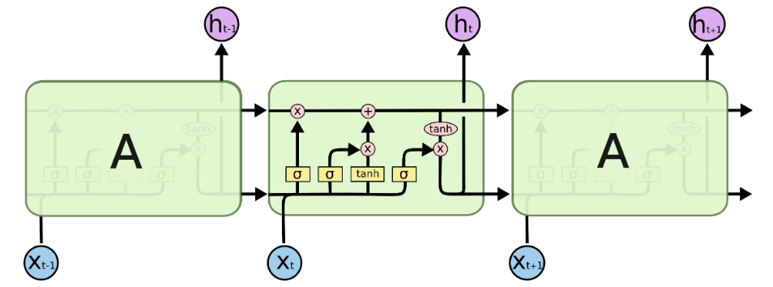
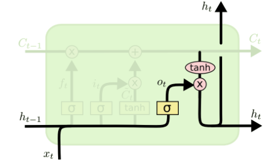
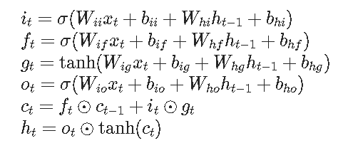

## 1. torch.nn.LSTM(*args, **kwargs)

> [了解 LSTM 网络 -- colah 的博客](http://colah.github.io/posts/2015-08-Understanding-LSTMs/)



    

> - **input_size** – The number of expected features in the input x
> - **hidden_size** – The number of features in the hidden state h
> - **num_layers** – Number of recurrent layers. E.g., setting `num_layers=2` would mean stacking two LSTMs together to form a stacked LSTM, with the second LSTM taking in outputs of the first LSTM and computing the final results. Default: 1
> - **bias** – If `False`, then the layer does not use bias weights b_ih and b_hh. Default: `True`
> - **batch_first** – If `True`, then the input and output tensors are provided as (batch, seq, feature) instead of (seq, batch, feature). Note that this does not apply to hidden or cell states. See the Inputs/Outputs sections below for details. Default: `False`
> - **dropout** – If non-zero, introduces a Dropout layer on the outputs of each LSTM layer except the last layer, with dropout probability equal to `dropout`. Default: 0
> - **bidirectional** – If `True`, becomes a bidirectional LSTM. Default: `False`
> - **proj_size** – If `> 0`, will use LSTM with projections of corresponding size. Default: 0

### Inputs: input,(h_0, c_0)（以batch_first=True为例）

> input : (batch_size, seq_length, input_size)  
>
> h_0 : (batch_size, D*num_layers, H~out~) （default to zeros）
>
> c_0 : (batch_size, D*num_layers, hidden_size) (default to zeros)

where:  

D = 2 if bidirectional=True otherwise 1

H~out~ = proj_size if proj_size > 0 otherwise hiddensize

### Outputs: output, (h_n, c_n)

> output : (batch_size, seq_length,  H~out~)
>
> h_0 : (batch_size, D*num_layers, H~out~) （default to zeros）
>
> c_0 : (batch_size, D*num_layers, hidden_size) (default to zeros)

### example

```
rnn = nn.LSTM(10, 20, 2)
input = torch.randn(5, 3, 10)   # (seq_length, batch_size, in_size)
h0 = torch.randn(2, 3, 20)		# (D*num_layers, batch_size, hidden_size)
c0 = torch.randn(2, 3, 20)		# (D*num_layers, batch_size, hidden_size)
output, (hn, cn) = rnn(input, (h0, c0))
```


