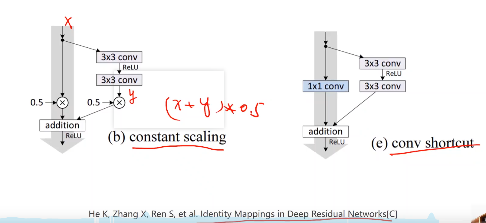

# 高级卷积神经网络

## 1. 概念

（1）处理复杂的神经网络：

（2）对于单个inception块，因为不知道3x3的卷积效果好还是5X5的卷积效果好，因此两种卷积操作都进行，最后进行拼接：

（3）1X1 的卷积，用于概念通道数，1X1卷积使得计算量大大减少：

（4）inception的实现：

进行张量的拼接，通道数变为：24+16+24+24=88

（5）使用inception块的卷积神经网络：

## 2. 层数堆叠的效果：

(1) 20-layer 的效果要优于56-layer，可能的原因是层数过多时反向传播会导致梯度消失（解决办法：一层一层去训练）

（2）梯度消失的解决办法：利用残差结构块deep residual learning

（3）代码实现：

（4）residual 的其它实现。

