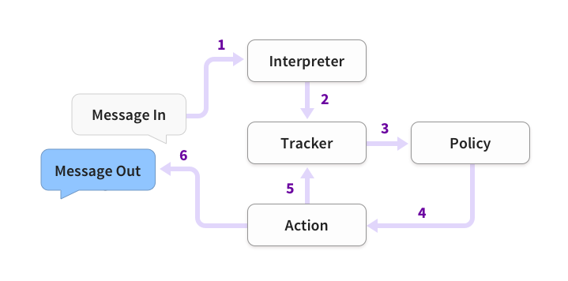

# Rasa架构

## rasa构建的助手响应消息的基本步骤



```
1. 收到消息并将其传递给解释器(Interpreter)，解释器将其转换为包含原始文本，意图和找到的任何实体的字典。这部分由NLU处理。 
2. 跟踪器(Tracker)是跟踪对话状态的对象。它接收新消息进入的信息。 
3. 策略(Policy)接收跟踪器的当前状态。 
4. 该策略选择接下来采取的操作(action)。 
5. 选择的操作由跟踪器记录。 
6. 响应被发送给用户。

注意 消息可以是人类输入的文本，也可以是按钮按下等结构化输入
```

