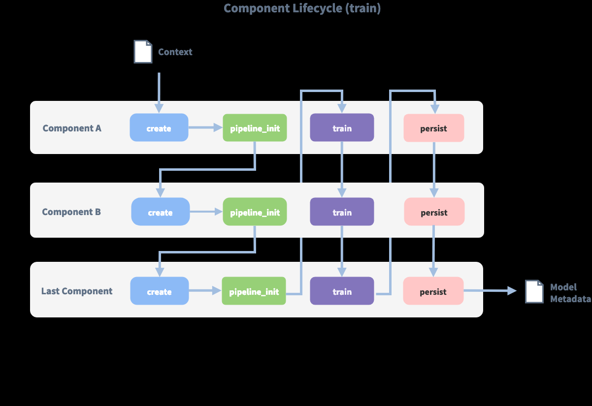

# NLU

## 1. NLU介绍

```
Rasa NLU是一个开源的自然语言处理根据，用于聊天机器人的意图分类(intend classification)、响应检索(response retrieval)和实体提取(entity extraction)
```

```
例子：
"I am looking for a Mexican restaurant in the center of town"

NLU返回：
{
  "intent": "search_restaurant",
  "entities": {
    "cuisine" : "Mexican",
    "location" : "center"
  }
}
```

## 2. 在Rasa中仅使用NLU

### 2.1 仅训练MLU模型

```
rasa train nlu

# 会查找在data/目录下的训练数据；将模型保存在models/
```

### 2.2 测试NLU模型

```
rasa shell nlu
rasa shell -m models/nlu-20190515-144445.tar.gz
```

### 2.3 运行NLU服务器

```
rasa run --enable-api -m models/nlu-20190515-144445.tar.gz
```

## 3. 训练数据格式

### 3.1 数据格式 - Markdown

```
-*+ [entity](entity name)
```

```
## intent:check_balance
- what is my balance <!-- no entity -->
- how much do I have on my [savings](source_account) <!-- entity "source_account" has value "savings" -->
- how much do I have on my [savings account](source_account:savings) <!-- synonyms, method 1-->
- Could I pay in [yen](currency)?  <!-- entity matched by lookup table -->

## intent:greet
- hey
- hello

## synonym:savings   <!-- synonyms, method 2 -->
- pink pig

## regex:zipcode
- [0-9]{5}

## lookup:currencies   <!-- lookup table list -->
- Yen
- USD
- Euro

## lookup:additional_currencies  <!-- no list to specify lookup table file -->
path/to/currencies.txt
```

```
训练数据可分类为四部分：
1. common examples （常见示例）
2. synonyms   （同义词）
3. regrex features and  （正则表达式功能和）
4. lookup tables     （查找表）


同义词会将提取的实体映射到相同的名称，例如，将“我的储蓄账户”映射到简单的“储蓄”。但是，这仅在提取实体后发生，因此您需要提供包含同义词的示例，以便 Rasa 可以学习选取它们。

可以将查找表直接指定为列表，也可以指定为包含换行符分隔的单词或短语的 txt 文件。加载训练数据后，这些文件用于生成添加到正则表达式功能的不区分大小写的正则表达式模式。例如，在这种情况下，提供了货币名称列表，以便更容易地挑选出此实体。
```

### 3.2 改进意图分类与实体识别

#### 3.2.1 常见示例

```
常见示例有三个组件：text/intent/entities，前两个是字符串，最后一个是数组。
text     -> （文本）用户消息【必填】
intent 	 -> （意向）与文本相关联的意向【可选】
entities -> （实体）是文本中需要标识的特定部分【可选】

实体由一个start值和一个end值标识，他们共同构成一个python样式范围以应用于字符串。例如，对于text="show me chinese restaurants",实体为text[8:15] == "chinese".实际上，实体字段不必与示例中的子字符串完全对应，这样就可以将同义词或拼写错误映射到同一个
```

#### 3.2.2 正则表达式功能

```
正则表达式可用于支持意向分类和实体提取。例如，如果您的实体具有确定性结构（如邮政编码或电子邮件地址），则可以使用正则表达式来简化对该实体的检测。对于邮政编码(zipcode)示例，它可能如下所示：

## regex:zipcode
- [0-9]{5}

正则表达式的名字（zipcode）并不表示实体或者意图；正则表达式也不能后定义实体或者意图，仅仅提供了帮助分类器识别实体和相关意图的模式。
```

#### 3.2.3 查找表

```
可以在训练数据中指定外部文件或元素列表形式的查找表（外部提供的查找表必须采用换行符分隔的格式）
例子1（采用外部提供的查找表）：
## lookup:plates
data/test/lookup_tables/plates.txt

例子2（以元素列表形式提供）：
## lookup:plates
- beans
- rice
- tacos
- cheese


在训练数据中提供查找表时，内容会合并到一个大的、不区分大小写的正则表达式中，该模式在训练示例中查找完全匹配项。这些正则表达式在多个令牌上匹配，因此"lectuce wrap"匹配"get me a lecttuce wrap ASP"为[0 0 0 1 1 0]

要使查找表有效，训练数据中必须有一些匹配的示例，否则模型将无法学习使用查找表匹配功能。
```

#### 3.2.4 规范化数据 (Normalizing Data)

```
实体同义词(Entity Synonyms)的表示:
## intent:search
- in the center of [NYC](city:New York City)
- in the centre of [New York City](city)
```

#### 3.2.5 生成更多实体示例

```

```

## 4. 选择管道(Choosing a Pipeline)

```
通过选择NLU管道，可以自定义模型并在数据集上进行微调
```

### 4.1 对于简短的回答

```
1. 如果训练数据是英文的，可以选择 "pretrained_embeddings_convert" 管道

language: "en"
pipeline: "pretrained_embeddings_convert"

2. 如果训练数据是多语言的(multi-lingual)，并且具有丰富的特定领域的词汇表，则使用"supervised_embeddings"管道

language: "en"
pipeline: "supervised_embeddings"
```

### 4.2 对于更长的回答

```
三种最重要的管道是 supervised_embeddings, pretrained_embeddings_convert 与pretrained_embeddings_spacy. pretrained_embeddings_spacy管道使用来自Glove或者fastText预训练的词向量模型；pretrained_embeddings_convert使用预训练的句子编码模型ConveRT来提取整个完整用户话语的向量表示；supervised_embeddings管道不使用任何预训练的词向量或者句子向量，而是专门针对数据集拟合这些向量

注：建议尝试不同的管道来训练最佳模型

1. pretrained_embeddings_spacy
此管道的优点是，如果有一个训练示例，比如“我想买苹果”，而Rasa被要求预测“买梨”的意图，而该模型已经知道“苹果”和“犁”这两个词非常相似。因此如果没有足够大的训练数据，这会特别有用。

2. pretrained_embeddings_convert
(由于ConveRT模型仅在会话的英语语料库上进行训练，因此仅当训练数据为英语时才使用此管道)
此管道使用ConveRT模型来提取句子的矢量表示形式，然后将其馈送到EmbeddingIntentClassifier用于意图分类。使用此管道的优点是，它不会独立处理用户消息的每个单词，而是为整个句子创建上下文向量表示。例如，有一个训练示例“我可以预订一辆车吗？”，并且Rasa被要求预测“我需要从我的地方乘车”的意图，因为两个示例的上下文向量表示已经非常相似，因此两者的目标分类很可能是相同的。
要使用此管道，必须安装tensorflow-text==1.15.1 and tensorflow-hub==0.6.0

3. supervised_embeddings
此管道的优点是，词向量将针对域进行自定义，例如，在一般英语中"balance"与"symmetry"密切相关，但与"cash"一词很不相同；而在银行领域中"balance"与"cash"密切相关，我们希望模型能够捕获到这一点。此管道不使用特定与语言的模型，因此它将与可以表计划的任何语言（在空格上使用或者使用自定义分词器）配合使用。
```

### 4.3 MITIE

```
我们还可以在管道中使用MITIE作为词向量源，MITIE后端对于小型数据集表现良好，但如果有超过几百个示例，则训练可能需要很长时间。
```

### 4.4 比较数据的不同管道

[比较NLU管道]: https://legacy-docs-v1.rasa.com/1.5.3/user-guide/evaluating-models/#comparing-nlu-pipelines
### 4.5 类别不均衡

```
如果存在较大的类不平衡，分类算法通常表现不佳，例如，如果您对于某些意图有大量训练数据，而对其他意图的训练数据却很少。为了缓解此问题，rasa 的supervised_embeddings管道使用均衡批处理策略。此算法确保所有类在每个批处理中都表示，或者至少在尽可能多的后续批处理中表示，同时仍然模仿某些类比其他类更频繁的事实。默认情况下使用平衡批处理。为了关闭它并使用经典的批处理策略，请包含"batch_strategy: sequence"在您的配置文件中

language: "en"

pipeline:
- name: "CountVectorsFeaturizer"
- name: "EmbeddingIntentClassifier"
  batch_strategy: sequence
```

### 4.6 多意图

```
如果要将意向拆分为多个标签，例如，用于预测多个意向或对分层意向结构进行建模，则只能使用监督嵌入管道执行此操作。为此，请在Whitespace Tokenizer中使用这些标志：
intent_split_symbol：设置分隔符字符串以拆分目的标签。默认_

例子：
language: "en"

pipeline:
- name: "WhitespaceTokenizer"
  intent_split_symbol: "_"
- name: "CountVectorsFeaturizer"
- name: "EmbeddingIntentClassifier"
```

### 4.7 理解Rasa NLU管道

```
在Rasa NLU中，传入消息由一系列组件处理，这些组件在所谓的处理管道中一个接着一个地执行，有用于实体提取、目的分类、响应选择、预处理的组件，还可以自定义组件。

每个组件处理输入并创建输出，输出可由管道中此组件之后的任何组件使用；有些组件仅生成由管道中其他组件使用的信息，还有一些组件生成属性，这些属性将在处理完成后返回。
例如，对于句子"I am looking for Chinese food"，其输出为：
{
    "text": "I am looking for Chinese food",
    "entities": [
        {"start": 8, "end": 15, "value": "chinese", "entity": "cuisine", "extractor": "CRFEntityExtractor", "confidence": 0.864}
    ],
    "intent": {"confidence": 0.6485910906220309, "name": "restaurant_search"},
    "intent_ranking": [
        {"confidence": 0.6485910906220309, "name": "restaurant_search"},
        {"confidence": 0.1416153159565678, "name": "affirm"}
    ]
}
```

### 4.8 组件生命周期(component lifecycle)

```
每个组件都可以从组件基类实现多个方法;在管道中，这些不同的方法将按特定顺序调用。假设，我们将以下管道添加到配置中："pipeline": ["Component A", "Component B", "Last Component"]。下图显示了此管道训练期间的调用顺序：
```


```
在使用create函数创建第一个组件之前，将创建一个所谓的context组件（这只不过是一个python字典）。此上下文用于在组件之间传递信息。例如，一个组件可以计算训练数据的特征向量，将其存储在上下文中，另一个组件可以从上下文中检索这些特征向量并执行意图分类。

最初，上下文由所有配置值填充，图像中的箭头显示调用顺序并可视化传递的上下文的路径。训练并持久化所有组件后，将使用最终的上下文字典来持久保存模型的元数据。
```

### 4.9 "实体"对象解释

```
解析后，实体将作为字典返回。有两个字段显示有关管道如何影响返回的实体的信息：实体的extractor字段告诉您哪个实体提取程序找到了此特定实体；processors字段包含更改此特定实体的组件的名称。

使用同义词也可能导致value字段不完全匹配text。它将返回经过训练的同义词。
{
  "text": "show me chinese restaurants",
  "intent": "restaurant_search",
  "entities": [
    {
      "start": 8,
      "end": 15,
      "value": "chinese",
      "entity": "cuisine",
      "extractor": "CRFEntityExtractor",
      "confidence": 0.854,
      "processors": []
    }
  ]
}
```

### 4.10 预配置的管道

```
模板只是完整组件列表的快捷方式。例如这两种配置是等效的：
1. 配置1：
language: "en"

pipeline: "pretrained_embeddings_spacy"

2. 配置2：
language: "en"

pipeline:
- name: "SpacyNLP"
- name: "SpacyTokenizer"
- name: "SpacyFeaturizer"
- name: "RegexFeaturizer"
- name: "CRFEntityExtractor"
- name: "EntitySynonymMapper"
- name: "SklearnIntentClassifier"
```

### 4.10.1 包含自定义信息的所有预配置管道模板的列表

**1. supervised_embeddings**

```
config.yml配置为：
language: "en"
pipeline: "supervised_embeddings"

可以通过添加或更改组件来自定义此管道的配置，以下是组成管道的默认组件：
language: "en"

pipeline:
- name: "WhitespaceTokenizer"
- name: "RegexFeaturizer"
- name: "CRFEntityExtractor"
- name: "EntitySynonymMapper"
- name: "CountVectorsFeaturizer"
- name: "CountVectorsFeaturizer"
  analyzer: "char_wb"
  min_ngram: 1
  max_ngram: 4
- name: "EmbeddingIntentClassifier"

例如，如果您选择的语言未进行空格标记化（单词未由空格分隔），则可以将WhitespaceTokenizer替换为自己的分词器。我们支持许多不同的分词器，或者可以创建自己的分词器。

管道使用两个CountVectorsFeaturizer实例。第一个特征是基于单词的文本。第二个特征是基于字符n-gram的文本，保留了单词边界。根据经验，我们发现第二个特征化器更强大，但我们决定保留第一个特征化，以使特征化更加健壮。
```

**2. pretrained_embeddings_convert**

```
config.yml配置为：
language: "en"
pipeline: "pretrained_embeddings_convert"

可以通过添加或更改组件来自定义此管道的配置，以下是组成管道的默认组件：
language: "en"

pipeline:
- name: "WhitespaceTokenizer"
- name: "ConveRTFeaturizer"
- name: "EmbeddingIntentClassifier"
```

**3. pretrained_embeddings_spacy**

```
config.yml配置为：
language: "en"
pipeline: "pretrained_embeddings_spacy"

可以通过添加或更改组件来自定义此管道的配置，以下是组成管道的默认组件：
language: "en"

pipeline:
- name: "SpacyNLP"
- name: "SpacyTokenizer"
- name: "SpacyFeaturizer"
- name: "RegexFeaturizer"
- name: "CRFEntityExtractor"
- name: "EntitySynonymMapper"
- name: "SklearnIntentClassifier"
```

**4. MITIE**

```
若要使用 MITIE 管道，必须从语料库训练词向量。
language: "en"

pipeline:
- name: "MitieNLP"
  model: "data/total_word_feature_extractor.dat"
- name: "MitieTokenizer"
- name: "MitieEntityExtractor"
- name: "EntitySynonymMapper"
- name: "RegexFeaturizer"
- name: "MitieFeaturizer"
- name: "SklearnIntentClassifier"

该管道的另一个版本使用MITIE的特征器及其多类分类器。训练可能非常慢，因此不建议将这用于大型数据集。
language: "en"

pipeline:
- name: "MitieNLP"
  model: "data/total_word_feature_extractor.dat"
- name: "MitieTokenizer"
- name: "MitieEntityExtractor"
- name: "EntitySynonymMapper"
- name: "RegexFeaturizer"
- name: "MitieIntentClassifier"
```

**5. 自定义管道**

```
不必使用模板，还可以通过列出要使用的组件的名称来运行完全自定义的管道：
pipeline:
- name: "SpacyNLP"
- name: "CRFEntityExtractor"
- name: "EntitySynonymMapper"

这将创建一个仅执行实体识别但不执行意向分类的管道。因此，Rasa NLU不会预测任何意图。
```

## 5. 语言支持

```
Rasa 的 supervised_embeddings 管道可以训练任意语言的训练数据，此管道使用所提供的数据从头开始创建Embedding. 此外，还支持预训练Embedding如Spacy
```

### 5.1 用任意语言训练模型

```
定义supervised_embeddings管道，并以所选语言生成一些NLU训练数据后，使用rasa train nlu训练模型；训练完成后使用rasa shell nlu测试模型性能
```

### 5.2 预训练词向量

**spacy**

```
通过pretrained_embeddings_spacy管道，可以使用spacy的预训练语言模型或加载fastTest向量，这些向量可以用于数百种语言
```

**MITIE**

```
还可以使用 MITIE 从语言语料库中预先训练自己的单词向量
```

## 6. 实体提取

### 6.1 介绍

以下是可用提取器及其用途：

| 元件                    | 需要              | 模型           | 备注                 |
| ----------------------- | ----------------- | -------------- | -------------------- |
| `CRFEntityExtractor`    | sklearn-crfsuite  | 条件随机字段   | 适用于训练自定义实体 |
| `SpacyEntityExtractor`  | spaCy             | 平均感知器     | 提供预先训练的实体   |
| `DucklingHTTPExtractor` | running duckling  | 上下文无关语法 | 提供预先训练的实体   |
| `MitieEntityExtractor`  | MITIE             | 结构化 SVM     | 适用于训练自定义实体 |
| `EntitySynonymMapper`   | existing entities | N/A            | 映射已知同义词       |

### 6.2 自定义实体

```
CRFEntityExtractor可以学习任何语言的自定义实体
```

