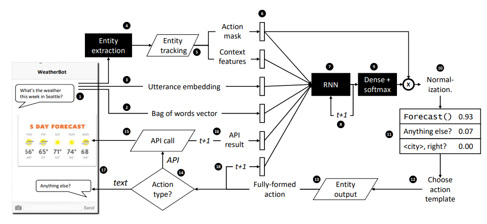

## Hybrid Code Networks: practical and efficient end-to-end dialog control with supervised and reinforcement learning

***原文地址：[1702.03274.pdf (arxiv.org)](https://arxiv.org/pdf/1702.03274.pdf)***

### 0. 摘要

```
基于循环神经网络RNN的端对端学习是对话系统的一种解决方案，但是当前的技术即使对于简单的动作也需要大量的对话用于学习。因此本文引入的混合代码网络（Hybrid Code Networks, HCNs），结合具有特定为软件和系统动作模板编码的领域知识的RNN。与当前的端对端方法相比，HCNs极大地减少了训练所需要的数据的数量，同时保留了推断对话状态潜在表示的关键好处。另外，HCNs能够使用监督学习、强化学习或两者的结合进行优化。HCNs在bAbl对话数据集上达到了最佳性能，并超过了两个商业部署的面向客户的对话系统。
```

## 1. 简介

```
	任务型对话系统使用管道的方法解决，包括自然语言理解（NLU）、对话管理（DM，包括：对话状态跟踪DST+对话策略DP）、自然语言生成（NLG），各个模块之间具有依赖性。
	目前，端对端方法训练的RNNs是直接针对对话的文本记录，一个关键的好处是RNN可以推断出状态的潜在表示，从而消除了对状态标签的需要，但是端对端方法缺乏注入领域知识和约束的通用机制（如：对数据库结果列表排序或者更新实体字典这样的简单操作可能需要许多个对话框来学习）。此外，在一些实际设置中，编程约束非常重要（如：银行对话系统要求用户登录后才能检索账户信息）。
	本文介绍了一种端对端模型-HCNs。除了学习RNN,HCNs还允许开发人员通过软件和动作模板表达领域知识。实验表明，与当前递归的端对端技术相比，HCNs只需要相当少的训练数据即可达到相同的性能，而且保留了端对端的可训练性。此外，神经网络可通过改变所应用的梯度更新使用监督学习或强化学习进行训练。
```

## 2. 模型表述

```
	混合代码网络的四个组成部分：递归神经网络(RNN)、特定领域软件(domain-specific software)、特定领域的行动模板(domain-specfic action templates)、一个传统的用于识别文本中提到的实体的实体提取模块(a conventional entity extraction module)

```


```
	周期开始时，用户输入一个话语文本(step 1)，对这个话语从几个方面提取特征：①生成词袋模型(step 2)；②生成文本词向量模型(step 3)；③实体提取模块提取文本中涉及的实体(step 4)，如"Jennifer Jones"识别为<name>实体。接下来文本以及识别到的实体将传递给“实体跟踪(entity tracking)”代码(step 5)，该过程会建立和维护实体，如将"Jennifer Jones"映射到数据库中一个特定的行，会选择性地返回一个"动作掩码(action mask)",以位向量的形式表示在当前时间步运允许的动作；同时也会选择性地返回"上下文特征(context features)",这些是开发者认为的可能对于区分不同的动作有用的特性；
	step1-5的特征将会进行连接以组成一个特征向量(step 6)；接下来这个特征向量会传递给RNN模块(LSTM或者GRU)，这个RNN会计算一个隐藏状态/向量，保留到下一个step(step 8)，并被传递给一个隐藏层(step 9)，step 9 的输出是对各个动作模板的区分；接下来，将动作掩码应用为元素乘法，并将结果的概率分布进行归一化，并将非允许操作的概率强制置位0(step 10)；从结果分布(step 11)中选择一个操作(step 12)。当RL处于活动状态时，需要进行搜索，因此在这种情况下，从分布中采样一个动作；当RL不活跃时，应该选择最佳的操作，因此总是选择概率最高的操作。
	接下来，选择的动作将传递给"实体输出"模块并生成一个完整的动作(step 13)，如将"<city>, right?"映射为"Seattle, right?"。在step 14，根据操作的类型控制分支：①如果他是一个API操作，则调用开发人员代码中相应的API调用(step 15)，如向用户呈现丰富的内容。API可以充当传感器并返回与对话框相关的特性，因此可以在下一个时间步(step 16)中将这些特性添加到特征向量；②如果操作是文本，它将呈现给用户(step 17)，然后循环，所采取的操作将作为下一个时间步(step 18)中RNN的特征
```

## 3. 相关工作

```

```

## 4. 监督学习评价I

## 5. 监督学习评价II

## 6. 强化学习示例
