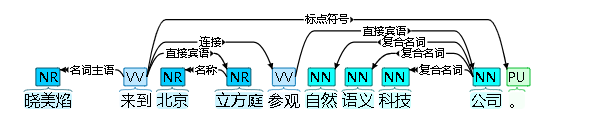
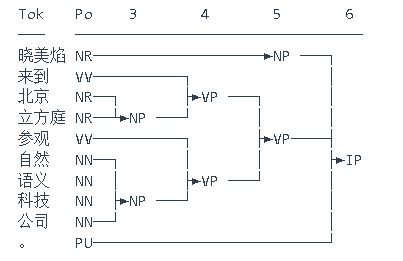
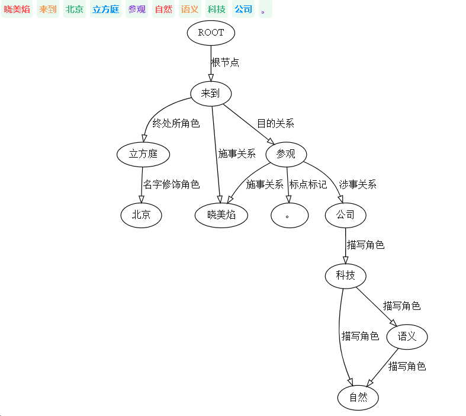
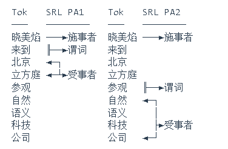
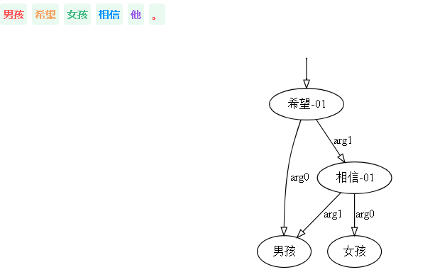
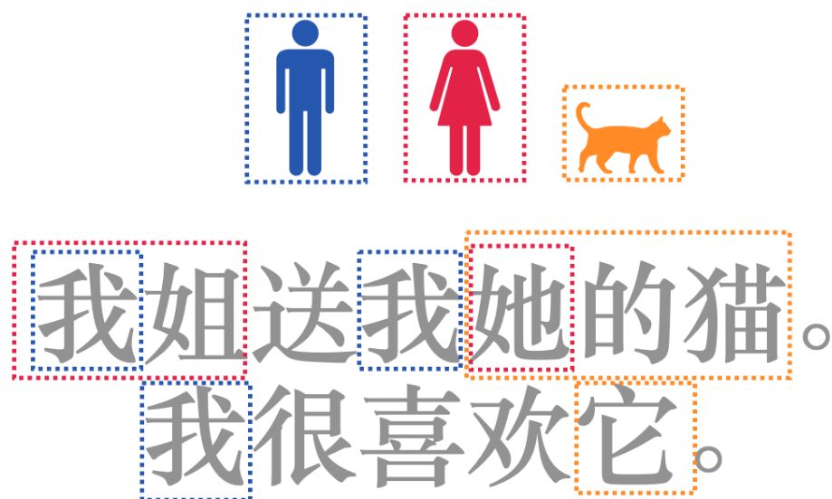

# Hanlp

HanLP线上模型训练自`9970`万字的大型综合语料库，覆盖新闻、社交媒体、金融、法律等多个领域，是已知范围内**全世界最大**的中文分词语料库。

HanLP主要功能包括分词、词性标注、关键词提取、自动摘要、依存句法分析、命名实体识别、短语提取、拼音转换、简繁转换等等。

Github地址：[https://github.com/hankcs/HanLP](https://link.zhihu.com/?target=https%3A//github.com/hankcs/HanLP)

官网地址：[(hankcs.com)](https://hanlp.hankcs.com/demos/tok.html#简介)

> 安装：pip install pyhanlp

## 1. 中文分词

 在分词标准上，HanLP提供[细粒度](https://hanlp.hankcs.com/docs/annotations/tok/ctb.html)和[粗粒度](https://hanlp.hankcs.com/docs/annotations/tok/msr.html)两种颗粒度，细粒度适合搜索引擎业务，粗粒度适合文本挖掘业务。

```python
from hanlp_restful import HanLPClient
# auth不填则匿名，zh中文，mul多语种
HanLP = HanLPClient('https://www.hanlp.com/api', auth=None, language='zh')

''' 1. 细分粒度 '''
HanLP.tokenize('商品和服务。晓美焰来到北京立方庭参观自然语义科技公司。')
''' 
[['商品', '和', '服务', '。'],
 ['晓美焰', '来到', '北京', '立方庭', '参观', '自然', '语义', '科技', '公司', '。']]
'''

''' 2. 粗分粒度 '''
HanLP.tokenize('商品和服务。晓美焰来到北京立方庭参观自然语义科技公司。', coarse=True)
'''
[['商品', '和', '服务', '。'], ['晓美焰', '来到', '北京立方庭', '参观', '自然语义科技公司', '。']]
'''
```

## 2. 词性标注（Part-of-Speech tagging、POS）

词性标注（Part-of-Speech tagging、POS）是一种标注句子中每个单词的词性（也称词类、语法类别）的任务。常见的词性标注集有[CTB](https://hanlp.hankcs.com/docs/annotations/pos/ctb.html)、[PKU](https://hanlp.hankcs.com/docs/annotations/pos/pku.html)、[863](https://hanlp.hankcs.com/docs/annotations/pos/863.html)、[NPCMJ](https://hanlp.hankcs.com/docs/annotations/pos/npcmj.html)、[Universal Dependencies](https://hanlp.hankcs.com/docs/annotations/pos/ud.html)

```python
from hanlp_restful import HanLPClient
# auth不填则匿名，zh中文，mul多语种
HanLP = HanLPClient('https://www.hanlp.com/api', auth=None, language='zh')

''' 1. CTB词性标注集 '''
HanLP.parse('我的希望是希望张晚霞的背影被晚霞映红。',tasks='pos/ctb').pretty_print()
'''
我/PN 的/DEG 希望/NN 是/VC 希望/VV 张晚霞/NR 的/DEG 背影/NN 被/LB 晚霞/NN 映红/VV 。/PU
'''

''' 2. PKU词性标注集 '''
HanLP.parse('我的希望是希望张晚霞的背影被晚霞映红。',tasks='pos/pku').pretty_print()
'''
我/r 的/u 希望/n 是/v 希望/v 张晚霞/nr 的/u 背影/n 被/p 晚霞/n 映红/v 。/w
'''

''' 3. 863词性标注集 '''
HanLP.parse('我的希望是希望张晚霞的背影被晚霞映红。',tasks='pos/863').pretty_print()
'''
我/r 的/u 希望/v 是/vl 希望/v 张晚霞/nh 的/u 背影/n 被/p 晚霞/n 映红/v 。/w
'''
```

## 3. 命名实体识别（Named Entity Recognition、NER）

命名实体识别（Named Entity Recognition、NER）是一种识别文本中实体的位置以及类别的任务。常见的命名实体规范有：[PKU](https://hanlp.hankcs.com/docs/annotations/ner/pku.html)、[MSRA、[OntoNotes](https://hanlp.hankcs.com/docs/annotations/ner/ontonotes.html)

```python
from hanlp_restful import HanLPClient
# auth不填则匿名，zh中文，mul多语种
HanLP = HanLPClient('https://www.hanlp.com/api', auth=None, language='zh')

''' 1. MSRA规范 '''
HanLP.parse('晓美焰来到北京立方庭参观自然语义科技公司。', tasks='ner/msra').pretty_print()
'''
Tok      NER Type  
───      ────────────────
晓美焰    ───►PERSON    
来到  
北京     	◄─┐  
立方庭    	◄─┴►LOCATION    
参观  
自然      ◄─┐             
语义  	  │             
科技  	  ├►ORGANIZATION 
公司  	◄─┘ 
。   	                           
'''

''' 2. PKU规范 '''
HanLP.parse('晓美焰来到北京立方庭参观自然语义科技公司。', tasks='ner/pku').pretty_print()
'''
Tok 		NER Ty
─── 		──────
晓美焰 	  ───►nr
来到  
北京  	  ───►ns
立方庭 
参观  
自然  
语义  
科技  
公司  
。   	
'''
```

## 4. 依存语法分析（Dependency Parsing、DEP）

依存句法分析（Dependency Parsing、DEP）是一种分析一个句子中单词与单词之间的语法关系，并将其表示为树形结构的任务。 HanLP支持[SD](https://hanlp.hankcs.com/docs/annotations/dep/sd_zh.html)、[UD](https://hanlp.hankcs.com/docs/annotations/dep/ud.html#chinese)、[PMT](https://hanlp.hankcs.com/docs/annotations/dep/pmt.html)等依存句法体系。

```python
doc = HanLP.parse('晓美焰来到北京立方庭参观自然语义科技公司。', tasks='dep')
print(doc)
'''
{
  "tok/fine": [
    ["晓美焰", "来到", "北京", "立方庭", "参观", "自然", "语义", "科技", "公司", "。"]
  ],
  "dep": [
    [[2, "nsubj"], [0, "root"], [4, "name"], [2, "dobj"], [2, "conj"], [9, "compound:nn"], [9, "compound:nn"], [9, "compound:nn"], [5, "dobj"], [2, "punct"]]
  ]
}

注：(dep中，第i个二元组表示第i个单词的[中心词的下标, 与中心词的依存关系])
'''
doc.pretty_print()
'''
Dep Tree     Tok 	Relation   
──────────── ─── 	───────────
         ┌─► 晓美焰  nsubj  
┌┬────┬──┴── 来到    root 
││    │  ┌─► 北京    name
││    └─►└── 立方庭  dobj
│└─►┌─────── 参观    conj
│   │  ┌───► 自然    compound:nn
│   │  │┌──► 语义    compound:nn
│   │  ││┌─► 科技    compound:nn
│   └─►└┴┴── 公司    dobj
└──────────► 。      punct
'''
```



## 5. 成分句法分析（Constituency Parsing、CON）

成分句法分析（Constituency Parsing、CON）是一种分析一个句子在语法上的递归构成，并将其表示为树形结构的任务。

```python
doc = HanLP.parse('晓美焰来到北京立方庭参观自然语义科技公司。', tasks=['pos', 'con'])
print(doc)
'''
{
  "tok/fine": [
    ["晓美焰", "来到", "北京", "立方庭", "参观", "自然", "语义", "科技", "公司", "。"]
  ],
  "pos/ctb": [
    ["NR", "VV", "NR", "NR", "VV", "NN", "NN", "NN", "NN", "PU"]
  ],
  "con": [
    ["TOP", [["IP", [["NP", [["NR", ["晓美焰"]]]], ["VP", [["VP", [["VV", ["来到"]], ["NP", [["NR", ["北京"]], ["NR", ["立方庭"]]]]]], ["VP", [["VV", ["参观"]], ["NP", [["NN", ["自然"]], ["NN", ["语义"]], ["NN", ["科技"]], ["NN", ["公司"]]]]]]]], ["PU", ["。"]]]]]]
  ]
}
'''
```



## 6. 语义依存分析（Semantic Dependency Parsing、SDP）

语义依存分析（Semantic Dependency Parsing、SDP）是一种分析一个句子中单词与单词之间的语义关系，并将其表示为图结构的任务。不同于依存句法分析，图中每个节点可以有任意个目标节点。

```python
doc = HanLP.parse('晓美焰来到北京立方庭参观自然语义科技公司。', tasks='sdp')
print(doc)
'''
{
  "tok/fine": [
    ["晓美焰", "来到", "北京", "立方庭", "参观", "自然", "语义", "科技", "公司", "。"]
  ],
  "sdp": [
    [[[2, "Agt"], [5, "Agt"]], [[0, "Root"]], [[4, "Nmod"]], [[2, "Lfin"]], [[2, "ePurp"]], [[7, "Desc"], [8, "Desc"]], [[8, "Desc"]], [[9, "Desc"]], [[5, "Datv"]], [[5, "mPunc"]]]
  ]
}

注:sdp中，第i个子数组代表第i个单词的语义依存关系，子数组中每个二元组的格式为[中心词的下标, 与中心词的语义依存关系]。每个单词的语义依存关系可能有零个、一个或多个（任意数量）
'''
```



## 7. 语义角色标注（Semantic Role Labeling 、SRL）

语义角色标注（Semantic Role Labeling 、SRL）任务的目标是分析一个句子的谓词论元结构（predicate-argument、PA），回答了“谁对谁做了什么”这样的语义问题。

```python
doc = HanLP.parse('晓美焰来到北京立方庭参观自然语义科技公司。', tasks=['srl'])
print(doc)
'''
{
  "tok/fine": [
    ["晓美焰", "来到", "北京", "立方庭", "参观", "自然", "语义", "科技", "公司", "。"]
  ],
  "srl": [
    [[["晓美焰", "ARG0", 0, 1], ["来到", "PRED", 1, 2], ["北京立方庭", "ARG1", 2, 4]], [["晓美焰", "ARG0", 0, 1], ["参观", "PRED", 4, 5], ["自然语义科技公司", "ARG1", 5, 9]]]
  ]
}
'''
```



## 8. 抽象意义表示（Abstract Meaning Representation，AMR）

抽象意义表示（Abstract Meaning Representation，AMR）是一种将句子的意义（时间地点谁对谁怎样地做了什么）表示为以概念为节点的单源有向无环图的语言学框架。AMR正在引起学术界越来越广泛的关注，已经涌现了许多利用AMR进行机器翻译、QA、关系提取等应用的工作。

```python
HanLP.abstract_meaning_representation('男孩希望女孩相信他。')
'''
[{'id': '0',
  'input': '男孩 希望 女孩 相信 他 。',
  'nodes': [{'id': 0,
    'label': '男孩',
    'anchors': [{'from': 0, 'to': 2}, {'from': 12, 'to': 13}]},
   {'id': 1, 'label': '希望-01', 'anchors': [{'from': 3, 'to': 5}]},
   {'id': 2, 'label': '女孩', 'anchors': [{'from': 6, 'to': 8}]},
   {'id': 3, 'label': '相信-01', 'anchors': [{'from': 9, 'to': 11}]}],
  'edges': [{'source': 1, 'target': 3, 'label': 'arg1'},
   {'source': 1, 'target': 0, 'label': 'arg0'},
   {'source': 3, 'target': 2, 'label': 'arg0'},
   {'source': 3, 'target': 0, 'label': 'arg1'}],
  'tops': [1],
  'framework': 'amr'}]
'''
```



## 9. 指代消解（Coreference Resolution，COR）

指代消解（Coreference Resolution，COR）任务的目标是将文本中指代同一事物的提名（mention）聚集到同一个簇。例如，`我姐送我她的猫。我很喜欢它。`这段文本的提名消解后得到的簇如下图所示：

```python
HanLP.coreference_resolution('我姐送我她的猫。我很喜欢它。')
'''
{'clusters': [[['我姐', 0, 1], ['我', 2, 3], ['她', 3, 4], ['我', 7, 8]],
  [['她的猫', 3, 6], ['它', 10, 11]]],
 'tokens': ['我姐', '送', '我', '她', '的', '猫', '。', '我', '很', '喜欢', '它', '。']}
'''
```

## 10. 语义文本相似度（Semantic Textual Similarity，STS）

语义文本相似度（Semantic Textual Similarity，STS）任务的目标是判断一对短文本的语义相似度，相似度区间为`[0, 1]`。

```python
HanLP.semantic_textual_similarity([
    ('看图猜一电影名', '看图猜电影'),
    ('无线路由器怎么无线上网', '无线上网卡和无线路由器怎么用'),
    ('北京到上海的动车票', '上海到北京的动车票'),
])
'''
[0.9764469861984253, 0.0, 0.003458678722381592]
'''
```

## 11. 文本风格转换（Text Style Transfer，TST）

文本风格转换（Text Style Transfer，TST）任务的目标是将原文本的风格转换为目标风格，同时保持语义不变。

```python
HanLP.text_style_transfer(['国家对中石油抱有很大的期望.', '要用创新去推动高质量的发展。'],
                            target_style='gov_doc')
'''
['国家对中石油寄予巨大期望。', '要用创新推动高质量发展。']
'''
```

## 12. 关键词短语提取（Keyphrase Extraction）

关键词（短语）提取（Keyphrase Extraction）的目标是文本中最具有代表性的关键词以及短语。

```python
HanLP.keyphrase_extraction('自然语言处理是一门博大精深的学科，掌握理论才能发挥出HanLP的全部性能。 '
                            '《自然语言处理入门》是一本配套HanLP的NLP入门书，助你零起点上手自然语言处理。', topk=3)
'''
{'自然语言处理': 0.800000011920929,
 'HanLP的全部性能': 0.5258457660675049,
 '语言处理': 0.49663180112838745}
'''
```

## 13. 抽取式自动摘要（Extractive Summarization）

抽取式自动摘要（Extractive Summarization）任务的目标是从文章中筛选出一些作为摘要的中心句子：既要紧扣要点，又要避免赘语。

```python
text = '''
据DigiTimes报道，在上海疫情趋缓，防疫管控开始放松后，苹果供应商广达正在逐步恢复其中国工厂的MacBook产品生产。
据供应链消息人士称，生产厂的订单拉动情况正在慢慢转强，这会提高MacBook Pro机型的供应量，并缩短苹果客户在过去几周所经历的延长交货时间。
仍有许多苹果笔记本用户在等待3月和4月订购的MacBook Pro机型到货，由于苹果的供应问题，他们的发货时间被大大推迟了。
据分析师郭明錤表示，广达是高端MacBook Pro的唯一供应商，自防疫封控依赖，MacBook Pro大部分型号交货时间增加了三到五周，
一些高端定制型号的MacBook Pro配置要到6月底到7月初才能交货。
尽管MacBook Pro的生产逐渐恢复，但供应问题预计依然影响2022年第三季度的产品销售。
苹果上周表示，防疫措施和元部件短缺将继续使其难以生产足够的产品来满足消费者的强劲需求，这最终将影响苹果6月份的收入。
'''
HanLP.extractive_summarization(text, topk=3)
'''
{'据DigiTimes报道，在上海疫情趋缓，防疫管控开始放松后，苹果供应商广达正在逐步恢复其中国工厂的MacBook产品生产。': 0.9999712705612183,
 '据供应链消息人士称，生产厂的订单拉动情况正在慢慢转强，这会提高MacBook Pro机型的供应量，并缩短苹果客户在过去几周所经历的延长交货时间。': 0.4533592164516449,
 '苹果上周表示，防疫措施和元部件短缺将继续使其难以生产足够的产品来满足消费者的强劲需求，这最终将影响苹果6月份的收入。': 0.14686930179595947}
'''
```

## 14. 文本纠错（Grammatical Error Correction，GEC）

文本纠错（Grammatical Error Correction，GEC）任务的目标是改正文本中潜在的拼写、标点、语法等表达错误。由于文本纠错的定义是中文拼写纠错（Chinese Spelling Correction，CSC）的超集，所以我们将二者作为统一整体进行研究。

目前，业界对文本纠错的研究还处于相当初始的阶段，具体体现在模型和语料库仅仅能覆盖简单的拼写和用词错误，而对稍微复杂一点的语病则无能为力。其主要原因并不在于模型，而是归结于语料库的匮乏。文本纠错的语料库主要来源为外国人在学习对外汉语的过程中暴露出来的书面语错误，与母语者常犯的错误往往相差甚远。而流行的数据增强方法伪造的训练数据与真实场景的分布大相径庭，无法达到实用水平。同时用于数据增强的语言模型又是在错误百出的互联网文本上训练而来，更是难以产出高质量的语料库。

```python
HanLP.grammatical_error_correction(['每个青年都应当有远大的报复。', '有的同学对语言很兴趣。'])
'''
['每个青年都应当有远大的抱负。', '有的同学对语言很有兴趣。']
'''
```

