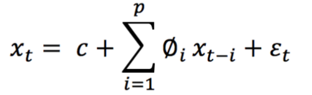

# 时间序列模型

***reference： https://zhuanlan.zhihu.com/p/67093525***

传统时间序列预测中常见的时间序列模型有：

- 自回归(AR)模型：以时间序列的前一个值和当前残差来线性地表示时间序列的当前值
- 移动平均(MA)模型：用时间序列的当前值和先前的残差序列来线性地表示时间序列的当前值
- 自回归移动平均(ARMA)模型：是AR模型和MA模型的组合，其中时间序列的当前值线性地表示为它先前的值以及当前值和先前的残差序列。AR、MA和ARMA模型中定义的时间序列均是平稳过程，即这些模型的均值及其观测值之间的协方差不随时间的变化而变化。
- 差分自回归移动平均模型(ARIMA)：对于非平稳时间序列，必须先将序列转换为平稳的随机序列。ARIMA模型一般适用于基于ARMA模型的非平稳时间序列，其**差分过程可有效地将非平稳数据转换为平稳数据**。
- 季节性差分自回归移动平均模型(SARIMA)模型：将季节差分与ARIMA模型相结合的，用于具有周期性特征的时间序列数据建模。


各模型之间的比较：


深度学习方法在时间序列预测中能够识别诸如非线性度和复杂度等数据的结构和模式。

**本文目标：**

> 1. 了解深度学习算法RNN、LSTM以及与LSTM集成学习如何提高性能。
> 2. 了解传统的时间序列建模技术ARIMA，以及当它与MLP和多元线性回归相结合时，如何在集成方法中改进时间序列预测。
> 3. 了解使用ARIMA与LSTM的问题和场景，以及采用其中一种对抗另一种的利弊。
> 4. 了解使用SARIMA进行时间序列建模时，如何与其他基于空间、基于决策和基于事件的模型进行集成学习。

**更为复杂的时间序列问题（后续再进行研究学习）**

> 1. 复杂的不规则时间结构
> 2. 缺失的观测
> 3. 强噪声和多变量之间复杂的相互关系的数据集

## 1. 深度学习算法——LSTM、GRU

​	LSTM是一种特殊的RNN，它由一组具有特征的单元集合组成，利用这些特征来记忆数据序列，**集合中的单元用于捕获并存储数据流**。此外，集合中的单元构成先前的模块与当前的模块的内部互连，从而将来自多个过去时间瞬间的信息传送给当前的模块。**每个单元中会使用到门，为下一个单元处理、过滤或添加单元中的数据。**


单元中的门基于Sigmoid神经网络层，使单元可以选择性地让数据通过或丢弃，每个sigmoid层输出一个在0到 1之间的数字，这个数字为每个单元中应该通过的数据的数量。更准确地说，如果这个值为0，意味着“不让任何数据通过”， 如果这个值为1，则表示“让所有数据都通过”。为了控制每个单元的状态，每个LSTM涉及三种类型的门：

> 1. 遗忘门：输出一个介于0到1之间的数字，其中1表示“完全保留此值”；而0则意味着“完全忽略此值”。
> 2. 记忆门：决定选择哪些数据通过sigmoid层和tanh层后需要存储到数据单元中。初始sigmoid层，称为“输入门层”，决定需要对哪些数值进行修改，随后，由tanh层生成可以添加到状态的新候选值的向量。
> 3. 输出门：决定每个单元输出的内容，根据数据过滤及新增数据后数据单元的状态，输出门会输出一个数据值（隐藏状态）。

**LSTM在时间序列预测中的应用 —— 堆叠继承方法（将多个LSTM网络叠加和组合）** 


AdaBoost算法用于对来自多个独立的长期短期记忆(LSTM)网络进行组合预测：首先，利用AdaBoost算法对数据进行训练，从原始数据集中生成替换样本，得到训练数据；然后，利用LSTM分别对每个训练样本进行预测；最后，采用AdaBoost算法对所有LSTM预测器的预测结果进行综合，生成集成结果。对两个主要的日汇率数据集和两个股票市场指数数据集的实证结果表明，AdaBoost-LSTM集成学习方法优于其他单一预测模型和集成学习方法。

## 2. ARIMA

> 1. AR：自回归。一种使用一个观察和多个滞后观测之间的依赖关系的回归模型
>
> 2. I：差分。通过计算不同时间观测值的差值，使时间序列平稳化
>
> 3. MA：移动平均。当滞后观测（q）使用移动平均模型时，计算观测值和残差项之间的依赖性的一种方法（Q）。阶为p的AR模型的一种简单形式，即AR(P)，可以写成一个线性过程，由以下公式表达：
>
>    **xt**表示平稳变量，c是常数，∅t中的项是滞后1，2，…的自相关系数。残差p和ξt是均值为零、方差为 **σt²**的高斯白噪声序列。

ARIMA模型的一般形式表示为ARIMA(p，q，d)。对于季节性时间序列数据，短期非季节性成分很可能对模型有贡献。其中：

> - p是训练模型时使用的滞后观测数目（即：滞后数目）。
> - d是应用差分的次数(即差分的阶数)。
> - q为移动平均窗口的大小(即移动平均的阶数)。

利用自相关函数(ACF)来计算由p个滞后隔离的时间序列中观测值之间的线性相关，利用偏自相关函数(PACF)来确定需要多少个自回归项q，利用逆自相关函数(IACF)来检测过差分，之后可以得到自回归阶p、差分阶数d的初值，移动平均阶q及其对应的季节性参数P、D和Q。参数d是从非平稳时间序列到平稳时间序列的差分频度变化的阶数。

```python
import pmdarima as pm
def detect():
    ''' 自动检测得到最佳的d/p/q值 '''
    model = pm.auto_arima(df.open, start_p = 0, start_q= 1, 
                        test = 'adf',
                        max_p = 3, max_q = 3,
                        m = 1,
                        d = None,
                        seasonal = False,
                        start_P = 0,
                        D = 0,
                        trace = True,
                        error_action = 'ignore',
                        suppress_warnings = True,
                        stepwise = True)
    print(model.summary)
```


多元ARIMA模型和向量自回归模型(VAR)是另外两种流行的预测模型，它们通过考虑多个演化变量来推广一元ARIMA模型和单变量自回归(AR)模型。


ARIMA是一种基于线性回归的预测方法，最适合于单步样本预测。在这里，所提到的算法为**多步样本预测与重新估计，即每次模型被重新拟合，以建立最佳的估计模型**。该算法以输入“时间序列”数据集为基础，建立预测模型，并计算预测的均方误差。它存储两个数据结构来保存每次迭代时累积添加的训练数据集，即：“历史”值和对测试数据集的连续预测的 “预测”值。


**基于ARIMA的集成学习**

​	对ARIMA、多层感知器(MLP)和多元线性回归(MLR)三种预测模型分别进行训练、验证和测试，得到目标污染物浓度预测。为了训练和拟合ARIMA模型，利用自相关函数(ACF)和偏自相关函数(PACF)对p、d、q值进行了估计。MLP模型采用以下参数来建立：用于权重优化的求解器是lbfgs，因为它能够更快地收敛，并且对于较少维数的数据性能更为优越。

## 3. SARIMA

为了支持序列的季节分量，将 ARIMA模型扩展成为SARIMA。SARIMA (季节性差分自回归移动平均模型应用于包含趋势和季节性的单变量数据，SARIMA由趋势和季节要素组成的序列构成。

> 与ARIMA模型相同的一些参数有：
>
> - p: 趋势的自回归阶数。
> - d: 趋势差分阶数。
> - q: 趋势的移动平均阶数
>
> 
>
> 不属于ARIMA的四个季节性因素有：
>
> - P: 季节性自回归阶数。
> - D: 季节性差分阶数。
> - Q: 季节性移动平均阶数。
> - m: 单个季节性周期的时间步长数。
>
> 
>
> SARIMA模型可以定义为：**SARIMA (p, d, q) (P,D,Q) m**

SARIMA时间序列模型也可以与基于空间和事件的模型相结合，以生成解决多维ML问题的集成模型。

## 总结

> - ARIMA对短期预测有较好的预测效果，而LSTM对长期模型有较好的预测效果。
> - 传统的时间序列预测方法(ARIMA)侧重于具有线性关系和固定人工诊断时间依赖的单变量数据。
> - 对大量数据集的机器学习问题研究发现，与ARIMA相比，LSTM获得的平均错误率在84-87%之间，表明LSTM优于ARIMA。
> - 深度学习中的“epoch”为训练次数，它对训练预测模型的性能没有影响，呈现出真正的随机性。
> - LSTM与RNN和MLP等更简单的NNS相比，似乎更适合于拟合或过度拟合训练数据集，而不是预测数据集。
> - 具有庞大数据集的神经网络(LSTMS和其他深度学习方法)提供了将其分成几个较小的批次并在多个阶段进行训练的方法。批大小/每个块大小根据使用的培训数据总数来定。术语：迭代，用于表示完成整个数据集模型训练所需的批次数。
> - LSTM无疑更为复杂，训练难度较大，在大多数情况下其性能不会超过简单ARIMA模型的性能。
> - ·传统的方法，如ETS和ARIMA，适用于一元数据集的单步预测。
> - 像Theta和Arima这样的经典方法在单变量数据集的多步预测方面表现出色。
> - 像ARIMA这样的经典方法侧重于固定的时间依赖性：不同时间观测值之间的相互关系，这就需要分析和说明作为输入的滞后观测值的数量。
> - 机器学习和深度学习方法尚未实现其对单变量时间序列预测的承诺，这方面还有许多研究要做。
> - 神经网络增加了处理噪声和非线性关系的能力，并具备任意定义且有固定数量的输入。此外，NNS可输出多变量和多步预测。
> - 递归神经网络(RNNs)增加了有序观测的显式处理，并能够从上下文中学习时间依赖关系。通过从一定时间内对序列的一次观测值，RNN可以学习到该序列先前所的相关观测，并对后续相关性进行预测。
> - 当LSTMS用于学习长期序列中的相关性时，在无需指定任何时间窗口的情况下， 它可以对复杂的多变量序列建模。