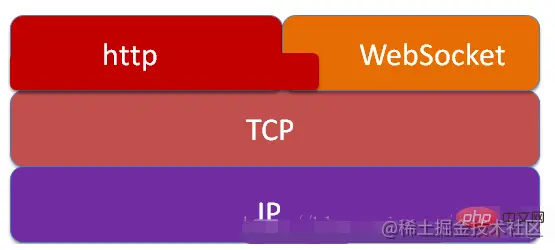
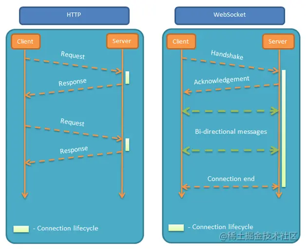

## WebSocket

*reference： https://juejin.cn/post/7020964728386093093*

## 1. 什么是WebSocket

```
WebSocket 是一种在单个TCP连接上进行全双工通信的协议。WebSocket 使得客户端和服务器之间的数据交换变得更加简单，允许服务端主动向客户端推送数据。
在 WebSocket API 中，浏览器和服务器只需要完成一次握手，两者之间就直接可以创建持久性的连接， 并进行双向数据传输。（维基百科）
WebSocket本质上一种计算机网络应用层的协议，用来弥补http协议在持久通信能力上的不足。
WebSocket 协议在2008年诞生，2011年成为国际标准。现在最新版本浏览器都已经支持了。
它的最大特点就是，服务器可以主动向客户端推送信息，客户端也可以主动向服务器发送信息，是真正的双向平等对话，属于服务器推送技术的一种。
WebSocket 的其他特点包括：
（1）建立在 TCP 协议之上，服务器端的实现比较容易。
（2）与 HTTP 协议有着良好的兼容性。默认端口也是80和443，并且握手阶段采用 HTTP 协议，因此握手时不容易屏蔽，能通过各种 HTTP 代理服务器。
（3）数据格式比较轻量，性能开销小，通信高效。
（4）可以发送文本，也可以发送二进制数据。
（5）没有同源限制，客户端可以与任意服务器通信。
（6）协议标识符是ws（如果加密，则为wss），服务器网址就是 URL。
```

## 2. 为什么需要 WebSocket

```
因为 HTTP 协议有一个缺陷：通信只能由客户端发起，不具备服务器推送能力。

http协议本身是没有持久通信能力的，但是我们在实际的应用中，是很需要这种能力的，所以，为了解决这些问题，WebSocket协议由此而生，于2011年被IETF定为标准RFC6455，并被RFC7936所补充规范。
并且在HTML5标准中增加了有关WebSocket协议的相关api，所以只要实现了HTML5标准的客户端，就可以与支持WebSocket协议的服务器进行全双工的持久通信了。
```

## 3. websocket与http的区别与联系



```
相同点： 都是一样基于TCP的，都是可靠性传输协议。都是应用层协议。

联系： WebSocket在建立握手时，数据是通过HTTP传输的。但是建立之后，在真正传输时候是不需要HTTP协议的。
```



```
1、WebSocket是双向通信协议，模拟Socket协议，可以双向发送或接受信息，而HTTP是单向的；
2、WebSocket是需要浏览器和服务器握手进行建立连接的，而http是浏览器发起向服务器的连接。
注意：虽然HTTP/2也具备服务器推送功能，但HTTP/2 只能推送静态资源，无法推送指定的信息。
```

## 4. websocket协议的原理

```
与http协议一样，WebSocket协议也需要通过已建立的TCP连接来传输数据。具体实现上是通过http协议建立通道，然后在此基础上用真正的WebSocket协议进行通信，所以WebSocket协议和http协议是有一定的交叉关系的。
首先，WebSocket 是一个持久化的协议，相对于 HTTP 这种非持久的协议来说。简单的举个例子吧，用目前应用比较广泛的 PHP 生命周期来解释。
HTTP 的生命周期通过 Request 来界定，也就是一个 Request 一个 Response ，那么在 HTTP1.0 中，这次 HTTP 请求就结束了。
在 HTTP1.1 中进行了改进，使得有一个 keep-alive，也就是说，在一个 HTTP 连接中，可以发送多个 Request，接收多个 Response。但是请记住 Request = Response， 在 HTTP 中永远是这样，也就是说一个 Request 只能有一个 Response。而且这个 Response 也是被动的，不能主动发起。
首先 WebSocket 是基于 HTTP 协议的，或者说借用了 HTTP 协议来完成一部分握手。
```

```
WebSocket连接的过程是：
1. 首先，客户端发起http请求，经过3次握手后，建立起TCP连接；http请求里存放WebSocket支持的版本号等信息，如：Upgrade、Connection、WebSocket-Version等；
2. 然后，服务器收到客户端的握手请求后，同样采用HTTP协议回馈数据；
3. 最后，客户端收到连接成功的消息后，开始借助于TCP传输信道进行全双工通信。
```

## 5. websocket断线重连

```
心跳就是客户端定时的给服务端发送消息，证明客户端是在线的， 如果超过一定的时间没有发送则就是离线了。

1. 如何判断在线离线？
当客户端第一次发送请求至服务端时会携带唯一标识、以及时间戳，服务端到db或者缓存去查询改请求的唯一标识，如果不存在就存入db或者缓存中，
第二次客户端定时再次发送请求依旧携带唯一标识、以及时间戳，服务端到db或者缓存去查询改请求的唯一标识，如果存在就把上次的时间戳拿取出来，使用当前时间戳减去上次的时间，
得出的毫秒秒数判断是否大于指定的时间，若小于的话就是在线，否则就是离线；

2. 如何解决断线问题？
通过查阅资料了解到 nginx 代理的 websocket 转发，无消息连接会出现超时断开问题。网上资料提到解决方案两种，一种是修改nginx配置信息，第二种是websocket发送心跳包。
下面就来总结一下本次项目实践中解决的websocket的断线 和 重连 这两个问题的解决方案。
主动触发包括主动断开连接，客户端主动发送消息给后端

断线的可能原因：
1：websocket超时没有消息自动断开连接，应对措施：
这时候我们就需要知道服务端设置的超时时长是多少，在小于超时时间内发送心跳包，有2中方案:一种是客户端主动发送上行心跳包，另一种方案是服务端主动发送下行心跳包。
下面主要讲一下客户端也就是前端如何实现心跳包：
心跳包机制：跳包之所以叫心跳包是因为它像心跳一样每隔固定时间发一次，以此来告诉服务器，这个客户端还活着。事实上这是为了保持长连接，至于这个包的内容，是没有什么特别规定的，不过一般都是很小的包，或者只包含包头的一个空包。
在TCP的机制里面，本身是存在有心跳包的机制的，也就是TCP的选项：SO_KEEPALIVE。系统默认是设置的2小时的心跳频率。但是它检查不到机器断电、网线拔出、防火墙这些断线。而且逻辑层处理断线可能也不是那么好处理。一般，如果只是用于保活还是可以的。
心跳包一般来说都是在逻辑层发送空的echo包来实现的。下一个定时器，在一定时间间隔下发送一个空包给客户端，然后客户端反馈一个同样的空包回来，服务器如果在一定时间内收不到客户端发送过来的反馈包，那就只有认定说掉线了。
在长连接下，有可能很长一段时间都没有数据往来。理论上说，这个连接是一直保持连接的，但是实际情况中，如果中间节点出现什么故障是难以知道的。更要命的是，有的节点(防火墙)会自动把一定时间之内没有数据交互的连接给断掉。在这个时候，就需要我们的心跳包了，用于维持长连接，保活。
心跳检测步骤：
①客户端每隔一个时间间隔发生一个探测包给服务器
②客户端发包时启动一个超时定时器
③服务器端接收到检测包，应该回应一个包
④如果客户机收到服务器的应答包，则说明服务器正常，删除超时定时器
⑤如果客户端的超时定时器超时，依然没有收到应答包，则说明服务器挂了


断线的可能原因2：websocket异常包括服务端出现中断，交互切屏等等客户端异常中断等等
当若服务端宕机了，客户端怎么做、服务端再次上线时怎么做？
客户端则需要断开连接，通过onclose 关闭连接，服务端再次上线时则需要清除之间存的数据，若不清除 则会造成只要请求到服务端的都会被视为离线。
针对这种异常的中断解决方案就是处理重连，下面我们给出的重连方案是使用js库处理：引入reconnecting-websocket.min.js，ws建立链接方法使用js库api方法
```

